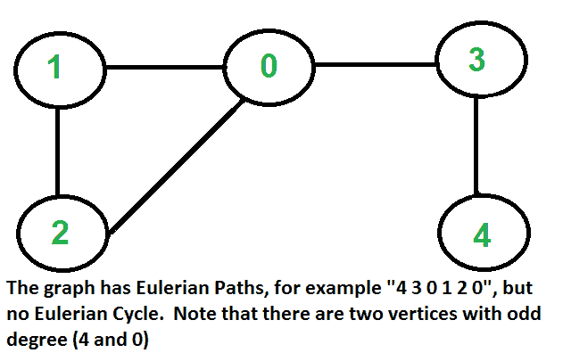
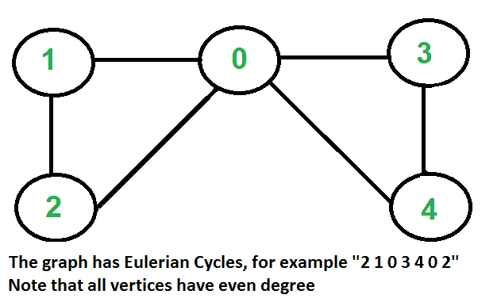
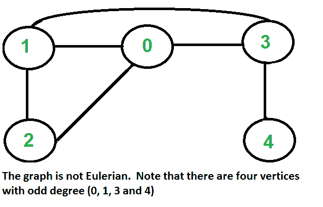

# 无向图

的欧拉路径和回路

> 原文： [https://www.geeksforgeeks.org/eulerian-path-and-circuit/](https://www.geeksforgeeks.org/eulerian-path-and-circuit/)

[欧拉路径](http://en.wikipedia.org/wiki/Eulerian_path)是图中的一条路径，该路径恰好访问每个边一次。 欧拉回路是一条始于和终止于同一顶点的欧拉路径。







**如何查找给定图是否为欧拉图？**

问题与以下问题相同。 “是否有可能画出给定的图形而无需从纸上抬起铅笔，也不必多次描画任何边”。

如果图形具有欧拉循环，则称为欧拉曲线；如果图形具有欧拉路径，则称为半欧拉曲线。 该问题似乎类似于[哈密顿路径](https://www.geeksforgeeks.org/backtracking-set-7-hamiltonian-cycle/)，这是一般图形的 NP 完全问题。 幸运的是，我们可以发现给定图在多项式时间内是否具有欧拉路径。 实际上，我们可以在`O(V + E)`时间找到它。

以下是具有欧拉路径和循环的无向图的一些有趣特性。 我们可以使用这些属性来查找图是否为欧拉图。

**欧拉循环**

如果满足以下两个条件，则无向图具有欧拉循环。

….a）连接了所有非零度的顶点。 我们不在乎零度的顶点，因为它们不属于欧拉循环或路径（我们仅考虑所有边）。

….b）所有顶点均具有偶数度。

**欧拉路径**

如果满足以下两个条件，则无向图具有欧拉路径。

….a）与欧拉循环的条件（a）

….b）如果零个或两个顶点具有奇数度，而所有其他顶点具有偶数度。 请注意，在无向图中，只有一个具有奇数度的顶点是不可能的（在无向图中，所有度的总和始终是偶数）

请注意，没有边的图被视为欧拉图，因为没有要遍历的边。

**这是如何工作的？**

在欧拉路径中，每次我们访问顶点 v 时，都会经过两个未访问的边，且端点的端点为 v。因此，欧拉路径中的所有中顶点必须具有均匀的度数。 对于欧拉循环，任何顶点都可以是中间顶点，因此所有顶点都必须具有偶数度。

## C++

```cpp

// A C++ program to check if a given graph is Eulerian or not 
#include<iostream> 
#include <list> 
using namespace std; 

// A class that represents an undirected graph 
class Graph 
{ 
    int V;    // No. of vertices 
    list<int> *adj;    // A dynamic array of adjacency lists 
public: 
    // Constructor and destructor 
    Graph(int V)   {this->V = V; adj = new list<int>[V]; } 
    ~Graph() { delete [] adj; } // To avoid memory leak 

     // function to add an edge to graph 
    void addEdge(int v, int w); 

    // Method to check if this graph is Eulerian or not 
    int isEulerian(); 

    // Method to check if all non-zero degree vertices are connected 
    bool isConnected(); 

    // Function to do DFS starting from v. Used in isConnected(); 
    void DFSUtil(int v, bool visited[]); 
}; 

void Graph::addEdge(int v, int w) 
{ 
    adj[v].push_back(w); 
    adj[w].push_back(v);  // Note: the graph is undirected 
} 

void Graph::DFSUtil(int v, bool visited[]) 
{ 
    // Mark the current node as visited and print it 
    visited[v] = true; 

    // Recur for all the vertices adjacent to this vertex 
    list<int>::iterator i; 
    for (i = adj[v].begin(); i != adj[v].end(); ++i) 
        if (!visited[*i]) 
            DFSUtil(*i, visited); 
} 

// Method to check if all non-zero degree vertices are connected. 
// It mainly does DFS traversal starting from 
bool Graph::isConnected() 
{ 
    // Mark all the vertices as not visited 
    bool visited[V]; 
    int i; 
    for (i = 0; i < V; i++) 
        visited[i] = false; 

    // Find a vertex with non-zero degree 
    for (i = 0; i < V; i++) 
        if (adj[i].size() != 0) 
            break; 

    // If there are no edges in the graph, return true 
    if (i == V) 
        return true; 

    // Start DFS traversal from a vertex with non-zero degree 
    DFSUtil(i, visited); 

    // Check if all non-zero degree vertices are visited 
    for (i = 0; i < V; i++) 
       if (visited[i] == false && adj[i].size() > 0) 
            return false; 

    return true; 
} 

/* The function returns one of the following values 
   0 --> If grpah is not Eulerian 
   1 --> If graph has an Euler path (Semi-Eulerian) 
   2 --> If graph has an Euler Circuit (Eulerian)  */
int Graph::isEulerian() 
{ 
    // Check if all non-zero degree vertices are connected 
    if (isConnected() == false) 
        return 0; 

    // Count vertices with odd degree 
    int odd = 0; 
    for (int i = 0; i < V; i++) 
        if (adj[i].size() & 1) 
            odd++; 

    // If count is more than 2, then graph is not Eulerian 
    if (odd > 2) 
        return 0; 

    // If odd count is 2, then semi-eulerian. 
    // If odd count is 0, then eulerian 
    // Note that odd count can never be 1 for undirected graph 
    return (odd)? 1 : 2; 
} 

// Function to run test cases 
void test(Graph &g) 
{ 
    int res = g.isEulerian(); 
    if (res == 0) 
        cout << "graph is not Eulerian\n"; 
    else if (res == 1) 
        cout << "graph has a Euler path\n"; 
    else
        cout << "graph has a Euler cycle\n"; 
} 

// Driver program to test above function 
int main() 
{ 
    // Let us create and test graphs shown in above figures 
    Graph g1(5); 
    g1.addEdge(1, 0); 
    g1.addEdge(0, 2); 
    g1.addEdge(2, 1); 
    g1.addEdge(0, 3); 
    g1.addEdge(3, 4); 
    test(g1); 

    Graph g2(5); 
    g2.addEdge(1, 0); 
    g2.addEdge(0, 2); 
    g2.addEdge(2, 1); 
    g2.addEdge(0, 3); 
    g2.addEdge(3, 4); 
    g2.addEdge(4, 0); 
    test(g2); 

    Graph g3(5); 
    g3.addEdge(1, 0); 
    g3.addEdge(0, 2); 
    g3.addEdge(2, 1); 
    g3.addEdge(0, 3); 
    g3.addEdge(3, 4); 
    g3.addEdge(1, 3); 
    test(g3); 

    // Let us create a graph with 3 vertices 
    // connected in the form of cycle 
    Graph g4(3); 
    g4.addEdge(0, 1); 
    g4.addEdge(1, 2); 
    g4.addEdge(2, 0); 
    test(g4); 

    // Let us create a graph with all veritces 
    // with zero degree 
    Graph g5(3); 
    test(g5); 

    return 0; 
} 

```

## Java

```java

// A Java program to check if a given graph is Eulerian or not 
import java.io.*; 
import java.util.*; 
import java.util.LinkedList; 

// This class represents an undirected graph using adjacency list 
// representation 
class Graph 
{ 
    private int V;   // No. of vertices 

    // Array  of lists for Adjacency List Representation 
    private LinkedList<Integer> adj[]; 

    // Constructor 
    Graph(int v) 
    { 
        V = v; 
        adj = new LinkedList[v]; 
        for (int i=0; i<v; ++i) 
            adj[i] = new LinkedList(); 
    } 

    //Function to add an edge into the graph 
    void addEdge(int v, int w) 
    { 
        adj[v].add(w);// Add w to v's list. 
        adj[w].add(v); //The graph is undirected 
    } 

    // A function used by DFS 
    void DFSUtil(int v,boolean visited[]) 
    { 
        // Mark the current node as visited 
        visited[v] = true; 

        // Recur for all the vertices adjacent to this vertex 
        Iterator<Integer> i = adj[v].listIterator(); 
        while (i.hasNext()) 
        { 
            int n = i.next(); 
            if (!visited[n]) 
                DFSUtil(n, visited); 
        } 
    } 

    // Method to check if all non-zero degree vertices are 
    // connected. It mainly does DFS traversal starting from 
    boolean isConnected() 
    { 
        // Mark all the vertices as not visited 
        boolean visited[] = new boolean[V]; 
        int i; 
        for (i = 0; i < V; i++) 
            visited[i] = false; 

        // Find a vertex with non-zero degree 
        for (i = 0; i < V; i++) 
            if (adj[i].size() != 0) 
                break; 

        // If there are no edges in the graph, return true 
        if (i == V) 
            return true; 

        // Start DFS traversal from a vertex with non-zero degree 
        DFSUtil(i, visited); 

        // Check if all non-zero degree vertices are visited 
        for (i = 0; i < V; i++) 
           if (visited[i] == false && adj[i].size() > 0) 
                return false; 

        return true; 
    } 

    /* The function returns one of the following values 
       0 --> If grpah is not Eulerian 
       1 --> If graph has an Euler path (Semi-Eulerian) 
       2 --> If graph has an Euler Circuit (Eulerian)  */
    int isEulerian() 
    { 
        // Check if all non-zero degree vertices are connected 
        if (isConnected() == false) 
            return 0; 

        // Count vertices with odd degree 
        int odd = 0; 
        for (int i = 0; i < V; i++) 
            if (adj[i].size()%2!=0) 
                odd++; 

        // If count is more than 2, then graph is not Eulerian 
        if (odd > 2) 
            return 0; 

        // If odd count is 2, then semi-eulerian. 
        // If odd count is 0, then eulerian 
        // Note that odd count can never be 1 for undirected graph 
        return (odd==2)? 1 : 2; 
    } 

    // Function to run test cases 
    void test() 
    { 
        int res = isEulerian(); 
        if (res == 0) 
            System.out.println("graph is not Eulerian"); 
        else if (res == 1) 
            System.out.println("graph has a Euler path"); 
        else
           System.out.println("graph has a Euler cycle"); 
    } 

    // Driver method 
    public static void main(String args[]) 
    { 
        // Let us create and test graphs shown in above figures 
        Graph g1 = new Graph(5); 
        g1.addEdge(1, 0); 
        g1.addEdge(0, 2); 
        g1.addEdge(2, 1); 
        g1.addEdge(0, 3); 
        g1.addEdge(3, 4); 
        g1.test(); 

        Graph g2 = new Graph(5); 
        g2.addEdge(1, 0); 
        g2.addEdge(0, 2); 
        g2.addEdge(2, 1); 
        g2.addEdge(0, 3); 
        g2.addEdge(3, 4); 
        g2.addEdge(4, 0); 
        g2.test(); 

        Graph g3 = new Graph(5); 
        g3.addEdge(1, 0); 
        g3.addEdge(0, 2); 
        g3.addEdge(2, 1); 
        g3.addEdge(0, 3); 
        g3.addEdge(3, 4); 
        g3.addEdge(1, 3); 
        g3.test(); 

        // Let us create a graph with 3 vertices 
        // connected in the form of cycle 
        Graph g4 = new Graph(3); 
        g4.addEdge(0, 1); 
        g4.addEdge(1, 2); 
        g4.addEdge(2, 0); 
        g4.test(); 

        // Let us create a graph with all veritces 
        // with zero degree 
        Graph g5 = new Graph(3); 
        g5.test(); 
    } 
} 
// This code is contributed by Aakash Hasija 

```

## Python

```py

# Python program to check if a given graph is Eulerian or not 
#Complexity : O(V+E) 

from collections import defaultdict 

#This class represents a undirected graph using adjacency list representation 
class Graph: 

    def __init__(self,vertices): 
        self.V= vertices #No. of vertices 
        self.graph = defaultdict(list) # default dictionary to store graph 

    # function to add an edge to graph 
    def addEdge(self,u,v): 
        self.graph[u].append(v) 
        self.graph[v].append(u) 

    #A function used by isConnected 
    def DFSUtil(self,v,visited): 
        # Mark the current node as visited  
        visited[v]= True

        #Recur for all the vertices adjacent to this vertex 
        for i in self.graph[v]: 
            if visited[i]==False: 
                self.DFSUtil(i,visited) 

    '''Method to check if all non-zero degree vertices are 
    connected. It mainly does DFS traversal starting from  
    node with non-zero degree'''
    def isConnected(self): 

        # Mark all the vertices as not visited 
        visited =[False]*(self.V) 

        #  Find a vertex with non-zero degree 
        for i in range(self.V): 
            if len(self.graph[i]) > 1: 
                break

        # If there are no edges in the graph, return true 
        if i == self.V-1: 
            return True

        # Start DFS traversal from a vertex with non-zero degree 
        self.DFSUtil(i,visited) 

        # Check if all non-zero degree vertices are visited 
        for i in range(self.V): 
            if visited[i]==False and len(self.graph[i]) > 0: 
                return False

        return True

    '''The function returns one of the following values 
       0 --> If grpah is not Eulerian 
       1 --> If graph has an Euler path (Semi-Eulerian) 
       2 --> If graph has an Euler Circuit (Eulerian)  '''
    def isEulerian(self): 
        # Check if all non-zero degree vertices are connected 
        if self.isConnected() == False: 
            return 0
        else: 
            #Count vertices with odd degree 
            odd = 0
            for i in range(self.V): 
                if len(self.graph[i]) % 2 !=0: 
                    odd +=1

            '''If odd count is 2, then semi-eulerian. 
            If odd count is 0, then eulerian 
            If count is more than 2, then graph is not Eulerian 
            Note that odd count can never be 1 for undirected graph'''
            if odd == 0: 
                return 2
            elif odd == 2: 
                return 1
            elif odd > 2: 
                return 0

     # Function to run test cases 
     def test(self): 
         res = self.isEulerian() 
         if res == 0: 
             print "graph is not Eulerian"
         elif res ==1 : 
             print "graph has a Euler path"
         else: 
             print "graph has a Euler cycle"

#Let us create and test graphs shown in above figures 
g1 = Graph(5); 
g1.addEdge(1, 0) 
g1.addEdge(0, 2) 
g1.addEdge(2, 1) 
g1.addEdge(0, 3) 
g1.addEdge(3, 4) 
g1.test() 

g2 = Graph(5) 
g2.addEdge(1, 0) 
g2.addEdge(0, 2) 
g2.addEdge(2, 1) 
g2.addEdge(0, 3) 
g2.addEdge(3, 4) 
g2.addEdge(4, 0) 
g2.test(); 

g3 = Graph(5) 
g3.addEdge(1, 0) 
g3.addEdge(0, 2) 
g3.addEdge(2, 1) 
g3.addEdge(0, 3) 
g3.addEdge(3, 4) 
g3.addEdge(1, 3) 
g3.test() 

#Let us create a graph with 3 vertices 
# connected in the form of cycle 
g4 = Graph(3) 
g4.addEdge(0, 1) 
g4.addEdge(1, 2) 
g4.addEdge(2, 0) 
g4.test() 

# Let us create a graph with all veritces 
# with zero degree 
g5 = Graph(3) 
g5.test() 

#This code is contributed by Neelam Yadav 

```

## C#

```cs

// A C# program to check if a given graph is Eulerian or not 
using System; 
using System.Collections.Generic; 

// This class represents an undirected graph using adjacency list 
// representation 
public class Graph 
{ 
    private int V;   // No. of vertices 

    // Array  of lists for Adjacency List Representation 
    private List<int> []adj; 

    // Constructor 
    Graph(int v) 
    { 
        V = v; 
        adj = new List<int>[v]; 
        for (int i=0; i<v; ++i) 
            adj[i] = new List<int>(); 
    } 

    //Function to add an edge into the graph 
    void addEdge(int v, int w) 
    { 
        adj[v].Add(w);// Add w to v's list. 
        adj[w].Add(v); //The graph is undirected 
    } 

    // A function used by DFS 
    void DFSUtil(int v,bool []visited) 
    { 
        // Mark the current node as visited 
        visited[v] = true; 

        // Recur for all the vertices adjacent to this vertex 
        foreach(int i in adj[v]){ 
            int n = i; 
            if (!visited[n]) 
                DFSUtil(n, visited); 
        } 
    } 

    // Method to check if all non-zero degree vertices are 
    // connected. It mainly does DFS traversal starting from 
    bool isConnected() 
    { 
        // Mark all the vertices as not visited 
        bool []visited = new bool[V]; 
        int i; 
        for (i = 0; i < V; i++) 
            visited[i] = false; 

        // Find a vertex with non-zero degree 
        for (i = 0; i < V; i++) 
            if (adj[i].Count != 0) 
                break; 

        // If there are no edges in the graph, return true 
        if (i == V) 
            return true; 

        // Start DFS traversal from a vertex with non-zero degree 
        DFSUtil(i, visited); 

        // Check if all non-zero degree vertices are visited 
        for (i = 0; i < V; i++) 
           if (visited[i] == false && adj[i].Count > 0) 
                return false; 

        return true; 
    } 

    /* The function returns one of the following values 
       0 --> If grpah is not Eulerian 
       1 --> If graph has an Euler path (Semi-Eulerian) 
       2 --> If graph has an Euler Circuit (Eulerian)  */
    int isEulerian() 
    { 
        // Check if all non-zero degree vertices are connected 
        if (isConnected() == false) 
            return 0; 

        // Count vertices with odd degree 
        int odd = 0; 
        for (int i = 0; i < V; i++) 
            if (adj[i].Count%2!=0) 
                odd++; 

        // If count is more than 2, then graph is not Eulerian 
        if (odd > 2) 
            return 0; 

        // If odd count is 2, then semi-eulerian. 
        // If odd count is 0, then eulerian 
        // Note that odd count can never be 1 for undirected graph 
        return (odd==2)? 1 : 2; 
    } 

    // Function to run test cases 
    void test() 
    { 
        int res = isEulerian(); 
        if (res == 0) 
            Console.WriteLine("graph is not Eulerian"); 
        else if (res == 1) 
            Console.WriteLine("graph has a Euler path"); 
        else
           Console.WriteLine("graph has a Euler cycle"); 
    } 

    // Driver method 
    public static void Main(String []args) 
    { 
        // Let us create and test graphs shown in above figures 
        Graph g1 = new Graph(5); 
        g1.addEdge(1, 0); 
        g1.addEdge(0, 2); 
        g1.addEdge(2, 1); 
        g1.addEdge(0, 3); 
        g1.addEdge(3, 4); 
        g1.test(); 

        Graph g2 = new Graph(5); 
        g2.addEdge(1, 0); 
        g2.addEdge(0, 2); 
        g2.addEdge(2, 1); 
        g2.addEdge(0, 3); 
        g2.addEdge(3, 4); 
        g2.addEdge(4, 0); 
        g2.test(); 

        Graph g3 = new Graph(5); 
        g3.addEdge(1, 0); 
        g3.addEdge(0, 2); 
        g3.addEdge(2, 1); 
        g3.addEdge(0, 3); 
        g3.addEdge(3, 4); 
        g3.addEdge(1, 3); 
        g3.test(); 

        // Let us create a graph with 3 vertices 
        // connected in the form of cycle 
        Graph g4 = new Graph(3); 
        g4.addEdge(0, 1); 
        g4.addEdge(1, 2); 
        g4.addEdge(2, 0); 
        g4.test(); 

        // Let us create a graph with all veritces 
        // with zero degree 
        Graph g5 = new Graph(3); 
        g5.test(); 
    } 
} 

// This code contributed by PrinciRaj1992 

```

Output:

```
graph has a Euler path
graph has a Euler cycle
graph is not Eulerian
graph has a Euler cycle
graph has a Euler cycle
```

时间复杂度：`O(V + E)`

**下一篇文章**：

[有向图的欧拉路径和回路。](https://www.geeksforgeeks.org/euler-circuit-directed-graph/)

[Fleury 的算法可打印欧拉路径或电路吗？](https://www.geeksforgeeks.org/fleurys-algorithm-for-printing-eulerian-path/)

**参考**：

[http://en.wikipedia.org/wiki/Eulerian_path](http://en.wikipedia.org/wiki/Eulerian_path)

如果发现任何不正确的地方，或者想分享有关上述主题的更多信息，请发表评论。

