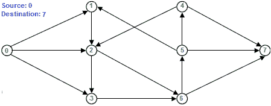

# 查找两个顶点之间的最大边不相交路径的数量

> 原文： [https://www.geeksforgeeks.org/find-edge-disjoint-paths-two-vertices/](https://www.geeksforgeeks.org/find-edge-disjoint-paths-two-vertices/)

给定一个有向图和其中两个顶点（源 s 和目标 t），找出从 s 到 t 的最大边不相交路径数。 如果两条路径不共享任何边，则它们被称为边不相交。



在上图中，从源 0 到目标 7 最多可以有两条边不相交的路径。 两条边不相交的路径在下面以红色突出显示，蓝色分别为 0-2-6-7 和 0-3-6-5-7。


请注意，路径可能不同，但最大数量相同。 例如，在上图中，另一组可能的路径分别是 0-1-2-6-7 和 0-3-6-5-7。

可以通过将其减少到[最大流量问题](https://www.geeksforgeeks.org/ford-fulkerson-algorithm-for-maximum-flow-problem/)来解决此问题。 以下是步骤。
**1）**将给定的源和目标视为流网络中的源和宿。 为每个边分配单位容量。
**2）**运行 Ford-Fulkerson 算法，查找从源到汇的最大流量。
**3）**最大流量等于边不相交路径的最大数量。

当我们运行 Ford-Fulkerson 时，我们将容量减少一个单位。 因此，边不能再次使用。 因此，最大流量等于边不相交路径的最大数量。

以下是上述算法的实现。 大部分代码取自[此处](https://www.geeksforgeeks.org/ford-fulkerson-algorithm-for-maximum-flow-problem/)。

## C / C ++

```

// C++ program to find maximum number of edge disjoint paths 
#include <iostream> 
#include <limits.h> 
#include <string.h> 
#include <queue> 
using namespace std; 

// Number of vertices in given graph 
#define V 8 

/* Returns true if there is a path from source 's' to sink 't' in 
  residual graph. Also fills parent[] to store the path */
bool bfs(int rGraph[V][V], int s, int t, int parent[]) 
{ 
    // Create a visited array and mark all vertices as not visited 
    bool visited[V]; 
    memset(visited, 0, sizeof(visited)); 

    // Create a queue, enqueue source vertex and mark source vertex 
    // as visited 
    queue <int> q; 
    q.push(s); 
    visited[s] = true; 
    parent[s] = -1; 

    // Standard BFS Loop 
    while (!q.empty()) 
    { 
        int u = q.front(); 
        q.pop(); 

        for (int v=0; v<V; v++) 
        { 
            if (visited[v]==false && rGraph[u][v] > 0) 
            { 
                q.push(v); 
                parent[v] = u; 
                visited[v] = true; 
            } 
        } 
    } 

    // If we reached sink in BFS starting from source, then return 
    // true, else false 
    return (visited[t] == true); 
} 

// Returns tne maximum number of edge-disjoint paths from s to t. 
// This function is copy of forFulkerson() discussed at http://goo.gl/wtQ4Ks 
int findDisjointPaths(int graph[V][V], int s, int t) 
{ 
    int u, v; 

    // Create a residual graph and fill the residual graph with 
    // given capacities in the original graph as residual capacities 
    // in residual graph 
    int rGraph[V][V]; // Residual graph where rGraph[i][j] indicates 
                     // residual capacity of edge from i to j (if there 
                     // is an edge. If rGraph[i][j] is 0, then there is not) 
    for (u = 0; u < V; u++) 
        for (v = 0; v < V; v++) 
             rGraph[u][v] = graph[u][v]; 

    int parent[V];  // This array is filled by BFS and to store path 

    int max_flow = 0;  // There is no flow initially 

    // Augment the flow while tere is path from source to sink 
    while (bfs(rGraph, s, t, parent)) 
    { 
        // Find minimum residual capacity of the edges along the 
        // path filled by BFS. Or we can say find the maximum flow 
        // through the path found. 
        int path_flow = INT_MAX; 

        for (v=t; v!=s; v=parent[v]) 
        { 
            u = parent[v]; 
            path_flow = min(path_flow, rGraph[u][v]); 
        } 

        // update residual capacities of the edges and reverse edges 
        // along the path 
        for (v=t; v != s; v=parent[v]) 
        { 
            u = parent[v]; 
            rGraph[u][v] -= path_flow; 
            rGraph[v][u] += path_flow; 
        } 

        // Add path flow to overall flow 
        max_flow += path_flow; 
    } 

    // Return the overall flow (max_flow is equal to maximum 
    // number of edge-disjoint paths) 
    return max_flow; 
} 

// Driver program to test above functions 
int main() 
{ 
    // Let us create a graph shown in the above example 
    int graph[V][V] = { {0, 1, 1, 1, 0, 0, 0, 0}, 
                        {0, 0, 1, 0, 0, 0, 0, 0}, 
                        {0, 0, 0, 1, 0, 0, 1, 0}, 
                        {0, 0, 0, 0, 0, 0, 1, 0}, 
                        {0, 0, 1, 0, 0, 0, 0, 1}, 
                        {0, 1, 0, 0, 0, 0, 0, 1}, 
                        {0, 0, 0, 0, 0, 1, 0, 1}, 
                        {0, 0, 0, 0, 0, 0, 0, 0} 
                      }; 

    int s = 0; 
    int t = 7; 
    cout << "There can be maximum " << findDisjointPaths(graph, s, t) 
         << " edge-disjoint paths from " << s <<" to "<< t ; 

    return 0; 
} 

```