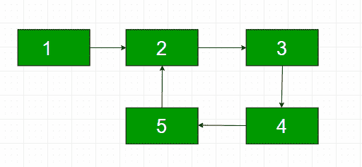

# 使用地图

查找链接列表中的循环长度

编写一个程序，检查给定的链表是否包含循环，如果存在循环，则返回循环中的节点数。 例如，在下面链接的列表中存在一个循环，并且循环的长度为4。如果不存在该循环，则该函数应返回0。



**方法：**在本文中，我们将使用 [**映射**](http://www.geeksforgeeks.org/map-associative-containers-the-c-standard-template-library-stl/) 的概念将[链表](http://www.geeksforgeeks.org/data-structures/linked-list/)中存在的节点的地址存储为 键及其位置作为值。

以下是分步方法：

1.  遍历链表的每个节点，并保持位置从一个开始。 在每个节点之后增加位置。
2.  检查地图中是否存在该节点。
3.  如果地图不包含该节点的地址，则将其及其位置插入地图。
4.  如果地图已经包含该节点的地址，则返回其位置之间的差。
5.  如果找不到这样的节点，则返回0。

下面是上述方法的实现：

## C ++

```

// C++ program to find length of loop
// in a linked list using Map

#include <bits/stdc++.h>
using namespace std;

// Linked List node
struct Node {
    int data;
    struct Node* next;

    Node(int num)
    {
        data = num;
        next = NULL;
    }
};

// Function detects and counts loop
// nodes in the list. If loop is not there,
// then returns 0
int countNodesinLoop(struct Node* head)
{
    struct Node* p = head;
    int pos = 0;

    // Maintain a map to store addresses
    // of node and their position
    unordered_map<Node*, int> m;

    // Traverse through the linked list
    while (p != NULL) {

        // If the node is not present in the map
        if (m.find(p) == m.end()) {
            m[p] = pos;
            pos++;
        }

        // if the node is present
        else {

            // Return difference between
            // position of the present node and
            // position where that node occured before
            return (pos - m[p]);
        }
        p = p->next;
    }

    // Return 0 to indicate
    // there is no loop
    return 0;
}

// Driver code
int main()
{
    // Create nodes of the linked list
    struct Node* head = new Node(1);
    head->next = new Node(2);
    head->next->next = new Node(3);
    head->next->next->next = new Node(4);
    head->next->next->next->next = new Node(5);

    // Create a loop for testing the function
    head->next->next->next->next->next = head->next;

    // Call the function for the above linked list
    cout << countNodesinLoop(head) << endl;

    return 0;
}

```

## 爪哇

```

// Java program to find length of loop
// in a linked list using Map
import java.util.*;
import java.io.*;

class GFG{

static class Node 
{ 
    int data; 
    Node next; 

    // Constructor 
    Node(int num)
    { 
        data = num; 
        next = null; 
    } 
} 

// Function detects and counts loop
// nodes in the list. If loop is not there,
// then returns 0
public static int countNodesinLoop(Node head)
{
    Node p = head;
    int pos = 0;

    // Maintain a map to store addresses
    // of node and their position
    HashMap<Node, 
            Integer> m = new HashMap<Node,
                                     Integer>();

    // Traverse through the linked list
    while (p != null) 
    {

        // If the node is not present in the map
        if (!m.containsKey(p)) 
        {
            m.put(p, pos);
            pos++;
        }

        // If the node is present
        else
        {

            // Return difference between
            // position of the present 
            // node and position where 
            // that node occured before
            return (pos - m.get(p));
        }
        p = p.next;
    }

    // Return 0 to indicate
    // there is no loop
    return 0;
}    

// Driver code
public static void main (String[] args) 
{

      // Create nodes of the linked list
      Node head = new Node(1); 
    head.next = new Node(2);
    head.next.next = new Node(3);
    head.next.next.next = new Node(4);
    head.next.next.next.next = new Node(5);

    // Create a loop for testing the function
    head.next.next.next.next.next = head.next;

    // Call the function for the above linked list
    System.out.println(countNodesinLoop(head));
}
}

// This code is contributed by adityapande88

```

**Output**

```
4

```

**相似的文章：** [使用弗洛伊德循环检测算法](https://www.geeksforgeeks.org/find-length-of-loop-in-linked-list/)
在“链表”中查找循环的长度

注意读者！ 现在不要停止学习。 通过 [**DSA自学课程**](https://practice.geeksforgeeks.org/courses/dsa-self-paced?utm_source=geeksforgeeks&utm_medium=article&utm_campaign=gfg_article_dsa_content_bottom) 以对学生方便的价格掌握所有重要的DSA概念，并为行业做好准备。

* * *

* * *

如果您喜欢GeeksforGeeks并希望做出贡献，则还可以使用 [tribution.geeksforgeeks.org](https://contribute.geeksforgeeks.org/) 撰写文章，或将您的文章邮寄至tribution@geeksforgeeks.org。 查看您的文章出现在GeeksforGeeks主页上，并帮助其他Geeks。

如果您发现任何不正确的地方，请单击下面的“改进文章”按钮，以改进本文。