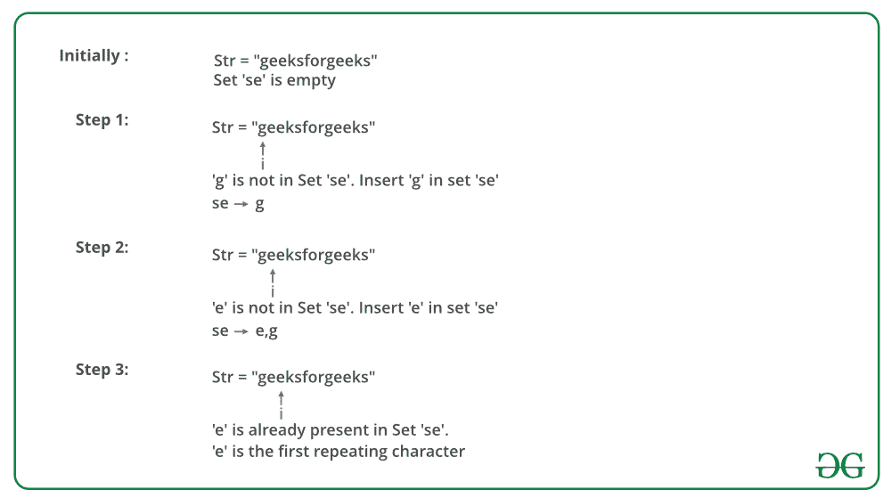

# 查找字符串

中的第一个重复字符

给定一个字符串，找到其中的第一个重复字符。 我们需要找到多次出现并且其**第二次出现**的索引最小的字符。 在中讨论了这个问题的一个变体。

[](https://media.geeksforgeeks.org/wp-content/uploads/find-first-repeated-character-in-a-string.png)

**示例：**

> **输入**：ch =“ geeksforgeeks”
> **输出**：e
> e 是重复的第一个元素
> 
> **输入**：str =“ hello geeks”
> **输出**：l
> l 是第一个重复的元素

**简单解决方案**：解决方案是运行两个嵌套循环。 从左侧开始遍历。 对于每个字符，请检查是否重复。 如果字符重复，则增加重复字符的计数。 当计数变为 K 时，返回字符。

该解决方案的时间复杂度为 O（n <sup>2</sup> ）

我们可以**使用排序**解决 O（n Log n）时间的问题。 以下是详细步骤。

*   将给定的数组复制到辅助数组 temp []。
*   使用 O（N log N）时间排序算法对临时数组进行排序。
*   从左到右扫描输入阵列。 对于每个元素，使用二进制搜索在 temp []中计算其出现次数。 一旦发现一个字符出现多次，我们将返回该字符。

此步骤可以在 O（N Log N）时间完成。

一种有效的**解决方案**是使用哈希技术平均解决 O（N）时间。

*   创建一个空哈希。
*   扫描输入字符串的每个字符，并将值插入哈希中的每个键。
*   当任何一个字符出现多次时，哈希键值将增加 1，然后返回该字符。

下图是上述方法的模拟：



下面是上述方法的实现：

## C / C ++

```

// CPP program to find the first 
// repeated character in a string 
#include <bits/stdc++.h> 
using namespace std; 

// Returns first repeating character in str. 
char firstRepeating(string &str) 
{ 
    // Creates an empty hashset 
    unordered_set<char> h; 

    // Traverse the input array from left to right 
    for (int i=0; i<str.length(); i++) 
    { 
        char c = str[i]; 

        // If element is already in hash set, update x 
        // and then break 
        if (h.find(c) != h.end()) 
            return c; 

        else // Else add element to hash set 
            h.insert(c); 
    } 

    // If there was no repeated character 
    return '\0'; 
} 

// Driver method to test above method 
int main () 
{ 
    string str = "geeksforgeeks"; 
    cout << firstRepeating(str); 
    return 0; 
} 

```

## 爪哇

```

// Java program to find the first 
// repeated character in a string 
import java.util.*; 

class Main 
{ 
    // This function prints the first repeated 
    // character in str[] 
    static char firstRepeating(char str[]) 
    { 
        // Creates an empty hashset 
        HashSet<Character> h = new HashSet<>(); 

        // Traverse the input array from left to right 
        for (int i=0; i<=str.length-1; i++) 
        { 
            char c = str[i]; 

            // If element is already in hash set, update x 
            // and then break 
            if (h.contains(c)) 
                return c; 

            else // Else add element to hash set 
                h.add(c); 
        } 

        return '\0'; 
    } 

    // Driver method to test above method 
    public static void main (String[] args) 
    { 
        String str = "geeksforgeeks"; 
        char[] arr = str.toCharArray(); 
        System.out.println(firstRepeating(arr)); 
    } 
} 

```

## 蟒蛇

```

# Python program to find the first 
# repeated character in a string 
def firstRepeatedChar(str): 

    h = {}  # Create empty hash 

    # Traverse each characters in string 
    # in lower case order 
    for ch in str: 

        # If character is already present 
        # in hash, return char 
        if ch in h: 
            return ch; 

        # Add ch to hash 
        else: 
            h[ch] = 0

    return '\0'

# Driver code 
print(firstRepeatedChar("geeksforgeeks")) 

```

## C＃

```

// C# program to find the first  
// repeated character in a string  
using System; 
using System.Collections.Generic; 

class GFG 
{ 
// This function prints the first  
// repeated character in str[]  
public static char firstRepeating(char[] str) 
{ 
    // Creates an empty hashset  
    HashSet<char> h = new HashSet<char>(); 

    // Traverse the input array  
    // from left to right  
    for (int i = 0; i <= str.Length - 1; i++) 
    { 
        char c = str[i]; 

        // If element is already in hash set,  
        // update x and then break  
        if (h.Contains(c)) 
        { 
            return c; 
        } 

        else // Else add element to hash set 
        { 
            h.Add(c); 
        } 
    } 

    return '\0'; 
} 

// Driver Code 
public static void Main(string[] args) 
{ 
    string str = "geeksforgeeks"; 
    char[] arr = str.ToCharArray(); 
    Console.WriteLine(firstRepeating(arr)); 
} 
} 

// This code is contributed by Shrikant13 

```

## 的 PHP

```

<?php  
// PHP program to find the first repeated 
// character in a string 

// Returns first repeating character in str. 
function firstRepeating($str) 
{ 
    // Creates an empty hashset 
    $h = array(); 

    // Traverse the input array  
    // from left to right 
    for ($i = 0; $i < strlen($str); $i++) 
    { 
        $c = $str[$i]; 

        // If element is already in hash  
        // set, update x and then break 
        if (array_search($c, $h)) 
            return $c; 

        else // Else add element to hash set 
            array_push($h, $c); 
    } 

    // If there was no repeated character 
    return '\0'; 
} 

// Driver Code 
$str = "geeksforgeeks"; 
echo firstRepeating($str); 

// This code is contributed by ita_c 
?> 

```

**Output:**

```
e

```

**类似的问题：** [在字符串](https://www.geeksforgeeks.org/given-a-string-find-its-first-non-repeating-character/)中找到第一个非重复字符。

本文由 **Afzal Ansari** 提供。 如果您喜欢 GeeksforGeeks 并希望做出贡献，则还可以使用 [tribution.geeksforgeeks.org](http://contribute.geeksforgeeks.org) 撰写文章，或将您的文章邮寄至 tribution@geeksforgeeks.org。 查看您的文章出现在 GeeksforGeeks 主页上，并帮助其他 Geeks。

如果发现任何不正确的地方，或者想分享有关上述主题的更多信息，请写评论。

注意读者！ 现在不要停止学习。 通过 [**DSA 自学课程**](https://practice.geeksforgeeks.org/courses/dsa-self-paced?utm_source=geeksforgeeks&utm_medium=article&utm_campaign=gfg_article_dsa_content_bottom) 以对学生方便的价格掌握所有重要的 DSA 概念，并为行业做好准备。