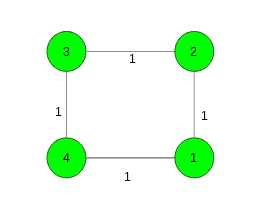
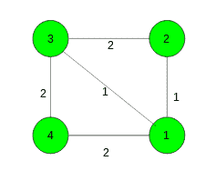

# 查找最小生成树的权重

> 原文： [https://www.geeksforgeeks.org/find-the-weight-of-the-minimum-spanning-tree/](https://www.geeksforgeeks.org/find-the-weight-of-the-minimum-spanning-tree/)

给定一个具有 **N 个节点**和 **M 个边**的连接的无向加权图。 任务是执行给定的查询并找到最小生成树的权重。 查询分为三种类型：

1.  **查询（1）**->查找最小生成树的权重。
2.  **query（2，x，y）**->将节点`x`和`y`到`0`的边的权重更改 。
3.  **query（3，x，y）**->将节点`x`和`y`之间的边权重恢复为其**原始权重[** 。

**示例**：

> **输入**：
> 
> 查询（2，1，2），
> 查询（1），
> 查询（3，1，2），
> 查询 （1）
> **输出**：
> 2
> 3
> 
> **输入**：
> 
> 查询（1），
> 查询（2、3、4），
> 查询（1）
> **输出：[**
> 4
> 2

**方法**：在执行任何查询之前，首先计算初始图的 MST，并将 T 设为该 MST。 关键的观察结果是，在处理查询的任何时候，都可以通过在此点和 T 的权重为零的边上运行 [Kruskal 算法](https://www.geeksforgeeks.org/kruskals-minimum-spanning-tree-algorithm-greedy-algo-2/)来计算当前图形的 MST 权重。 在数据结构中保持权重为零的边，并在查询类型 2 和类型 3 后计算最小生成树的权重。

下面是上述方法的实现：

## C++

```cpp

// C++ implementation of the approach 
#include <bits/stdc++.h> 
using namespace std; 
#define N 2005 

// To store vertices, edges 
// and the required answer 
int n, m, ans; 

// To store parent and rank 
int par[N], Rank[N]; 

// To store edges and the edges in MST 
vector<pair<int, pair<int, int> > > edges, mst; 

// To store the edges with weight zero 
queue<pair<int, int> > zeros; 

// Function for initialize 
void initialize() 
{ 
    for (int i = 0; i <= n; i++) { 
        par[i] = i; 
        Rank[i] = 0; 
    } 
} 

// Function to add edges 
void Add_edge(int u, int v, int weight) 
{ 
    edges.push_back({ weight, { u, v } }); 
} 

// Utility function to find set of an element i 
// (uses path compression technique) 
int find(int x) 
{ 
    if (par[x] != x) 
        par[x] = find(par[x]); 

    return par[x]; 
} 

// Function that performs union of two sets x and y 
// (uses union by rank) 
void Union(int x, int y) 
{ 
    int xroot = find(x); 
    int yroot = find(y); 

    if (Rank[xroot] < Rank[yroot]) 
        par[xroot] = yroot; 
    else if (Rank[xroot] > Rank[yroot]) 
        par[yroot] = xroot; 
    else { 
        par[yroot] = xroot; 
        Rank[xroot]++; 
    } 
} 

// Function to compute minimum spanning tree 
void compute_MST() 
{ 
    // Sort edges in increasing order of weight 
    sort(edges.begin(), edges.end()); 

    // Go through all the edges 
    for (int i = 0; i < m; i++) { 
        int u = find(edges[i].second.first); 
        int v = find(edges[i].second.second); 

        if (u == v) 
            continue; 

        // Build minimum spanning tree 
        // and store minimum cost 
        mst.push_back(edges[i]); 
        ans += edges[i].first; 
        Union(u, v); 
    } 
} 

// Function to find the cost of minimum 
// spanning tree 
void Modified_Kruskal(pair<int, int> x) 
{ 
    initialize(); 

    // Make answer zero 
    ans = 0; 
    int sz = zeros.size(); 

    // Keep the edges which only have zero weights 
    // and remove all the other edges 
    for (int i = 0; i < sz; i++) { 
        pair<int, int> Front = zeros.front(); 
        zeros.pop(); 

        if (Front.first == x.first 
            and Front.second == x.second) 
            continue; 

        // Make union between the vertices of 
        // edges which have weight zero and keep 
        // them in queue 
        Union(Front.first, Front.second); 
        zeros.push(Front); 
    } 

    // Find the cost of the minimum spanning tree 
    for (int i = 0; i < mst.size(); i++) { 
        int u = find(mst[i].second.first); 
        int v = find(mst[i].second.second); 

        if (u == v) 
            continue; 

        ans += mst[i].first; 
        Union(u, v); 
    } 
} 

// Function to handle different queries 
void query(int type, int u = 0, int v = 0) 
{ 

    // Update edge weight to 0 
    if (type == 2) { 
        // push edge in zeros 
        zeros.push({ u, v }); 
        Modified_Kruskal({ -1, -1 }); 
    } 

    // Restore edge weight to original value 
    else if (type == 3) { 
        // push edge in zeros 
        zeros.push({ u, v }); 
        Modified_Kruskal({ u, v }); 
    } 
    else
        cout << ans << endl; 
} 

// Driver code 
int main() 
{ 

    // Number of nodes and edges 
    n = 4, m = 4; 
    initialize(); 

    // Add edges 
    Add_edge(1, 2, 1); 
    Add_edge(2, 3, 1); 
    Add_edge(3, 4, 1); 
    Add_edge(4, 1, 1); 

    // Build the minimum spanning tree 
    compute_MST(); 

    // Execute queries 
    query(2, 1, 2); 
    query(1); 
    query(3, 1, 2); 
    query(1); 

    return 0; 
} 

```

## Python

```py

# Python3 implementation of the approach 
from collections import deque 

N = 2005

# To store vertices, edges 
# and the required answer 
n, m, ans = 0, 0, 0

# To store parent and rank 
par = [0] * N 
Rank = [0] * N 

# To store edges and the edges in MST 
edges, mst = [], [] 

# To store the edges with weight zero 
zeroes = deque() 

# Function for initialize 
def initialize(): 
    for i in range(n + 1): 
        par[i] = i 
        Rank[i] = 0

# Function to add edges 
def add_edge(u: int, v: int, weight: int): 
    edges.append((weight, (u, v))) 

# Utility function to find set of an element i 
# (uses path compression technique) 
def find(x: int) -> int: 
    if par[x] != x: 
        par[x] = find(par[x]) 
    return par[x] 

# Function that performs union of two sets x and y 
# (uses union by rank) 
def union(x: int, y: int): 
    xroot = find(x) 
    yroot = find(y) 

    if Rank[xroot] < Rank[yroot]: 
        par[xroot] = yroot 
    elif Rank[xroot] > Rank[yroot]: 
        par[yroot] = xroot 
    else: 
        par[yroot] = xroot 
        Rank[xroot] += 1

# Function to compute minimum spanning tree 
def compute_MST(): 
    global ans 

    # Sort edges in increasing order of weight 
    edges.sort() 

    # Go through all the edges 
    for i in range(m): 
        u = find(edges[i][1][0]) 
        v = find(edges[i][1][1]) 

        if u == v: 
            continue

        # Build minimum spanning tree 
        # and store minimum cost 
        mst.append(edges[i]) 
        ans += edges[i][0] 
        union(u, v) 

# Function to find the cost of minimum 
# spanning tree 
def modified_kruskal(x): 
    global ans 
    initialize() 

    # Make answer zero 
    ans = 0
    sz = len(zeroes) 

    # Keep the edges which only have zero weights 
    # and remove all the other edges 
    for i in range(sz): 
        front = zeroes[0] 
        zeroes.popleft() 

        if front[0] == x[0] and front[1] == x[1]: 
            continue

        # Make union between the vertices of 
        # edges which have weight zero and keep 
        # them in queue 
        union(front[0], front[1]) 
        zeroes.append(front) 

    # Find the cost of the minimum spanning tree 
    for i in range(len(mst)): 
        u = find(mst[i][1][0]) 
        v = find(mst[i][1][1]) 

        if u == v: 
            continue
        ans += mst[i][0] 
        union(u, v) 

# Function to handle different queries 
def query(type: int, u=0, v=0): 
    global ans 

    # Update edge weight to 0 
    if type == 2: 

        # push edge in zeros 
        zeroes.append((u, v)) 
        modified_kruskal((-1, -1)) 

    # Restore edge weight to original value 
    elif type == 3: 

        # push edge in zeros 
        zeroes.append((u, v)) 
        modified_kruskal((u, v)) 
    else: 
        print(ans) 

# Driver Code 
if __name__ == "__main__": 

    # Number of nodes and edges 
    n = 4
    m = 4
    initialize() 

    # Add edges 
    add_edge(1, 2, 1) 
    add_edge(2, 3, 1) 
    add_edge(3, 4, 1) 
    add_edge(4, 1, 1) 

    # Build the minimum spanning tree 
    compute_MST() 

    # Execute queries 
    query(2, 1, 2) 
    query(1) 
    query(3, 1, 2) 
    query(1) 

# This code is contributed by 
# sanjeev2552 

```

**Output:**

```
2
3

```


* * *

* * *

如果您喜欢 GeeksforGeeks 并希望做出贡献，则还可以使用 [tribution.geeksforgeeks.org](https://contribute.geeksforgeeks.org/) 撰写文章，或将您的文章邮寄至 tribution@geeksforgeeks.org。 查看您的文章出现在 GeeksforGeeks 主页上，并帮助其他 Geeks。

如果您发现任何不正确的地方，请单击下面的“改进文章”按钮，以改进本文。