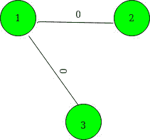

# 在边权重为 0 或 1 的完整图形中查找 MST 的权重

> 原文： [https://www.geeksforgeeks.org/find-weight-of-mst-in-a-complete-graph-with-edge-weights-either-0-or-1/](https://www.geeksforgeeks.org/find-weight-of-mst-in-a-complete-graph-with-edge-weights-either-0-or-1/)

给定`N`个顶点的无向加权完整[图](https://www.geeksforgeeks.org/graph-and-its-representations/)。 确切有**个 M** 边的权重为 1，其余所有可能的边的权重为 0。[数组](https://www.geeksforgeeks.org/array-data-structure/) **arr [] []** 给出了一组权重的边 1.任务是计算此[图](https://www.geeksforgeeks.org/graph-and-its-representations/)的[最小生成树](https://www.geeksforgeeks.org/prims-minimum-spanning-tree-mst-greedy-algo-5/)的总权重。

**范例**：

> **输入**：N = 6，M = 11，arr [] [] = {（1 3），（1 4），（1 5），（1 6），（2 3），（2 4），（2 5），（2 6），（3 4），（3 5），（3 6）}
> **输出**：2
> **说明**：
> 这是给定图的最小生成树：
> 
> 
> 
> **输入**：N = 3，M = 0，arr [] [] {}
> **输出**：0
> **说明**：
> 这 是给定图的最小生成树：
> 
> 

**方法**：

对于 **N 个**节点的给定[图](https://www.geeksforgeeks.org/graph-and-its-representations/)作为[连接组件](https://www.geeksforgeeks.org/connected-components-in-an-undirected-graph/)，我们需要 **N-1 **1 个权重**边的**边。 以下是步骤：

1.  将权重为 1 的所有边的给定[图](https://www.geeksforgeeks.org/graph-and-its-representations/)存储在[映射](http://www.geeksforgeeks.org/map-associative-containers-the-c-standard-template-library-stl/)中。

2.  使用[设置](http://www.geeksforgeeks.org/set-in-cpp-stl/)来存储不包含在任何 **0 权重** [连接的组件](https://www.geeksforgeeks.org/connected-components-in-an-undirected-graph/)中的顶点。

3.  对于当前存储在[集](http://www.geeksforgeeks.org/set-in-cpp-stl/)中的每个顶点，执行 [DFS 遍历](https://www.geeksforgeeks.org/depth-first-search-or-dfs-for-a-graph/)并将组件数增加 1，并从 [DFS 遍历](https://www.geeksforgeeks.org/depth-first-search-or-dfs-for-a-graph/)中删除所有访问的顶点 [设置](http://www.geeksforgeeks.org/set-in-cpp-stl/)。

4.  在 [DFS 遍历](https://www.geeksforgeeks.org/depth-first-search-or-dfs-for-a-graph/)期间，将[向量](http://www.geeksforgeeks.org/vector-in-cpp-stl/)中的 **0 权重**顶点和另一个[集](http://www.geeksforgeeks.org/set-in-cpp-stl/)中的 1 权重顶点包括在内。 对[向量](http://www.geeksforgeeks.org/vector-in-cpp-stl/)中包含的所有顶点运行 [DFS 遍历](https://www.geeksforgeeks.org/depth-first-search-or-dfs-for-a-graph/)。

5.  然后，将最小生成树的总权重指定为组件数– 1。

下面是上述方法的实现：

## C++

```cpp

// C++ Program to find weight of
// minimum spanning tree in a
// complete graph where edges
// have weight either 0 or 1
#include <bits/stdc++.h>
using namespace std;

// To store the edges of the given
// graph
map<int, int> g[200005];
set<int> s, ns;

// A utility function to perform
// DFS Traversal
void dfs(int x)
{
    vector<int> v;
    v.clear();
    ns.clear();

    // Check those vertices which
    // are stored in the set
    for (int it : s) {
        // Vertices are included if
        // the weight of edge is 0
        if (!g[x][it]) {
            v.push_back(it);
        }
        else {
            ns.insert(it);
        }
    }
    s = ns;
    for (int i : v) {
        dfs(i);
    }
}

// A utility function to find the
// weight of Minimum Spanning Tree
void weightOfMST(int N)
{
    // To count the connected
    // components
    int cnt = 0;

    // Inserting the initial vertices
    // in the set
    for (int i = 1; i <= N; ++i) {
        s.insert(i);
    }

    // Traversing vertices stored in
    // the set and Run DFS Traversal
    // for each vertices
    for (; s.size();) {

        // Incrementing the zero
        // weight connected components
        ++cnt;

        int t = *s.begin();
        s.erase(t);

        // DFS Traversal for every
        // vertex remove
        dfs(t);
    }

    cout << cnt - 1;
}

// Driver's Code
int main()
{
    int N = 6, M = 11;
    int edges[][] = { { 1, 3 }, { 1, 4 },
                      { 1, 5 }, { 1, 6 },
                      { 2, 3 }, { 2, 4 }, 
                      { 2, 5 }, { 2, 6 }, 
                      { 3, 4 }, { 3, 5 }, 
                      { 3, 6 } };

    // Insert edges
    for (int i = 0; i < M; ++i) {
        int u = edges[i][0];
        int v = edges[i][1];
        g[u][v] = 1;
        g[v][u] = 1;
    }

    // Function call find the weight
    // of Minimum Spanning Tree
    weightOfMST(N);
    return 0;
}

```

## Java

```java

// Java Program to find weight of 
// minimum spanning tree in a 
// complete graph where edges 
// have weight either 0 or 1 
import java.util.*;

class GFG{

// To store the edges 
// of the given graph
static HashMap<Integer, 
               Integer>[] g = 
               new HashMap[200005];
static HashSet<Integer> s = 
               new HashSet<>();
static HashSet<Integer> ns = 
               new HashSet<>();

// A utility function to 
// perform DFS Traversal
static void dfs(int x) 
{
  Vector<Integer> v = new Vector<>();
  v.clear();
  ns.clear();

  // Check those vertices which
  // are stored in the set
  for (int it : s) 
  {
    // Vertices are included if
    // the weight of edge is 0
    if (g[x].get(it) != null) 
    {
      v.add(it);
    } 
    else
    {
      ns.add(it);
    }
  }

  s = ns;

  for (int i : v) 
  {
    dfs(i);
  }
}

// A utility function to find the
// weight of Minimum Spanning Tree
static void weightOfMST(int N) 
{
  // To count the connected
  // components
  int cnt = 0;

  // Inserting the initial vertices
  // in the set
  for (int i = 1; i <= N; ++i) 
  {
    s.add(i);
  }

  Vector<Integer> qt = new Vector<>();

  for (int t : s)
    qt.add(t);

  // Traversing vertices stored in
  // the set and Run DFS Traversal
  // for each vertices
  while (!qt.isEmpty()) 
  {
    // Incrementing the zero
    // weight connected components
    ++cnt;
    int t = qt.get(0);
    qt.remove(0);

    // DFS Traversal for every
    // vertex remove
    dfs(t);
  }

  System.out.print(cnt - 4);
}

// Driver's Code
public static void main(String[] args) 
{
  int N = 6, M = 11;
  int edges[][] = {{1, 3}, {1, 4}, 
                   {1, 5}, {1, 6}, 
                   {2, 3}, {2, 4}, 
                   {2, 5}, {2, 6}, 
                   {3, 4}, {3, 5}, 
                   {3, 6}};

  for (int i = 0; i < g.length; i++)
    g[i] = new HashMap<Integer, 
                       Integer>();
  // Insert edges
  for (int i = 0; i < M; ++i) 
  {
    int u = edges[i][0];
    int v = edges[i][1];
    g[u].put(v, 1);
    g[v].put(u, 1);

  }

  // Function call find the weight
  // of Minimum Spanning Tree
  weightOfMST(N);
}
}

// This code is contributed by gauravrajput1

```

**Output:** 

```
2

```

**时间复杂度**：O（N * log N + M），其中 N 是顶点数，M 是边数。


* * *

* * *

如果您喜欢 GeeksforGeeks 并希望做出贡献，则还可以使用 [tribution.geeksforgeeks.org](https://contribute.geeksforgeeks.org/) 撰写文章，或将您的文章邮寄至 tribution@geeksforgeeks.org。 查看您的文章出现在 GeeksforGeeks 主页上，并帮助其他 Geeks。

如果您发现任何不正确的地方，请单击下面的“改进文章”按钮，以改进本文。