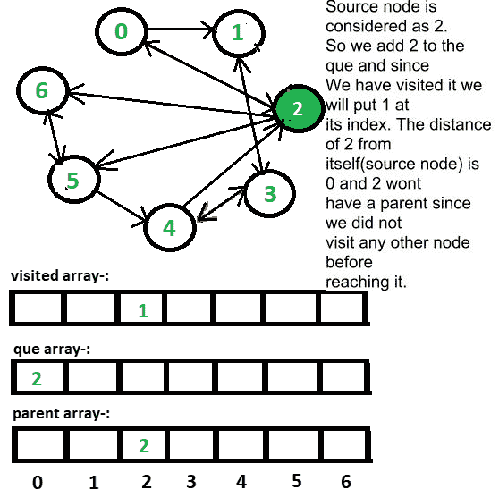
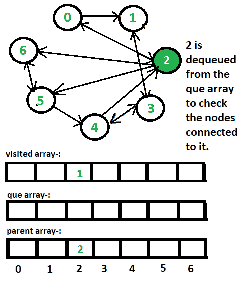
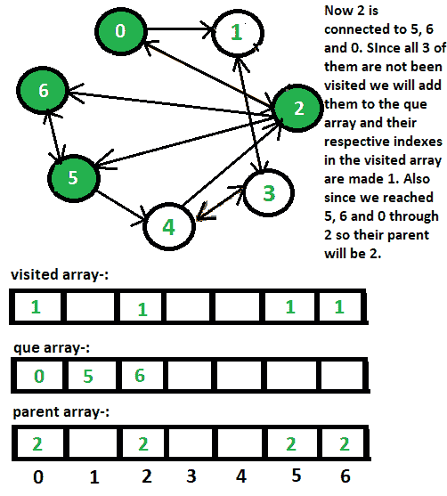
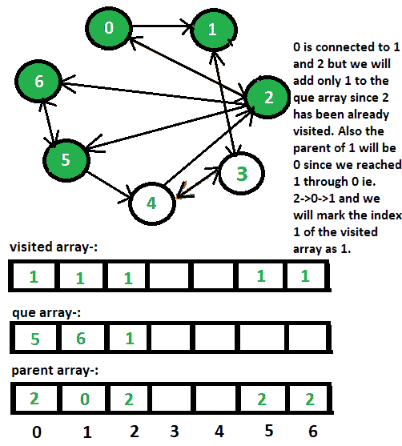
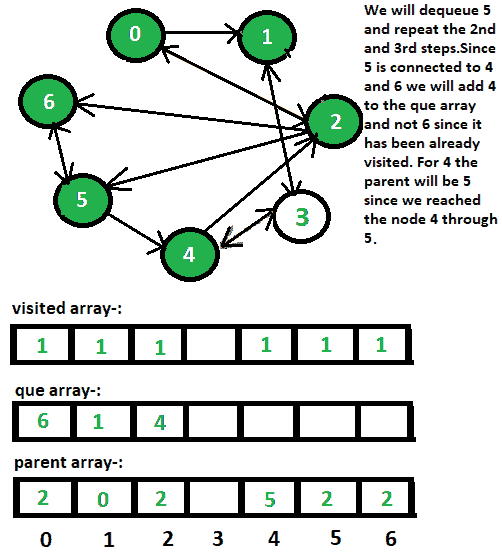
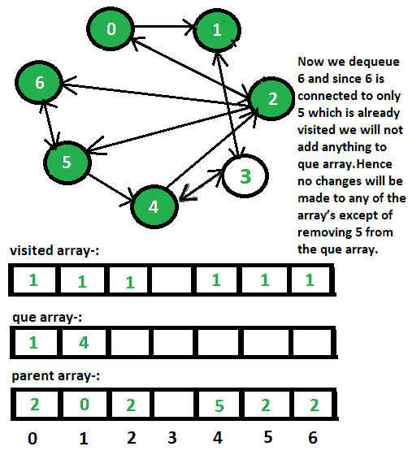
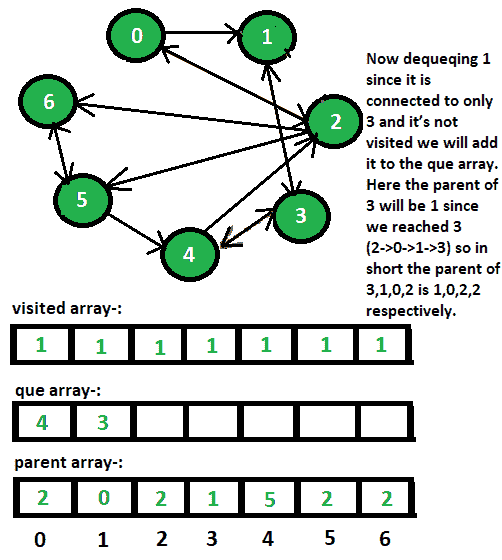
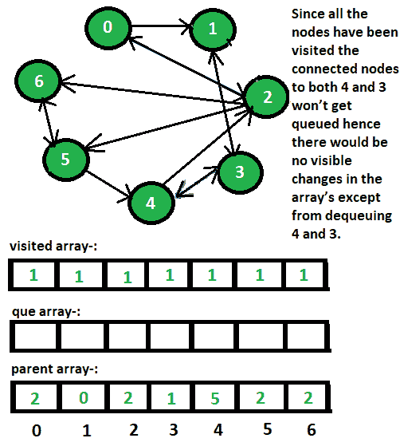

# 使用 BFS 查找从一个顶点到其余顶点的路径

> 原文： [https://www.geeksforgeeks.org/finding-the-path-from-one-vertex-to-rest-using-bfs/](https://www.geeksforgeeks.org/finding-the-path-from-one-vertex-to-rest-using-bfs/)

给定有向图的邻接列表表示，任务是使用 [BFS](http://www.geeksforgeeks.org/breadth-first-traversal-for-a-graph/) 查找从源到图中每个其他节点的路径。

**示例**：

```
Input:

Output:
0 <- 2
1 <- 0 <- 2
2
3 <- 1 <- 0 <- 2
4 <- 5 <- 2
5 <- 2
6 <- 2

```

**方法**：在以下图像中：

*   **que []** 数组存储到达的顶点，只有在尚未考虑所有顶点的情况下，**才将**的顶点排入队列，**将其排入**的顶点。 。
*   为了区分是否已访问该节点，我们将在相应的索引处将 **Visited []** 数组中的`1`放在相应的索引处，以表明该节点已被访问，并且是否在给定的索引`0`存在，表示尚未访问它。
*   父数组是存储每个顶点的父节点。 对于前。 如果 0 连接到 2，则 2 将是 0 的父节点，我们将 2 放在父数组的索引 0 处。

<center>








</center>

下面是上述方法的实现：

## Java

```java

// Java implementation of the approach 
import java.util.ArrayList; 
import java.util.Arrays; 
import java.util.List; 

class GFG { 

    // Function to print the path from 
    // source (s) to destination (d) 
    static void print(int parent[], int s, int d) 
    { 
        // The while loop will stop only when the 
        // destination and the source node become equal 
        while (s != d) { 

            // Print the destination and store the parent 
            // of the node in the destination since parent 
            // stores the node through which 
            // the current node has been reached 
            System.out.print(d + " <- "); 
            d = parent[d]; 
        } 

        System.out.println(d); 
    } 

    // Finding Path using BFS ALgorithm 
    static void bfs(List<List<Integer> > adjList, int source, int n) 
    { 
        int parent[] = new int[n]; 
        int que[] = new int[n]; 
        Arrays.fill(parent, 0); 
        Arrays.fill(que, 0); 

        int front = -1, rear = -1; 
        int visited[] = new int[n]; 
        Arrays.fill(visited, 0); 
        visited = 1; 
        parent = source; 

        // To add any non visited node we will increment the rear 
        // and add that vertex to the end of the array (enqueuing) 
        que[++rear] = source; 

        int k; 

        // The loop will continue till the rear and front are equal 
        while (front != rear) { 

            // Here Dequeuing is nothing but to increment the front int 
            k = que[++front]; 
            List<Integer> list = adjList.get(k); 
            for (int i = 0; i < list.size(); i++) { 
                int j = list.get(i); 
                if (visited[j] == 0) { 
                    que[++rear] = j; 
                    visited[j] = 1; 
                    parent[j] = k; 
                } 
            } 
        } 

        // Print the path from source to every other node 
        for (k = 0; k < n; k++) 
            print(parent, source, k); 
    } 

    // Driver code 
    public static void main(String args[]) 
    { 

        // Adjacency list representation of the graph 
        List<List<Integer> > adjList = new ArrayList<>(); 

        // Vertices 1 and 2 have an incoming edge 
        // from vertex 0 
        List<Integer> tmp = new ArrayList<Integer>(Arrays.asList(1, 2)); 
        adjList.add(tmp); 

        // Vertex 3 has an incoming edge from vertex 1 
        tmp = new ArrayList<Integer>(Arrays.asList(3)); 
        adjList.add(tmp); 

        // Vertices 0, 5 and 6 have an incoming 
        // edge from vertex 2 
        tmp = new ArrayList<Integer>(Arrays.asList(0, 5, 6)); 
        adjList.add(tmp); 

        // Vertices 1 and 4 have an incoming edge 
        // from vertex 3 
        tmp = new ArrayList<Integer>(Arrays.asList(1, 4)); 
        adjList.add(tmp); 

        // Vertices 2 and 3 have an incoming edge 
        // from vertex 4 
        tmp = new ArrayList<Integer>(Arrays.asList(2, 3)); 
        adjList.add(tmp); 

        // Vertices 4 and 6 have an incoming edge 
        // from vertex 5 
        tmp = new ArrayList<Integer>(Arrays.asList(4, 6)); 
        adjList.add(tmp); 

        // Vertex 5 has an incoming edge from vertex 6 
        tmp = new ArrayList<Integer>(Arrays.asList(5)); 
        adjList.add(tmp); 

        int n = adjList.size(); 

        int source = 2; 
        bfs(adjList, source, n); 
    } 
} 

```

## Python3

```

# Python3 implementation of the approach  

# Function to print the path from  
# src (s) to destination (d)  
def printfunc(parent, s, d):  

    # The while loop will stop only when  
    # the destination and the src node  
    # become equal  
    while s != d:  

        # Print the destination and store  
        # the parent of the node in the  
        # destination since parent stores 
        # the node through which the current 
        # node has been reached  
        print(str(d) + " <-", end = " ")  
        d = parent[d]  

    print(d)  

# Finding Path using BFS ALgorithm  
def bfs(adjList, src, n):  

    parent = [0] * (n)  
    que = [0] * (n)  

    front, rear = -1, -1
    visited = [0] * (n)  
    visited[src] = 1
    parent[src] = src 

    # To add any non visited node we will  
    # increment the rear and add that vertex  
    # to the end of the array (enqueuing)  
    rear += 1
    que[rear] = src  

    # The loop will continue till the rear  
    # and front are equal  
    while front != rear:  

        # Here Dequeuing is nothing but to 
        # increment the front int  
        front += 1
        k = que[front]  
        List = adjList[k]  
        for i in range(0, len(List)):  
            j = List[i] 

            if visited[j] == 0: 
                rear += 1
                que[rear] = j  
                visited[j] = 1
                parent[j] = k  

    # Print the path from src to every  
    # other node  
    for k in range(0, n):  
        printfunc(parent, src, k)  

# Driver code  
if __name__ == "__main__":  

    # Adjacency list representation 
    # of the graph  
    adjList = []  

    # Vertices 1 and 2 have an incoming edge  
    # from vertex 0  
    adjList.append([1, 2])  

    # Vertex 3 has an incoming edge  
    # from vertex 1  
    adjList.append([3])  

    # Vertices 0, 5 and 6 have an incoming  
    # edge from vertex 2  
    adjList.append([0, 5, 6])  

    # Vertices 1 and 4 have an incoming edge  
    # from vertex 3  
    adjList.append([1, 4])  

    # Vertices 2 and 3 have an incoming edge  
    # from vertex 4  
    adjList.append([2, 3])  

    # Vertices 4 and 6 have an incoming edge  
    # from vertex 5  
    adjList.append([4, 6])  

    # Vertex 5 has an incoming edge  
    # from vertex 6  
    adjList.append([5])  

    n = len(adjList)  

    src = 2
    bfs(adjList, src, n)  

# This code is contributed by Rituraj Jain 

```

**Output:**

```
0 <- 2
1 <- 0 <- 2
2
3 <- 1 <- 0 <- 2
4 <- 5 <- 2
5 <- 2
6 <- 2

```


* * *

* * *

如果您喜欢 GeeksforGeeks 并希望做出贡献，则还可以使用 [tribution.geeksforgeeks.org](https://contribute.geeksforgeeks.org/) 撰写文章，或将您的文章邮寄至 tribution@geeksforgeeks.org。 查看您的文章出现在 GeeksforGeeks 主页上，并帮助其他 Geeks。

如果您发现任何不正确的地方，请单击下面的“改进文章”按钮，以改进本文。