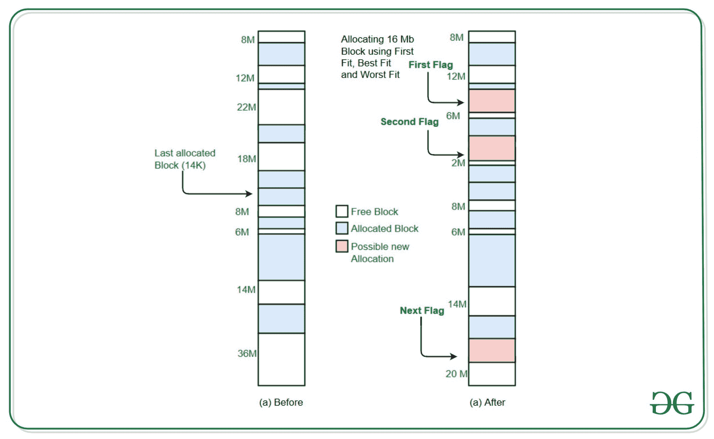

# 使用链接列表

的内存管理中的First Fit算法

**用于内存管理的首选算法：**分配了足以容纳该进程的第一内存分区。

在此[文章](https://www.geeksforgeeks.org/program-first-fit-algorithm-memory-management/?ref=rp)中，我们已经讨论了使用[数组](https://www.geeksforgeeks.org/introduction-to-arrays/)的首次拟合算法。 但是，这里我们将研究使用链表的另一种方法，其中也可以删除分配的节点。

**示例：**

```
Input: blockSize[] = {100, 500, 200}
        processSize[] = {417, 112, 426, 95} 
Output:
Block of size 426 can't be allocated
Tag    Block ID    Size
0         1        417
1         2        112
2         0        95
After deleting block with tag id 0.
Tag    Block ID    Size
1         2        112
2         0        95
3         1        426

```

[](https://media.geeksforgeeks.org/wp-content/uploads/20200528181214/fkjd.jpg)

**方法：**想法是使用带有唯一标签ID的存储块。 为每个大小不同的进程提供了块ID（表示它们属于哪个内存块），以及唯一的标记ID（用于删除特定进程以释放空间）。 创建一个给定的内存块大小的空闲列表和已分配的进程列表。

**创建分配的列表：**
通过找到具有足够大小来分配内存的第一个内存块，创建给定进程大小的分配列表。 如果找不到该内存块，则只需打印它即可。 否则，创建一个节点并将其添加到分配的链表中。

**删除进程：**
每个进程都有唯一的标签ID。 从分配的链表中删除流程节点，以释放一些空间供其他流程使用。 删除后，使用已删除节点的块ID来增加空闲列表中的内存块大小。

下面是该方法的实现：

## C / C++

```cpp

// C++ implementation of the First 
// sit memory management algorithm 
// using linked list 

#include <bits/stdc++.h> 
using namespace std; 

// Two global counters 
int g = 0, k = 0; 

// Structure for free list 
struct free { 
    int tag; 
    int size; 
    struct free* next; 
}* free_head = NULL, *prev_free = NULL; 

// Structure for allocated list 
struct alloc { 
    int block_id; 
    int tag; 
    int size; 
    struct alloc* next; 
}* alloc_head = NULL, *prev_alloc = NULL; 

// Function to create free 
// list with given sizes 
void create_free(int c) 
{ 
    struct free* p = (struct free*) 
        malloc(sizeof(struct free)); 
    p->size = c; 
    p->tag = g; 
    p->next = NULL; 
    if (free_head == NULL) 
        free_head = p; 
    else
        prev_free->next = p; 
    prev_free = p; 
    g++; 
} 

// Function to print free list which 
// prints free blocks of given sizes 
void print_free() 
{ 
    struct free* p = free_head; 
    cout << "Tag\tSize\n"; 
    while (p != NULL) { 
        cout << p->tag << "\t"
             << p->size << "\n"; 
        p = p->next; 
    } 
} 

// Function to print allocated list which 
// prints allocated blocks and their block ids 
void print_alloc() 
{ 
    struct alloc* p = alloc_head; 
    cout << "Tag\tBlock ID\tSize\n"; 
    while (p != NULL) { 
        cout << p->tag << "\t  "
             << p->block_id << "\t\t"
             << p->size << "\n"; 
        p = p->next; 
    } 
} 

// Function to allocate memory to 
// blocks as per First fit algorithm 
void create_alloc(int c) 
{ 
    // create node for process of given size 
    struct alloc* q = (struct alloc*) 
        malloc(sizeof(struct alloc)); 
    q->size = c; 
    q->tag = k; 
    q->next = NULL; 
    struct free* p = free_head; 

    // Iterate to find first memory 
    // block with appropriate size 
    while (p != NULL) { 
        if (q->size <= p->size) 
            break; 
        p = p->next; 
    } 

    // Node found to allocate 
    if (p != NULL) { 
        // Adding node to allocated list 
        q->block_id = p->tag; 
        p->size -= q->size; 
        if (alloc_head == NULL) 
            alloc_head = q; 
        else { 
            prev_alloc = alloc_head; 
            while (prev_alloc->next != NULL) 
                prev_alloc = prev_alloc->next; 
            prev_alloc->next = q; 
        } 
        k++; 
    } 
    else // Node found to allocate space from 
        cout << "Block of size " << c 
             << " can't be allocated\n"; 
} 

// Function to delete node from 
// allocated list to free some space 
void delete_alloc(int t) 
{ 
    // Standard delete function 
    // of a linked list node 
    struct alloc *p = alloc_head, *q = NULL; 

    // First, find the node according 
    // to given tag id 
    while (p != NULL) { 
        if (p->tag == t) 
            break; 
        q = p; 
        p = p->next; 
    } 
    if (p == NULL) 
        cout << "Tag ID doesn't exist\n"; 
    else if (p == alloc_head) 
        alloc_head = alloc_head->next; 
    else
        q->next = p->next; 
    struct free* temp = free_head; 
    while (temp != NULL) { 
        if (temp->tag == p->block_id) { 
            temp->size += p->size; 
            break; 
        } 
        temp = temp->next; 
    } 
} 

// Driver Code 
int main() 
{ 
    int blockSize[] = { 100, 500, 200 }; 
    int processSize[] = { 417, 112, 426, 95 }; 
    int m = sizeof(blockSize) 
            / sizeof(blockSize[0]); 
    int n = sizeof(processSize) 
            / sizeof(processSize[0]); 

    for (int i = 0; i < m; i++) 
        create_free(blockSize[i]); 

    for (int i = 0; i < n; i++) 
        create_alloc(processSize[i]); 

    print_alloc(); 

    // Block of tag id 0 deleted 
    // to free space for block of size 426 
    delete_alloc(0); 

    create_alloc(426); 
    cout << "After deleting block"
         << " with tag id 0.\n"; 
    print_alloc(); 
} 

```

**Output:**

```
Block of size 426 can't be allocated
Tag    Block ID    Size
0      1        417
1      2        112
2      0        95
After deleting block with tag id 0.
Tag    Block ID    Size
1      2        112
2      0        95
3      1        426

```


* * *

* * *

如果您喜欢GeeksforGeeks并希望做出贡献，则还可以使用 [tribution.geeksforgeeks.org](https://contribute.geeksforgeeks.org/) 撰写文章，或将您的文章邮寄至tribution@geeksforgeeks.org。 查看您的文章出现在GeeksforGeeks主页上，并帮助其他Geeks。

如果您发现任何不正确的地方，请单击下面的“改进文章”按钮，以改进本文。