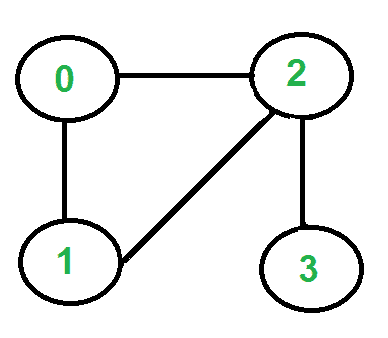
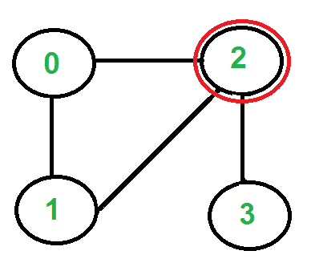
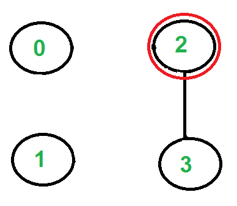

# Fleury 的欧拉路径或电路打印算法

> 原文： [https://www.geeksforgeeks.org/fleurys-algorithm-for-printing-eulerian-path/](https://www.geeksforgeeks.org/fleurys-algorithm-for-printing-eulerian-path/)

[欧拉路径](http://en.wikipedia.org/wiki/Eulerian_path)是图中的一条路径，该路径恰好访问每个边一次。 欧拉回路是一条始于和终止于同一顶点的欧拉路径。

强烈建议您先阅读以下有关 Euler 路径和电路的文章。

[https://www.geeksforgeeks.org/eulerian-path-and-circuit/](https://www.geeksforgeeks.org/eulerian-path-and-circuit/)

在上述文章中，我们讨论了找出给定图是否为欧拉图的问题。 在这篇文章中，讨论了打印欧拉路径或电路的算法。

以下是 Fleury 的用于打印欧拉足迹或自行车道的算法（来源 [Ref1](http://www.math.ku.edu/~jmartin/courses/math105-F11/Lectures/chapter5-part2.pdf) ）。

**1\.** 确保图形具有 0 或 2 个奇数顶点。

**2\.** 如果有 0 个奇数顶点，则从任何地方开始。 如果有 2 个奇数顶点，则从其中一个开始。

**3\.** 一次跟随一条边。 如果您在桥接器和非桥接器之间进行选择，则*始终选择非桥接器*。

**4\.** 边用尽时停止。

这个想法是， ***“不要燃烧[桥](https://www.geeksforgeeks.org/bridge-in-a-graph/)“*** ，以便我们可以回到顶点并遍历其余边。 例如，让我们考虑下图。



有两个奇数度的顶点“ 2”和“ 3”，我们可以从任何一个开始。 让我们从顶点“ 2”开始浏览。

 

从顶点“ 2”伸出三个边，该选哪个？ 我们没有选择边“ 2-3”，因为那是一座桥梁（我们将无法回到“ 3”）。 我们可以选择其余两个边中的任意一个。 假设我们选择“ 2-0”。 我们删除该边并移至顶点“ 0”。

 

顶点“ 0”只有一个边，因此我们将其选中，将其删除，然后移至顶点“ 1”。 欧拉巡回赛成为“ 2-0 0-1”。


顶点“ 1”只有一个边，因此我们将其选中，将其删除，然后移至顶点“ 2”。 欧拉巡回演唱会变成“ 2-0 0-1 1-2”



同样，从顶点 2 开始只有一条边，因此我们将其选中，将其删除，然后移至顶点 3。 HTG3]

没有更多的边了，所以我们在这里停止。 最终巡回演出是“ 2-0 0-1 1-2 2-3”。

有关更多示例，请参见[此](http://www.math.ku.edu/~jmartin/courses/math105-F11/Lectures/chapter5-part2.pdf)和[此](http://www.austincc.edu/powens/+Topics/HTML/05-6/05-6.html)。

以下是上述算法的 C++实现。 在以下代码中，假定给定的图形具有欧拉径或电路。 主要重点是打印欧拉小径或电路。 我们可以使用 [isEulerian（）](https://www.geeksforgeeks.org/eulerian-path-and-circuit/)首先检查给定图中是否有 Eulerian Trail 或 Circuit。

我们首先找到起点，该起点必须是奇数个顶点（如果有奇数个顶点），并将其存储在变量“ u”中。 如果奇数顶点为零，则从顶点“ 0”开始。 我们调用 printEulerUtil（）从 u 开始打印 Euler 游览。 我们遍历 u 的所有相邻顶点，如果只有一个相邻顶点，我们会立即考虑。 如果相邻顶点不止一个，则仅当边 u-v 不是桥时才考虑相邻 v。 如何查找给定的边是否为桥？ 我们计算从 u 可到达的顶点数。 我们删除边 u-v，并再次从 u 计算可达顶点的数量。 如果可到达的顶点数量减少，则边 u-v 是桥。 为了计算可到达的顶点，我们可以使用 BFS 或 DFS，我们在上面的代码中使用了 DFS。 函数 DFSCount（u）返回可从 u 到达的顶点数。

处理完一条边后（包括在 Euler 游览中），我们将其从图形中删除。 要删除边，我们在邻接列表中将顶点条目替换为-1。 请注意，仅删除节点可能不起作用，因为代码是递归的，并且父调用可能在邻接列表的中间。

## C / C++

```

// A C++ program print Eulerian Trail in a given Eulerian or Semi-Eulerian Graph 
#include <iostream> 
#include <string.h> 
#include <algorithm> 
#include <list> 
using namespace std; 

// A class that represents an undirected graph 
class Graph 
{ 
  int V;    // No. of vertices 
  list<int> *adj;    // A dynamic array of adjacency lists 
public: 
    // Constructor and destructor 
  Graph(int V)  { this->V = V;  adj = new list<int>[V];  } 
  ~Graph()      { delete [] adj;  } 

  // functions to add and remove edge 
  void addEdge(int u, int v) {  adj[u].push_back(v); adj[v].push_back(u); } 
  void rmvEdge(int u, int v); 

  // Methods to print Eulerian tour 
  void printEulerTour(); 
  void printEulerUtil(int s); 

  // This function returns count of vertices reachable from v. It does DFS 
  int DFSCount(int v, bool visited[]); 

  // Utility function to check if edge u-v is a valid next edge in 
  // Eulerian trail or circuit 
  bool isValidNextEdge(int u, int v); 
}; 

/* The main function that print Eulerian Trail. It first finds an odd 
   degree vertex (if there is any) and then calls printEulerUtil() 
   to print the path */
void Graph::printEulerTour() 
{ 
  // Find a vertex with odd degree 
  int u = 0; 
  for (int i = 0; i < V; i++) 
      if (adj[i].size() & 1) 
        {   u = i; break;  } 

  // Print tour starting from oddv 
  printEulerUtil(u); 
  cout << endl; 
} 

// Print Euler tour starting from vertex u 
void Graph::printEulerUtil(int u) 
{ 
  // Recur for all the vertices adjacent to this vertex 
  list<int>::iterator i; 
  for (i = adj[u].begin(); i != adj[u].end(); ++i) 
  { 
      int v = *i; 

      // If edge u-v is not removed and it's a a valid next edge 
      if (v != -1 && isValidNextEdge(u, v)) 
      { 
          cout << u << "-" << v << "  "; 
          rmvEdge(u, v); 
          printEulerUtil(v); 
      } 
  } 
} 

// The function to check if edge u-v can be considered as next edge in 
// Euler Tout 
bool Graph::isValidNextEdge(int u, int v) 
{ 
  // The edge u-v is valid in one of the following two cases: 

  // 1) If v is the only adjacent vertex of u 
  int count = 0;  // To store count of adjacent vertices 
  list<int>::iterator i; 
  for (i = adj[u].begin(); i != adj[u].end(); ++i) 
     if (*i != -1) 
        count++; 
  if (count == 1) 
    return true; 

  // 2) If there are multiple adjacents, then u-v is not a bridge 
  // Do following steps to check if u-v is a bridge 

  // 2.a) count of vertices reachable from u 
  bool visited[V]; 
  memset(visited, false, V); 
  int count1 = DFSCount(u, visited); 

  // 2.b) Remove edge (u, v) and after removing the edge, count 
  // vertices reachable from u 
  rmvEdge(u, v); 
  memset(visited, false, V); 
  int count2 = DFSCount(u, visited); 

  // 2.c) Add the edge back to the graph 
  addEdge(u, v); 

  // 2.d) If count1 is greater, then edge (u, v) is a bridge 
  return (count1 > count2)? false: true; 
} 

// This function removes edge u-v from graph.  It removes the edge by 
// replacing adjcent vertex value with -1\. 
void Graph::rmvEdge(int u, int v) 
{ 
  // Find v in adjacency list of u and replace it with -1 
  list<int>::iterator iv = find(adj[u].begin(), adj[u].end(), v); 
  *iv = -1; 

  // Find u in adjacency list of v and replace it with -1 
  list<int>::iterator iu = find(adj[v].begin(), adj[v].end(), u); 
  *iu = -1; 
} 

// A DFS based function to count reachable vertices from v 
int Graph::DFSCount(int v, bool visited[]) 
{ 
  // Mark the current node as visited 
  visited[v] = true; 
  int count = 1; 

  // Recur for all vertices adjacent to this vertex 
  list<int>::iterator i; 
  for (i = adj[v].begin(); i != adj[v].end(); ++i) 
      if (*i != -1 && !visited[*i]) 
          count += DFSCount(*i, visited); 

  return count; 
} 

// Driver program to test above function 
int main() 
{ 
  // Let us first create and test graphs shown in above figure 
  Graph g1(4); 
  g1.addEdge(0, 1); 
  g1.addEdge(0, 2); 
  g1.addEdge(1, 2); 
  g1.addEdge(2, 3); 
  g1.printEulerTour(); 

  Graph g2(3); 
  g2.addEdge(0, 1); 
  g2.addEdge(1, 2); 
  g2.addEdge(2, 0); 
  g2.printEulerTour(); 

  Graph g3(5); 
  g3.addEdge(1, 0); 
  g3.addEdge(0, 2); 
  g3.addEdge(2, 1); 
  g3.addEdge(0, 3); 
  g3.addEdge(3, 4); 
  g3.addEdge(3, 2); 
  g3.addEdge(3, 1); 
  g3.addEdge(2, 4); 
  g3.printEulerTour(); 

  return 0; 
} 

```

## Java

```java

// A Java program print Eulerian Trail 
// in a given Eulerian or Semi-Eulerian Graph 
import java.util.ArrayList; 

// An Undirected graph using 
// adjacency list representation 
public class Graph { 

    private int vertices; // No. of vertices 
    private ArrayList<Integer>[] adj; // adjacency list 

    // Constructor 
    Graph(int numOfVertices) 
    { 
        // initialise vertex count 
        this.vertices = numOfVertices; 

        // initialise adjacency list 
        initGraph(); 
    } 

    // utility method to initialise adjacency list 
    @SuppressWarnings("unchecked") 
    private void initGraph() 
    { 
        adj = new ArrayList[vertices]; 
        for (int i = 0; i < vertices; i++)  
        { 
            adj[i] = new ArrayList<>(); 
        } 
    } 

    // add edge u-v 
    private void addEdge(Integer u, Integer v) 
    { 
        adj[u].add(v); 
        adj[v].add(u); 
    } 

    // This function removes edge u-v from graph. 
    private void removeEdge(Integer u, Integer v) 
    { 
        adj[u].remove(v); 
        adj[v].remove(u); 
    } 

    /* The main function that print Eulerian Trail.  
       It first finds an odd degree vertex (if there  
       is any) and then calls printEulerUtil() to 
       print the path */
    private void printEulerTour() 
    { 
        // Find a vertex with odd degree 
        Integer u = 0; 
        for (int i = 0; i < vertices; i++) 
        { 
            if (adj[i].size() % 2 == 1) 
            { 
                u = i; 
                break; 
            } 
        } 

        // Print tour starting from oddv 
        printEulerUtil(u); 
        System.out.println(); 
    } 

    // Print Euler tour starting from vertex u 
    private void printEulerUtil(Integer u) 
    { 
        // Recur for all the vertices adjacent to this vertex 
        for (int i = 0; i < adj[u].size(); i++) 
        { 
            Integer v = adj[u].get(i); 
            // If edge u-v is a valid next edge 
            if (isValidNextEdge(u, v))  
            { 
                System.out.print(u + "-" + v + " "); 

                // This edge is used so remove it now 
                removeEdge(u, v);  
                printEulerUtil(v); 
            } 
        } 
    } 

    // The function to check if edge u-v can be 
    // considered as next edge in Euler Tout 
    private boolean isValidNextEdge(Integer u, Integer v) 
    { 
        // The edge u-v is valid in one of the 
        // following two cases: 

        // 1) If v is the only adjacent vertex of u  
        // ie size of adjacent vertex list is 1 
        if (adj[u].size() == 1) { 
            return true; 
        } 

        // 2) If there are multiple adjacents, then 
        // u-v is not a bridge Do following steps  
        // to check if u-v is a bridge 
        // 2.a) count of vertices reachable from u 
        boolean[] isVisited = new boolean[this.vertices]; 
        int count1 = dfsCount(u, isVisited); 

        // 2.b) Remove edge (u, v) and after removing 
        //  the edge, count vertices reachable from u 
        removeEdge(u, v); 
        isVisited = new boolean[this.vertices]; 
        int count2 = dfsCount(u, isVisited); 

        // 2.c) Add the edge back to the graph 
        addEdge(u, v); 
        return (count1 > count2) ? false : true; 
    } 

    // A DFS based function to count reachable 
    // vertices from v 
    private int dfsCount(Integer v, boolean[] isVisited) 
    { 
        // Mark the current node as visited 
        isVisited[v] = true; 
        int count = 1; 
        // Recur for all vertices adjacent to this vertex 
        for (int adj : adj[v]) 
        { 
            if (!isVisited[adj]) 
            { 
                count = count + dfsCount(adj, isVisited); 
            } 
        } 
        return count; 
    } 

    // Driver program to test above function 
    public static void main(String a[]) 
    { 
        // Let us first create and test 
        // graphs shown in above figure 
        Graph g1 = new Graph(4); 
        g1.addEdge(0, 1); 
        g1.addEdge(0, 2); 
        g1.addEdge(1, 2); 
        g1.addEdge(2, 3); 
        g1.printEulerTour(); 

        Graph g2 = new Graph(3); 
        g2.addEdge(0, 1); 
        g2.addEdge(1, 2); 
        g2.addEdge(2, 0); 
        g2.printEulerTour(); 

        Graph g3 = new Graph(5); 
        g3.addEdge(1, 0); 
        g3.addEdge(0, 2); 
        g3.addEdge(2, 1); 
        g3.addEdge(0, 3); 
        g3.addEdge(3, 4); 
        g3.addEdge(3, 2); 
        g3.addEdge(3, 1); 
        g3.addEdge(2, 4); 
        g3.printEulerTour(); 
    } 
} 

// This code is contributed by Himanshu Shekhar 

```

## Python

```py

# Python program print Eulerian Trail in a given Eulerian or Semi-Eulerian Graph 

from collections import defaultdict 

#This class represents an undirected graph using adjacency list representation 
class Graph: 

    def __init__(self,vertices): 
        self.V= vertices #No. of vertices 
        self.graph = defaultdict(list) # default dictionary to store graph 
        self.Time = 0

    # function to add an edge to graph 
    def addEdge(self,u,v): 
        self.graph[u].append(v) 
        self.graph[v].append(u) 

    # This function removes edge u-v from graph     
    def rmvEdge(self, u, v): 
        for index, key in enumerate(self.graph[u]): 
            if key == v: 
                self.graph[u].pop(index) 
        for index, key in enumerate(self.graph[v]): 
            if key == u: 
                self.graph[v].pop(index) 

    # A DFS based function to count reachable vertices from v 
    def DFSCount(self, v, visited): 
        count = 1
        visited[v] = True
        for i in self.graph[v]: 
            if visited[i] == False: 
                count = count + self.DFSCount(i, visited)          
        return count 

    # The function to check if edge u-v can be considered as next edge in 
    # Euler Tour 
    def isValidNextEdge(self, u, v): 
        # The edge u-v is valid in one of the following two cases: 

          #  1) If v is the only adjacent vertex of u 
        if len(self.graph[u]) == 1: 
            return True
        else: 
            ''' 
             2) If there are multiple adjacents, then u-v is not a bridge 
                 Do following steps to check if u-v is a bridge 

            2.a) count of vertices reachable from u'''    
            visited =[False]*(self.V) 
            count1 = self.DFSCount(u, visited) 

            '''2.b) Remove edge (u, v) and after removing the edge, count 
                vertices reachable from u'''
            self.rmvEdge(u, v) 
            visited =[False]*(self.V) 
            count2 = self.DFSCount(u, visited) 

            #2.c) Add the edge back to the graph 
            self.addEdge(u,v) 

            # 2.d) If count1 is greater, then edge (u, v) is a bridge 
            return False if count1 > count2 else True

    # Print Euler tour starting from vertex u 
    def printEulerUtil(self, u): 
        #Recur for all the vertices adjacent to this vertex 
        for v in self.graph[u]: 
            #If edge u-v is not removed and it's a a valid next edge 
            if self.isValidNextEdge(u, v): 
                print("%d-%d " %(u,v)), 
                self.rmvEdge(u, v) 
                self.printEulerUtil(v) 

    '''The main function that print Eulerian Trail. It first finds an odd 
   degree vertex (if there is any) and then calls printEulerUtil() 
   to print the path '''
    def printEulerTour(self): 
        #Find a vertex with odd degree 
        u = 0
        for i in range(self.V): 
            if len(self.graph[i]) %2 != 0 : 
                u = i 
                break
        # Print tour starting from odd vertex 
        print ("\n") 
        self.printEulerUtil(u) 

# Create a graph given in the above diagram 

g1 = Graph(4) 
g1.addEdge(0, 1) 
g1.addEdge(0, 2) 
g1.addEdge(1, 2) 
g1.addEdge(2, 3) 
g1.printEulerTour() 

g2 = Graph(3) 
g2.addEdge(0, 1) 
g2.addEdge(1, 2) 
g2.addEdge(2, 0) 
g2.printEulerTour() 

g3 = Graph (5) 
g3.addEdge(1, 0) 
g3.addEdge(0, 2) 
g3.addEdge(2, 1) 
g3.addEdge(0, 3) 
g3.addEdge(3, 4) 
g3.addEdge(3, 2) 
g3.addEdge(3, 1) 
g3.addEdge(2, 4) 
g3.printEulerTour() 

#This code is contributed by Neelam Yadav 

```

## C#

```cs

// A C# program print Eulerian Trail 
// in a given Eulerian or Semi-Eulerian Graph 
using System; 
using System.Collections.Generic; 

// An Undirected graph using 
// adjacency list representation 
class Graph 
{ 
    private int vertices; // No. of vertices 
    private List<int>[] adj; // adjacency list 

    // Constructor 
    Graph(int numOfVertices) 
    { 
        // initialise vertex count 
        this.vertices = numOfVertices; 

        // initialise adjacency list 
        initGraph(); 
    } 

    // utility method to initialise adjacency list 
    private void initGraph() 
    { 
        adj = new List<int>[vertices]; 
        for (int i = 0; i < vertices; i++)  
        { 
            adj[i] = new List<int>(); 
        } 
    } 

    // add edge u-v 
    private void addEdge(int u, int v) 
    { 
        adj[u].Add(v); 
        adj[v].Add(u); 
    } 

    // This function removes edge u-v from graph. 
    private void removeEdge(int u, int v) 
    { 
        adj[u].Remove(v); 
        adj[v].Remove(u); 
    } 

    /* The main function that print Eulerian Trail.  
    It first finds an odd degree vertex (if there  
    is any) and then calls printEulerUtil() to 
    print the path */
    private void printEulerTour() 
    { 
        // Find a vertex with odd degree 
        int u = 0; 
        for (int i = 0; i < vertices; i++) 
        { 
            if (adj[i].Count % 2 == 1) 
            { 
                u = i; 
                break; 
            } 
        } 

        // Print tour starting from oddv 
        printEulerUtil(u); 
        Console.WriteLine(); 
    } 

    // Print Euler tour starting from vertex u 
    private void printEulerUtil(int u) 
    { 
        // Recur for all the vertices 
        // adjacent to this vertex 
        for (int i = 0; i < adj[u].Count; i++) 
        { 
            int v = adj[u][i]; 

            // If edge u-v is a valid next edge 
            if (isValidNextEdge(u, v))  
            { 
                Console.Write(u + "-" + v + " "); 

                // This edge is used so remove it now 
                removeEdge(u, v);  
                printEulerUtil(v); 
            } 
        } 
    } 

    // The function to check if edge u-v can be 
    // considered as next edge in Euler Tout 
    private bool isValidNextEdge(int u, int v) 
    { 
        // The edge u-v is valid in one of the 
        // following two cases: 

        // 1) If v is the only adjacent vertex of u  
        // ie size of adjacent vertex list is 1 
        if (adj[u].Count == 1)  
        { 
            return true; 
        } 

        // 2) If there are multiple adjacents, then 
        // u-v is not a bridge Do following steps  
        // to check if u-v is a bridge 
        // 2.a) count of vertices reachable from u 
        bool[] isVisited = new bool[this.vertices]; 
        int count1 = dfsCount(u, isVisited); 

        // 2.b) Remove edge (u, v) and after removing 
        // the edge, count vertices reachable from u 
        removeEdge(u, v); 
        isVisited = new bool[this.vertices]; 
        int count2 = dfsCount(u, isVisited); 

        // 2.c) Add the edge back to the graph 
        addEdge(u, v); 
        return (count1 > count2) ? false : true; 
    } 

    // A DFS based function to count reachable 
    // vertices from v 
    private int dfsCount(int v, bool[] isVisited) 
    { 
        // Mark the current node as visited 
        isVisited[v] = true; 
        int count = 1; 

        // Recur for all vertices adjacent 
        // to this vertex 
        foreach(int i in adj[v]) 
        { 
            if (!isVisited[i]) 
            { 
                count = count + dfsCount(i, isVisited); 
            } 
        } 
        return count; 
    } 

    // Driver Code 
    public static void Main(String []a) 
    { 
        // Let us first create and test 
        // graphs shown in above figure 
        Graph g1 = new Graph(4); 
        g1.addEdge(0, 1); 
        g1.addEdge(0, 2); 
        g1.addEdge(1, 2); 
        g1.addEdge(2, 3); 
        g1.printEulerTour(); 

        Graph g2 = new Graph(3); 
        g2.addEdge(0, 1); 
        g2.addEdge(1, 2); 
        g2.addEdge(2, 0); 
        g2.printEulerTour(); 

        Graph g3 = new Graph(5); 
        g3.addEdge(1, 0); 
        g3.addEdge(0, 2); 
        g3.addEdge(2, 1); 
        g3.addEdge(0, 3); 
        g3.addEdge(3, 4); 
        g3.addEdge(3, 2); 
        g3.addEdge(3, 1); 
        g3.addEdge(2, 4); 
        g3.printEulerTour(); 
    } 
} 

// This code is contributed by PrinciRaj1992 

```

**Output:**

```
2-0  0-1  1-2  2-3
0-1  1-2  2-0
0-1  1-2  2-0  0-3  3-4  4-2  2-3  3-1
```

请注意，上述代码会修改给定的图形，如果我们不希望修改给定的图形，则可以创建图形的副本。

**时间复杂度**：上述实现的时间复杂度为 O（（V + E） <sup>2</sup> ）。 函数 printEulerUtil（）类似于 DFS，它调用 isValidNextEdge（），它也执行 DFS 两次。 DFS 用于邻接表表示的时间复杂度为 O（V + E）。 因此，总时间复杂度为 O（（V + E）*（V + E）），对于连接图，可以将其写为 O（E <sup>2</sup> ）。

有更好的算法可以打印 Euler 游览， [Hierholzer 的算法](https://www.geeksforgeeks.org/hierholzers-algorithm-directed-graph/)可在 O（V + E）时间找到。

**参考**：

[http://www.math.ku.edu/~jmartin/courses/math105-F11/Lectures/chapter5-part2.pdf](http://www.math.ku.edu/~jmartin/courses/math105-F11/Lectures/chapter5-part2.pdf)

[http://en.wikipedia.org/wiki/Eulerian_path#Fleury.27s_algorithm](http://en.wikipedia.org/wiki/Eulerian_path#Fleury.27s_algorithm)

如果发现任何不正确的地方，或者想分享有关上述主题的更多信息，请发表评论。

