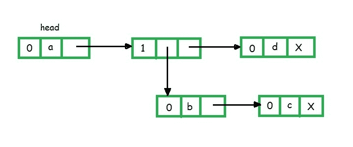
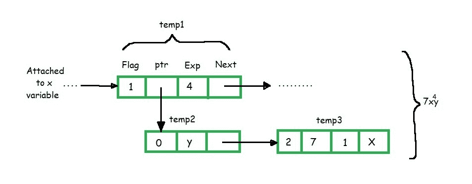

# 广义链接列表

广义链表 L 定义为 n> = 0 个元素的有限序列，即[ <sub>1</sub> ，[ <sub>2]</sub> ，[ <sub>3</sub> ，l <sub>4</sub> ，…，l <sub>n</sub> ，使得 l <sub>i</sub> 是原子或原子列表。 因此

**L =（l <sub>1</sub> ，l <sub>2</sub> ，l <sub>3</sub> ，l <sub>4</sub> ，…，l <sub>n</sub> ）**

，其中 n 是列表中节点的总数。


为了表示项目列表，有一些关于节点结构的假设。

*   标志= 1 表示存在*下指针*

*   标志= 0 表示存在*下一个指针*

*   数据意味着原子

*   下指针是当前节点下的节点地址

*   下一个指针是作为下一个节点附加的节点的地址

**为什么使用广义链表？**

之所以使用广义链表，是因为尽管使用链表的多项式运算效率不错，但缺点是链表无法有效地使用*多元变量多项式方程*。 它帮助我们用元素列表表示多变量多项式。

**通用链表**的典型“ C”结构

```

typedef struct node { 
    char c;                    //Data 
    int index;                 //Flag 
    struct node *next, *down;   //Next & Down pointer 
}GLL; 

```

**GLL 的示例** {列表表示}

*（a，（b，c），d）*



当第一字段为 0 时，表示 第二个字段是可变的。 如果第一个字段为 1，则表示第二个字段为向下指针，表示某些列表正在开始。

**使用广义链表**

的多项式表示形式典型的节点结构为：


*   标志= 0 表示*变量*存在

*   标志= 1 表示存在*下指针*

*   标志= 2 表示存在*系数*和*指数*

***例如：***

9x <sup>5</sup> + 7xy <sup>4</sup> + 10xz


在上面的示例中，头节点的变量为 x。 temp 节点将第一个字段显示为 2，表示存在系数和指数。


由于临时节点连接到头节点，并且头节点具有变量 x，因此临时节点的系数= 9，指数=5。上述两个节点可以读取为 9x <sup>5</sup> 。



类似地，在上图中，节点 temp1 可以读取为 x <sup>4</sup> 。

*   标志字段为 1 表示向下指针存在

*   temp2 = y

*   temp3 =系数= 7

*   指数= 1

*   flag = 2 表示节点包含系数和指数值。

*   temp2 连接到 temp3，这表示 7y <sub>1</sub> ，而 temp2 也连接到 temp1，表示

*   temp1 x temp2

*   x <sup>4</sup> x 7y <sup>1</sup> = 7x <sup>4</sup> y <sup>1</sup> 值由上图表示


* * *

* * *

如果您喜欢 GeeksforGeeks 并希望做出贡献，则还可以使用 [tribution.geeksforgeeks.org](https://contribute.geeksforgeeks.org/) 撰写文章，或将您的文章邮寄至 tribution@geeksforgeeks.org。 查看您的文章出现在 GeeksforGeeks 主页上，并帮助其他 Geeks。

如果您发现任何不正确的地方，请单击下面的“改进文章”按钮，以改进本文。