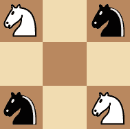
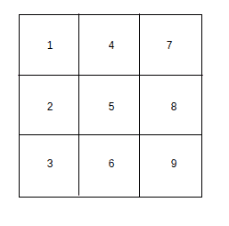
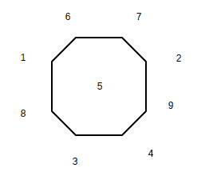
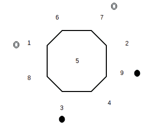

# 数学| 图论练习题

> 原文： [https://www.geeksforgeeks.org/graph-theory-practice-questions/](https://www.geeksforgeeks.org/graph-theory-practice-questions/)

**问题 1 –** Geeksland 有 25 部电话。 是否可以用电线连接它们，以便每部电话恰好与另外 7 部电话相连。

**解决方案–** 让我们假设这样的安排是可能的。 可以将其视为图形，其中电话使用顶点表示，电话使用边表示。 现在，此图中有 25 个顶点。 图中每个顶点的度为 7。

从[握手引理](https://www.geeksforgeeks.org/handshaking-lemma-and-interesting-tree-properties/)，我们知道。

```
sum of degrees of all vertices = 2*(number of edges)
number of edges = (sum of degrees of all vertices) / 2

```

我们需要了解一条边连接两个顶点。 因此，所有顶点的度数总和等于边数的两倍。

因此，

```
 25*7 = 2*(number of edges)
number of edges = 25*7 / 2 = 87.5

```

这不是整数。 结果，我们可以得出结论，我们的假设是错误的，这样的安排是不可能的。

**问题 2 –** 下图显示了 3 * 3 网格上的骑士排列。


**图–** 初始状态

是否可以使用有效的骑士动作达到如下所示的最终状态？



**图–** 最终状态

**解决方案–** 否。 您可能会认为您需要成为一名优秀的国际象棋手才能破解上述问题。 但是，以上问题可以使用图形解决。 但是我们应该画什么样的图呢？ 如下所示，用数字表示 9 个顶点中的每一个。



现在，我们将网格的每个正方形视为图形中的一个顶点。 如果可以在图中的相应正方形之间进行有效的骑士移动，则图中的两个顶点之间存在一条边。 例如，如果考虑正方形 1，则具有有效骑士移动的可达到正方形为 6 和 8。可以说顶点 1 连接到图中的顶点 6 和 8。

同样，我们可以绘制整个图形，如下所示。 显然，从任何正方形都无法到达顶点 5。 因此，没有一条边连接到顶点 5。



我们使用空心圆在图中绘制白色骑士，并使用实心圆绘制黑色骑士。 因此，图的初始状态可以表示为：



**图–** 初始状态

最终状态表示为：


**图–** 最终状态

请注意，为了达到最终状态，需要存在两个骑士（黑骑士和白骑士交叉）的路径。 我们只能在图形上按顺时针或逆时针方向移动骑士（如果图形上连接了两个顶点：这意味着网格上存在相应的骑士移动）。 但是，骑士在图表上出现的顺序无法更改。 骑士无法跨越（一个顶点上不能存在两个骑士）另一个骑士来达到最终状态。 因此，我们可以得出结论，无论最后的安排如何，都是不可能的。

**问题 3**：在一个平面上绘制了 9 条线段。 每个线段是否可能恰好相交 3 个其他线段？

**解决方案**：最初，这个问题似乎很难解决。 我们可以考虑使用图形来解决它。 但是，我们如何绘制图形。 如果尝试通过使用线段作为图形的边来解决此问题，那么我们似乎一无所获（最初听起来很混乱）。 在这里，我们需要考虑一个图形，其中每个线段都表示为一个顶点。 现在，如果相应的线段相交，则此图的两个顶点已连接。

现在，该图具有 9 个顶点。 每个顶点的度为 3。

我们知道对于图

**，所有顶点的度数总和= 2 *图**

中的边数，因为上述问题中的顶点度数之和为 9 * 3 = 27 即奇怪，这种安排是不可能的。

本文由 [**Ankit Jain**](https://www.facebook.com/profile.php?id=100000412091676) 贡献。 如果您喜欢 GeeksforGeeks 并希望做出贡献，则还可以使用 [tribution.geeksforgeeks.org](http://www.contribute.geeksforgeeks.org) 撰写文章，或将您的文章邮寄至 tribution@geeksforgeeks.org。 查看您的文章出现在 GeeksforGeeks 主页上，并帮助其他 Geeks。

如果发现任何不正确的地方，或者想分享有关上述主题的更多信息，请写评论。

