# 图形类型和应用

> 原文： [https://www.geeksforgeeks.org/graph-types-and-applications/](https://www.geeksforgeeks.org/graph-types-and-applications/)

**先决条件**：[图论基础–第 1 组](https://www.geeksforgeeks.org/mathematics-graph-theory-basics-set-1/)，[图论基础–第 2 组](https://www.geeksforgeeks.org/mathematics-graph-theory-basics/)

图 G =（V，E）由一组顶点 V = {V1，V2，...组成。 。 。 }和边集 E = {E1，E2，。。 。 。 }。 一组无序的不同顶点对，其元素称为图 G 的边缘，这样，每个边缘都由无序的顶点对（Vi，Vj）标识。
如果存在与 Vi 和 Vj 关联的边 Ek，则顶点（Vi，Vj）被称为相邻。 在这种情况下，Vi 和 Vj 被称为端点，并且边缘 Ek 被称为 Vi 和 Vj 的连接/接头。

**图形类型**：

*   **有限图**：如果图具有有限数量的顶点和有限数量的边，则称该图是有限的。
    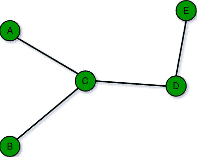
*   **无限图**：如果图具有无限数量的顶点以及无限数量的边，则称该图为无限。
    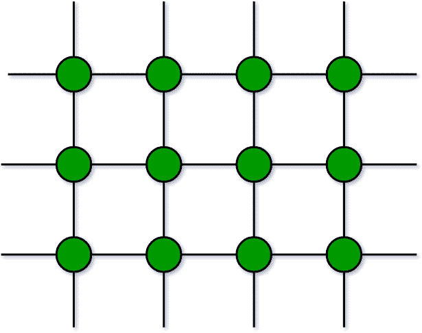
*   **平凡图**：如果有限图仅包含一个顶点且不包含边，则称该图为平凡图。
    
*   **简单图**：简单图是在一对顶点之间不包含多个边的图。 连接不同城市的简单铁路轨道就是简单图形的示例。
    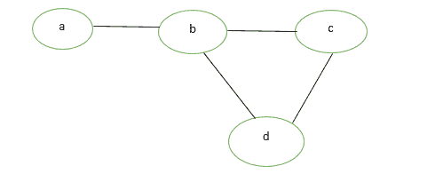
    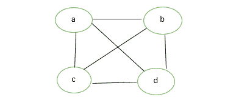
*   **Multi Graph:** Any graph which contain some parallel edges but doesn’t contain any self-loop is called multi graph. For example A Road Map.
    
    *   **平行边**：如果两个顶点连接的边不止一个，则此类边称为平行边，该边多根，但只有一个终点。
    *   **循环**：将顶点连接到自身的图的边称为循环或自循环。
*   **空图**：n 阶和大小为零的图，它是包含 n 个顶点但不包含任何边的图。
    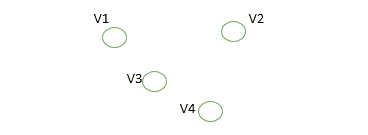
*   **Complete Graph:** A simple graph with n vertices is called a complete graph if the degree of each vertex is n-1, that is, one vertex is attach with n-1 edges. A complete graph is also called Full Graph.
    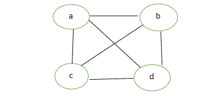

    

*   **伪图**：具有自环和一些多个边的图 G 称为伪图。
    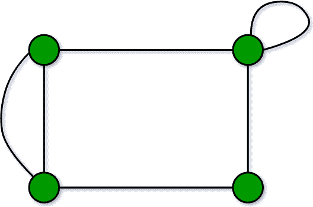
*   **正则图**：如果图 G 的所有顶点都具有相等的度，则称简单图为正则。 所有完整的图形都是规则的，但反之亦然。
    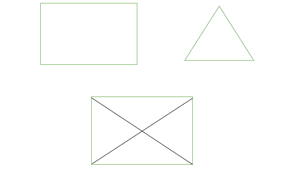
*   **Bipartite Graph:** A graph G = (V, E) is said to be bipartite graph if its vertex set V(G) can be partitioned into two non-empty disjoint subsets. V1(G) and V2(G) in such a way that each edge e of E(G) has its one end in V1(G) and other end in V2(G).
    The partition V1 U V2 = V is called Bipartite of G.
    Here in the figure:
    V1(G)={V5, V4, V3}
    V2(G)={V1, V2}

    

*   **带标签的图形**：如果图形的顶点和边缘都标有名称，数据或权重，则称为带标签的图形。 也称为*加权图*。
    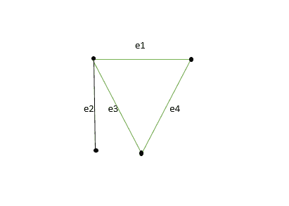
*   **Digraph Graph:** A graph G = (V, E) with a mapping f such that every edge maps onto some ordered pair of vertices (Vi, Vj) is called Digraph. It is also called *Directed Graph*. Ordered pair (Vi, Vj) means an edge between Vi and Vj with an arrow directed from Vi to Vj.
    Here in the figure:
    e1 = (V1, V2)
    e2 = (V2, V3)
    e4 = (V2, V4)

    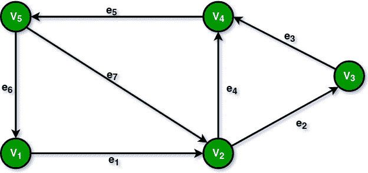

*   **Subgraph:** A graph G = (V1, E1) is called subgraph of a graph G(V, E) if V1(G) is a subset of V(G) and E1(G) is a subset of E(G) such that each edge of G1 has same end vertices as in G.
    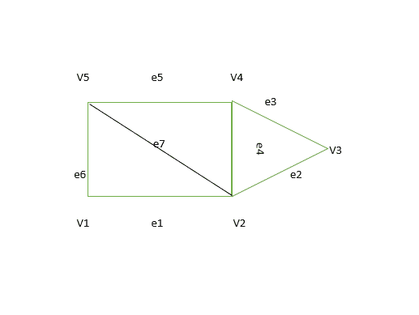

    **子图类型**：

    *   **顶点不相交子图**：如果 V1（G1）交集，则任何两个图 G1 =（V1，E1）和 G2 =（V2，E2）被称为图 G =（V，E）的顶点不相交 V2（G2）=空。 在图中，G1 和 G2 之间没有共同的顶点。
    *   **边不相交的子图**：如果 E1（G1）相交 E2（G2）=空，则子图被称为边不相交。 在图中，G1 和 G2 之间没有公共边。

    **注意**：边不相交子图可能具有相同的顶点，但顶点不相交图不能具有共同的边，因此顶点不相交子图将始终是边不相交子图。
    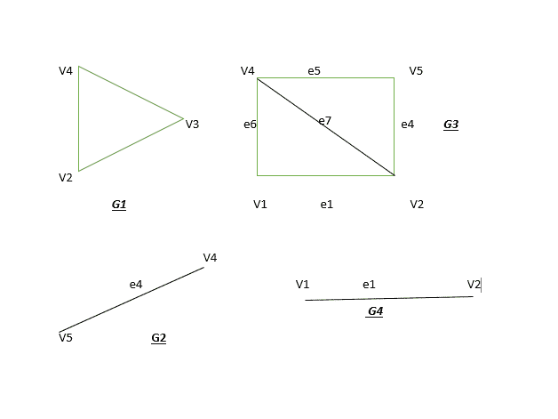

*   **连接的图或断开的图**：如果图 G 的任意一对顶点（Vi，Vj）彼此可达，则称图 G 已连接。 或者，如果图 G 的每对顶点之间至少存在一条路径，则称该图已连接。否则，该图将断开连接。 具有 n 个顶点的空图是由 n 个分量组成的不连续图。 每个分量都包含一个顶点且没有边。
    
*   **循环图**：由 n 个顶点和 n 个> = 3 组成的图 G，即 V1，V2，V3- – – – – – – Vn 和边（V1，V2），（V2， V3），（V3，V4）-– – – – – – –（Vn，V1）被称为循环图。
    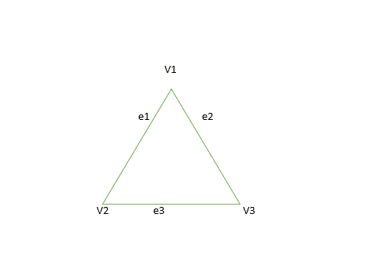

**图形的应用**：

*   **计算机科学**：在计算机科学中，图形用于表示通信，数据组织，计算设备等的网络。
*   **物理和化学**：图论也用于研究化学和物理中的分子。
*   **社会科学**：图论在社会学中也被广泛使用。
*   **数学**：在这种情况下，图形在几何图形和拓扑的某些部分（例如结理论）中很有用。
*   **生物学**：图论在生物学和保护工作中很有用。

* * *

* * *

如果您喜欢 GeeksforGeeks 并希望做出贡献，则还可以使用 [tribution.geeksforgeeks.org](https://contribute.geeksforgeeks.org/) 撰写文章，或将您的文章邮寄至 tribution@geeksforgeeks.org。 查看您的文章出现在 GeeksforGeeks 主页上，并帮助其他 Geeks。

如果您发现任何不正确的地方，请单击下面的“改进文章”按钮，以改进本文。