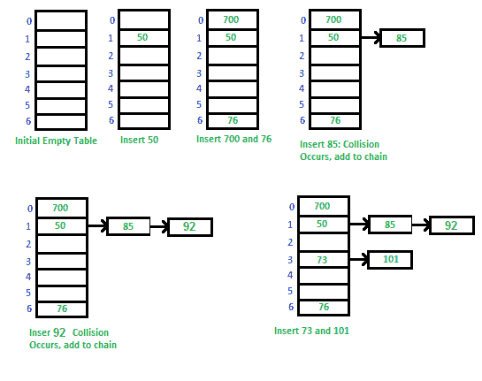

# 哈希 | 系列 2（单独链接）

> 原文：[https://www.geeksforgeeks.org/hashing-set-2-separate-chaining/](https://www.geeksforgeeks.org/hashing-set-2-separate-chaining/)

我们强烈建议您在下面的帖子中提及此内容。

[哈希 | 系列 1（简介）](https://www.geeksforgeeks.org/hashing-set-1-introduction/)

**什么是碰撞？**

由于散列函数为一个大整数或字符串的键为我们提供了一个较小的数字，因此两个键可能会产生相同的值。 新插入的密钥映射到哈希表中已经占用的插槽的情况称为冲突，必须使用某种冲突处理技术来处理。

**与大桌子相撞的机会是什么？**

即使我们有大桌子来存储密钥，冲突也很可能发生。 一个重要的发现是[生日悖论](https://www.geeksforgeeks.org/birthday-paradox/)。 只有 23 个人，两个人有相同生日的概率为 50%。

**如何处理碰撞？**

主要有两种方法来处理冲突：

1.  单独链接

2.  开放式寻址

在本文中，仅讨论单独链接。 我们将在下一篇文章中讨论开放式寻址。

**单独链接**：

这个想法是使哈希表的每个单元指向具有相同哈希函数值的记录的链接列表。

让我们将一个简单的哈希函数视为`key mod 7`，并将密钥序列设为 50、700、76、85、92、73、101。

[](https://media.geeksforgeeks.org/wp-content/cdn-uploads/gq/2015/07/hashChaining1.png)

[**C++程序，用于通过链接进行哈希**](https://www.geeksforgeeks.org/c-program-hashing-chaining/)

**优点**：

1.  实现简单。

2.  哈希表永远不会填满，我们总是可以向链中添加更多元素。

3.  对哈希函数或负载因子较不敏感。

4.  在不知道可以插入或删除多少个密钥和频率的情况下，通常使用它。

**缺点**：

1.  链接的缓存性能不佳，因为使用链接列表存储密钥。 开放式寻址提供了更好的缓存性能，因为所有内容都存储在同一表中。

2.  空间的浪费（从不使用哈希表的某些部分）

3.  如果链变长，那么在最坏的情况下搜索时间可能变为`O(n)`。

4.  为链接使用多余的空间。

**链接的性能**：

可以在假设每个键被等效地散列到表的任何插槽（简单统一散列）的假设下评估散列的性能。

```
 m = Number of slots in hash table
 n = Number of keys to be inserted in hash table

 Load factor α = n/m 

 Expected time to search = O(1 + α)

 Expected time to delete = O(1 + α)

Time to insert = O(1)

 Time complexity of search insert and delete is 
 O(1) if  α is O(1)

```

**下一篇文章**：

[冲突处理的开放寻址](http://quiz.geeksforgeeks.org/hashing-set-3-open-addressing/)

**参考**：

[http://courses.csail.mit.edu/6.006/fall09/lecture_notes/lecture05.pdf](http://courses.csail.mit.edu/6.006/fall09/lecture_notes/lecture05.pdf)

如果发现任何不正确的地方，或者想分享有关上述主题的更多信息，请发表评论。

