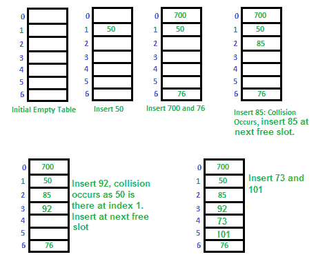

# 哈希 | 系列 3（开放地址）

> 原文：[https://www.geeksforgeeks.org/hashing-set-3-open-addressing/](https://www.geeksforgeeks.org/hashing-set-3-open-addressing/)

我们强烈建议您在下面的帖子中提及该内容。

[哈希 | 系列 1（简介）](http://quiz.geeksforgeeks.org/hashing-set-1-introduction/)，

[哈希 | 系列 2（单链接）](http://quiz.geeksforgeeks.org/hashing-set-2-separate-chaining/)

**开放式寻址**，

与单独的链接一样，开放式寻址是一种处理冲突的方法。 在开放式寻址中，所有元素都存储在哈希表本身中。 因此，表的大小在任何时候都必须大于或等于键的总数（请注意，如果需要，我们可以通过复制旧数据来增加表的大小）。

`insert(k)`：继续探测，直到找到一个空插槽。 找到空插槽后，插入`k`。

`search(k)`：继续探测，直到插槽的键不等于`k`或到达空插槽为止。

`delete(k)`： **删除操作很有趣**。 如果我们只是删除一个键，则搜索可能会失败。 因此，已删除键的插槽特别标记为“已删除”。

插入内容可以在删除的广告位中插入项目，但搜索不会在删除的广告位中停止。

通过以下方式完成打开寻址：

a）**线性探测**：在线性探测中，我们线性探测下一个插槽。 例如，两个探针之间的典型间隙也为 1，如以下示例所示。

令`hash(x)`为使用哈希函数计算的插槽索引，`S`为表大小。

```
If slot hash(x) % S is full, then we try (hash(x) + 1) % S
If (hash(x) + 1) % S is also full, then we try (hash(x) + 2) % S
If (hash(x) + 2) % S is also full, then we try (hash(x) + 3) % S 
..................................................
..................................................

```

让我们将一个简单的哈希函数视为`key mod 7`，并将键序列设为 50、700、76、85、92、73、101。

[](https://media.geeksforgeeks.org/wp-content/cdn-uploads/gq/2015/08/openAddressing1.png)

**线性探测中的挑战**：

1.  **主群集**：线性探测的问题之一是主群集，许多连续的元素形成组，并且开始花费时间来寻找空闲插槽或搜索元素。 ***，***

2.  **次要群集**：次要群集不太严重，如果两个记录的初始位置相同，则它们仅具有相同的碰撞链（探针序列）。

b）**二次探测**我们在第`i`个迭代中寻找`i ^ 2`插槽。

```
let hash(x) be the slot index computed using hash function.  
If slot hash(x) % S is full, then we try (hash(x) + 1*1) % S
If (hash(x) + 1*1) % S is also full, then we try (hash(x) + 2*2) % S
If (hash(x) + 2*2) % S is also full, then we try (hash(x) + 3*3) % S
..................................................
..................................................

```

c）[**双重哈希处理**](https://www.geeksforgeeks.org/double-hashing/) 我们使用另一个哈希函数`hash2(x)`并在第`i`个旋转中查找`i * hash2(x)`插槽。

```
let hash(x) be the slot index computed using hash function.  
If slot hash(x) % S is full, then we try (hash(x) + 1*hash2(x)) % S
If (hash(x) + 1*hash2(x)) % S is also full, then we try (hash(x) + 2*hash2(x)) % S
If (hash(x) + 2*hash2(x)) % S is also full, then we try (hash(x) + 3*hash2(x)) % S
..................................................
..................................................

```

有关逐步图，请参见此的[。](https://www.cse.cuhk.edu.hk/irwin.king/_media/teaching/csc2100b/tu6.pdf)

**上面三个的比较**：

线性探测具有最佳的缓存性能，但会受到聚类的影响。 线性探测的另一优点是易于计算。

在缓存性能和群集方面，二次探查介于两者之间。

双重散列的缓存性能较差，但没有群集。 双散列需要更多的计算时间，因为需要计算两个散列函数。

| 序号 | **单链接** | **开放地址** |
| --- | --- | --- |
| 1. | 链接更容易实现。 | 开放式寻址需要更多的计算。 |
| 2. | 在链接中，哈希表永远不会填满，我们总是可以向链中添加更多元素。 | 在开放式寻址中，表可能已满。 |
| 3. | 链接对哈希函数或负载因子不太敏感。 | 开放式寻址需要格外小心，以避免聚类和负载因子。 |
| 4. | 当不知道可以插入或删除多少个键以及多少频率时，通常使用链接。 | 当知道键的频率和数量时，使用开放式寻址。 |
| 5. | 链接的缓存性能不佳，因为键是使用链表存储的。 | 开放式寻址提供了更好的缓存性能，因为所有内容都存储在同一表中。 |
| 6. | 浪费空间（从未使用过链表中哈希表的某些部分）。 | 在开放式编址中，即使输入未映射到插槽，也可以使用该插槽。 |
| 7. | 链接为链接使用了额外的空间。 | 在打开寻址中没有链接 |

**开放寻址的性能**：

像链接一样，可以在假设每个键被均等地散列到表的任何插槽的假设下评估散列的性能（简单统一散列）

```
m = Number of slots in the hash table
n = Number of keys to be inserted in the hash table

Load factor ? = n/m  ( < 1 )

Expected time to search/insert/delete < 1/(1 - ?) 

So Search, Insert and Delete take (1/(1 - ?)) time

```

https://youtu.be/Dk57JonwKNk 

参考文献：

[http://courses.csail.mit.edu/6.006/fall11/lectures/lecture10.pdf](http://courses.csail.mit.edu/6.006/fall11/lectures/lecture10.pdf)

[https://www.cse.cuhk.edu.hk/irwin.king/_media/teaching/csc2100b/tu6.pdf](https://www.cse.cuhk.edu.hk/irwin.king/_media/teaching/csc2100b/tu6.pdf)

如果发现任何不正确的地方，或者想分享有关上述主题的更多信息，请写评论。

