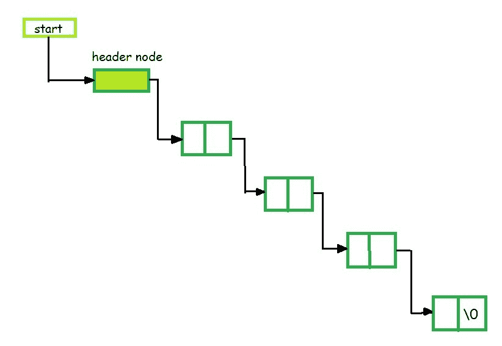
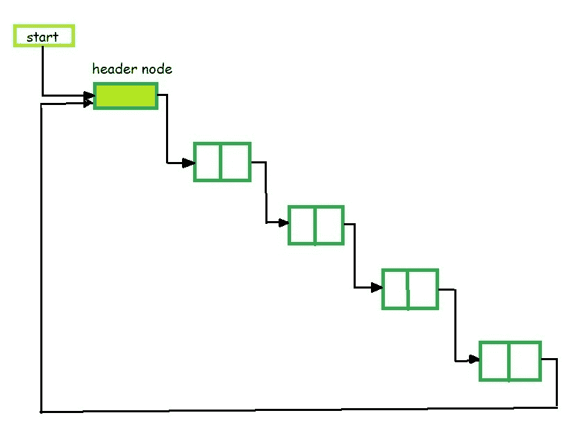
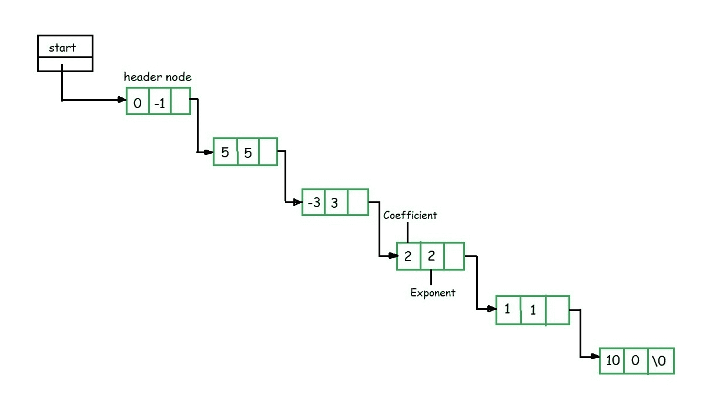
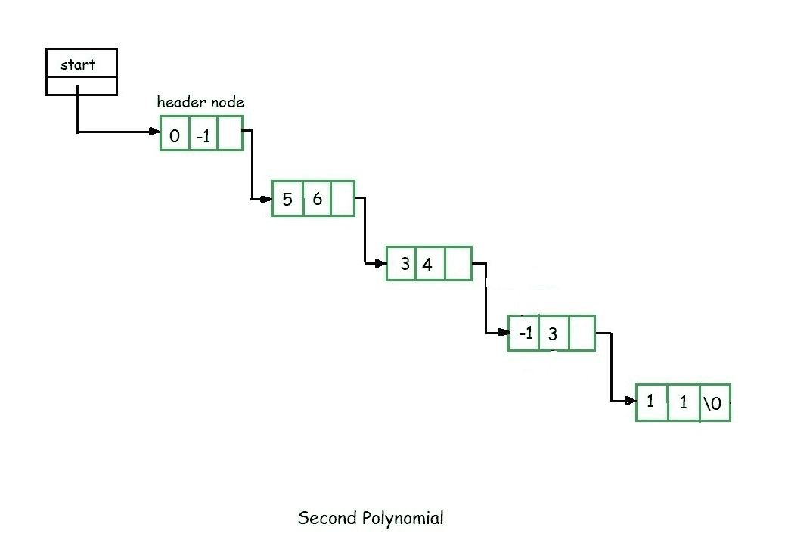
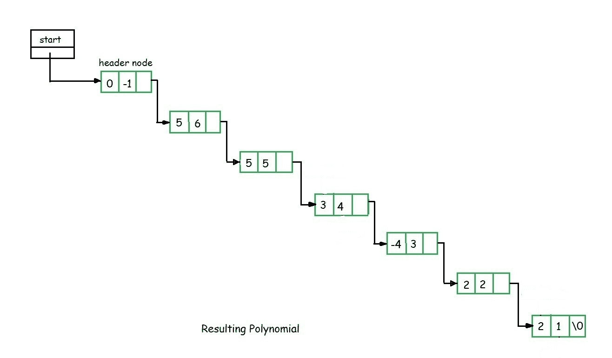

# C 中的标头链表

> 原文：[https://www.geeksforgeeks.org/header-linked-list-in-c/](https://www.geeksforgeeks.org/header-linked-list-in-c/) 

**必备软件**：[链表](https://www.geeksforgeeks.org/data-structures/linked-list/)，[循环链表](https://www.geeksforgeeks.org/circular-linked-list/)

*标头节点*是在列表的开头的*处找到的特殊节点。 包含此类节点的列表称为标头链表。 当需要除每个节点中的信息以外的其他信息时，这种类型的列表很有用。

*例如，*假设有一个应用程序，其中经常计算列表中的项目数。 通常，始终会遍历列表以查找列表的长度。 然而，如果在另外的报头节点中保持当前长度，则可以容易地获得信息。*

**标头链表的类型**

1.  **接地标头链表**

    这是一个列表，其*最后一个节点*包含 *NULL* 指针。 在头部链表中，**起始**指针始终指向头部节点。 **start-> next = NULL** 表示接地的标头链表为*空*。 在此类型的链表上可能执行的操作是*插入，删除和遍历*。



3.  **循环头链表**

    其中*最后节点*指向*头节点*的列表称为循环链表。 链条不指示第一个或最后一个节点。 在这种情况下，外部指针提供了参考框架，因为循环链表的最后一个节点不包含， **NULL** 指针。 对这种类型的链表的可能操作是*插入，删除和遍历*。



```

// C program for a Header Linked List 
#include <malloc.h> 
#include <stdio.h> 

// Structure of the list 
struct link { 
    int info; 
    struct link* next; 
}; 

// Empty List 
struct link* start = NULL; 

// Function to create a header linked list 
struct link* create_header_list(int data) 
{ 

    // Create a new node 
    struct link *new_node, *node; 
    new_node = (struct link*) 
        malloc(sizeof(struct link)); 
    new_node->info = data; 
    new_node->next = NULL; 

    // If it is the first node 
    if (start == NULL) { 

        // Initialize the start 
        start = (struct link*) 
            malloc(sizeof(struct link)); 
        start->next = new_node; 
    } 
    else { 

        // Insert the node in the end 
        node = start; 
        while (node->next != NULL) { 
            node = node->next; 
        } 
        node->next = new_node; 
    } 
    return start; 
} 

// Function to display the 
// header linked list 
struct link* display() 
{ 
    struct link* node; 
    node = start; 
    node = node->next; 
    while (node != NULL) { 
        printf("%d ", node->info); 
        node = node->next; 
    } 
    printf("\n"); 
    return start; 
} 

// Driver code 
int main() 
{ 

    // Create the list 
    create_header_list(11); 
    create_header_list(12); 
    create_header_list(13); 

    // Print the list 
    display(); 
    create_header_list(14); 
    create_header_list(15); 

    // Print the list 
    display(); 

    return 0; 
} 

```

**输出**：

```
11 12 13 
11 12 13 14 15

```

**标头链表**

**多项式**的应用

*   标头链表经常用于在内存中维护多项式。 *头节点*用于表示*零多项式*。

*   假设我们有

    `F(x) = 5x^5 – 3x^3 + 2x^2 + x^1 + 10x^0`

*   从`F(x)`表示的多项式可以清楚地看出，该多项式具有**系数**和**指数**两部分，其中`x`是**形式参数** 。 因此，我们可以说多项式是项的和，每个项都由一个系数和一个指数组成。

*   计算机实现要求将多项式实现为系数和指数对的*列表。 这些对中的每对都将构成一个结构，因此多项式将表示为结构列表。*

*   如果要在链表的帮助下表示`F(x)`，则该表将包含 5 个节点。 当我们链接每个节点时，我们得到一个表示多项式`F(x)`的链表结构。



***多项式的加法***

1.  要添加两个多项式，我们需要扫描一次。

2.  如果在两个多项式中找到具有相同指数的项，则将这些系数相加，否则，将较大指数的项复制到总和中并继续。

3.  当我们到达多项式之一的末尾时，另一项的其余部分将被复制到总和中。

4.  假设我们有两个如图所示的多项式，我们必须对这些多项式进行加法运算。




6.  当我们扫描两个多项式的第一个节点时，我们发现第二个多项式中的第一个节点的指数幂大于第一个多项式的第一个节点的指数幂。

7.  这里第二个多项式的第一个节点的指数更大，因此我们必须将第二个多项式的第一个节点复制到总和中。

8.  然后，我们考虑第一个多项式的第一个节点，然后再次将第一个多项式的第一个节点值与第二个多项式的第二个节点值进行比较。

9.  在此，第一多项式的第一节点指数值大于第二多项式的第二节点指数值。 我们将第一个多项式的第一个节点复制到总和中。

10.  现在考虑第一个多项式的第二个节点，并将其与第二个多项式的第二个节点进行比较。

11.  这里，第二个多项式的第二个节点的指数值大于第一个多项式的第二个节点，因此我们将第二个列表的第二个节点复制到总和中。

12.  现在我们考虑第二个多项式的第三个节点指数，并将其与第一个多项式的第二个节点指数值进行比较。 我们发现两者相等，因此将它们的系数相加并复制到总和中。

13.  这个过程一直持续到两个多项式的所有节点都耗尽为止。 例如，将上述两个多项式相加后，我们得到以下*结果多项式*，如图所示。



*进一步的参考：* [加两个多项式](https://www.geeksforgeeks.org/adding-two-polynomials-using-linked-list/)


* * *

* * *

如果您喜欢 GeeksforGeeks 并希望做出贡献，则还可以使用 [tribution.geeksforgeeks.org](https://contribute.geeksforgeeks.org/) 撰写文章，或将您的文章邮寄至 tribution@geeksforgeeks.org。 查看您的文章出现在 GeeksforGeeks 主页上，并帮助其他 Geeks。

如果您发现任何不正确的地方，请单击下面的“改进文章”按钮，以改进本文。