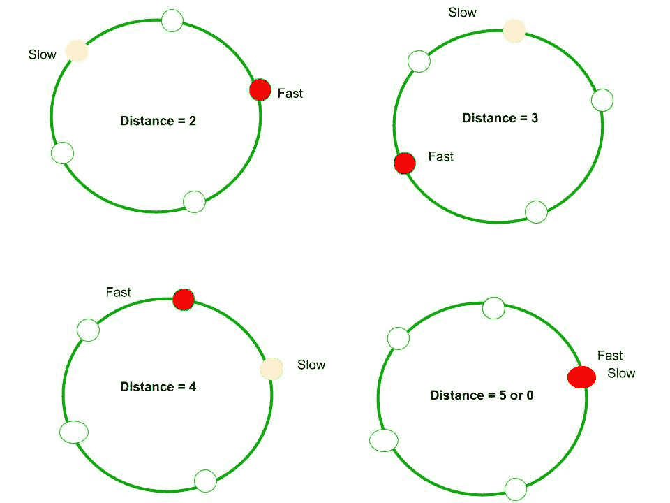

# 弗洛伊德的慢速指针和快速指针方法是如何工作的？

> 原文：[https://www.geeksforgeeks.org/how-does-floyds-slow-and-fast-pointers-approach-work/](https://www.geeksforgeeks.org/how-does-floyds-slow-and-fast-pointers-approach-work/)

我们已经在[链表](https://www.geeksforgeeks.org/detect-loop-in-a-linked-list/)中的检测循环中讨论了 Floyd 的快慢指针算法。

该算法是从链表的开头开始两个指针，分别是慢速和快速。 我们一次移动一个慢节点，一次快速移动两个节点。 如果有一个循环，那么他们一定会见面的。 此方法之所以有效，是因为以下事实。

1.  当慢速指针进入循环时，快速指针必须在循环内部。 令快指针为慢指针的距离 k。

2.  现在，如果考虑慢速和快速指针的移动，我们可以注意到它们之间的距离（从慢速到快速）在每次迭代后增加一。 经过一个迭代（慢=慢的下一个和快速=下一个快速的下一个），慢和快之间的距离变为 k + 1，经过两次迭代，k + 2，依此类推。 当距离变为 n 时，它们会合，因为它们以长度 n 的周期运动。

例如，我们可以在下图中看到，初始距离为 2。经过 1 次迭代，距离变为 3，经过 2 次迭代，距离变为 4。经过 3 次迭代，它变为距离 0 的 5。它们相遇。

**循环删除算法如何工作？**

请参阅[检测和删除链接列表](https://www.geeksforgeeks.org/detect-and-remove-loop-in-a-linked-list/)中的循环的方法 3

* * *

* * *

如果您喜欢 GeeksforGeeks 并希望做出贡献，则还可以使用 [tribution.geeksforgeeks.org](https://contribute.geeksforgeeks.org/) 撰写文章，或将您的文章邮寄至 tribution@geeksforgeeks.org。 查看您的文章出现在 GeeksforGeeks 主页上，并帮助其他 Geeks。

如果您发现任何不正确的地方，请单击下面的“改进文章”按钮，以改进本文。