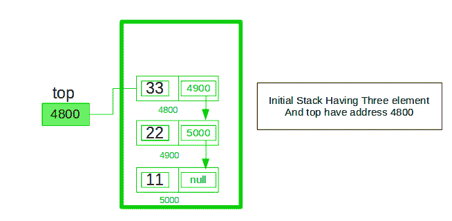
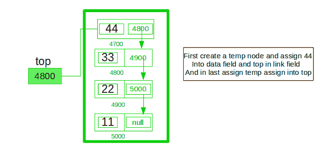
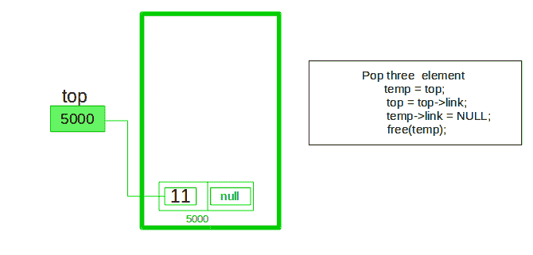

# 使用单链表

> 原文：[https://www.geeksforgeeks.org/implement-a-stack-using-singly-linked-list/](https://www.geeksforgeeks.org/implement-a-stack-using-singly-linked-list/)

实现栈

使用单个链表概念实现[栈](http://www.geeksforgeeks.org/stack-data-structure/)。 所有单个[链表](http://www.geeksforgeeks.org/data-structures/linked-list/)操作都是基于栈操作 LIFO（后进先出）执行的，借助这一知识，我们将使用单个链表实现栈。 使用单个链表，所以在这里如何实现链表意味着我们以节点的形式存储信息，我们需要遵循栈规则，并且需要使用单个链表节点来实现，所以我们需要什么规则 在栈的实现中遵循一个简单的规则，即后进先出，我们应该在 top 变量的帮助下执行的所有操作仅在 top 变量的帮助下如何插入元素







通过链表可以轻松实现栈。 在栈实现中，栈包含顶部指针。 这是栈的“头”，其中推送和弹出项发生在列表的头。 第一个节点在链接字段中为空，第二个节点链接在链接字段中具有第一个节点地址，依此类推，最后一个节点地址在“ top”指针中。

在数组上使用链表的主要优点是可以实现可根据需要缩小或增长的栈。 使用数组会限制数组的最大容量，这可能导致栈溢出。 在这里，每个新节点将被动态分配。 因此不可能发生溢出。

**栈操作**：

1.  **[push（）](https://www.geeksforgeeks.org/stack-push-and-pop-in-c-stl/)**：将该元素插入到链表中，只是栈的顶部节点。

2.  **[pop（）](https://www.geeksforgeeks.org/stack-push-and-pop-in-c-stl/)**：从栈中返回顶部元素，并将顶部指针移至链表或栈的第二个节点。

3.  **[peek（）](https://www.geeksforgeeks.org/stack-peek-method-in-java/)**：返回顶部元素。

4.  **display（）**：打印栈的所有元素。

**下面是上述方法的实现**：

## C++

```cpp

// C++ program to Implement a stack  
//using singly linked list  
#include <bits/stdc++.h>  
using namespace std;  

// Declare linked list node  

struct Node  
{  
    int data;  
    struct Node* link;  
};  

struct Node* top;  

// Utility function to add an element  
// data in the stack insert at the beginning  
void push(int data)  
{  

    // Create new node temp and allocate memory  
    struct Node* temp;  
    temp = new Node();  

    // Check if stack (heap) is full.  
    // Then inserting an element would  
    // lead to stack overflow  
    if (!temp) 
    {  
        cout << "\nHeap Overflow";  
        exit(1);  
    }  

    // Initialize data into temp data field  
    temp->data = data;  

    // Put top pointer reference into temp link  
    temp->link = top;  

    // Make temp as top of Stack  
    top = temp;  
}  

// Utility function to check if  
// the stack is empty or not  
int isEmpty()  
{  
    return top == NULL;  
}  

// Utility function to return top element in a stack  
int peek()  
{  

    // Check for empty stack  
    if (!isEmpty())  
        return top->data;  
    else
        exit(1);  
}  

// Utility function to pop top  
// element from the stack  
void pop()  
{  
    struct Node* temp;  

    // Check for stack underflow  
    if (top == NULL)  
    {  
        cout << "\nStack Underflow" << endl;  
        exit(1);  
    }  
    else
    {  

        // Top assign into temp  
        temp = top;  

        // Assign second node to top  
        top = top->link;  

        // Destroy connection between 
        // first and second  
        temp->link = NULL;  

        // Release memory of top node  
        free(temp);  
    }  
}  

// Function to print all the  
// elements of the stack  
void display()  
{  
    struct Node* temp;  

    // Check for stack underflow  
    if (top == NULL) 
    {  
        cout << "\nStack Underflow";  
        exit(1);  
    }  
    else 
    {  
        temp = top;  
        while (temp != NULL) 
        {  

            // Print node data  
            cout << temp->data << "-> ";  

            // Assign temp link to temp  
            temp = temp->link;  
        }  
    }  
}  

// Driver Code  
int main()  
{  

    // Push the elements of stack  
    push(11);  
    push(22);  
    push(33);  
    push(44);  

    // Display stack elements  
    display();  

    // Print top element of stack  
    cout << "\nTop element is "
         << peek() << endl;  

    // Delete top elements of stack  
    pop();  
    pop();  

    // Display stack elements  
    display();  

    // Print top element of stack  
    cout << "\nTop element is " 
         << peek() << endl;  

    return 0;  
}  

// This code is contributed by Striver  

```

## Java

```java

// Java program to Implement a stack 
// using singly linked list 
// import package 
import static java.lang.System.exit; 

// Create Stack Using Linked list 
class StackUsingLinkedlist { 

    // A linked list node 
    private class Node { 

        int data; // integer data 
        Node link; // reference variable Node type 
    } 
    // create global top reference variable global 
    Node top; 
    // Constructor 
    StackUsingLinkedlist() 
    { 
        this.top = null; 
    } 

    // Utility function to add an element x in the stack 
    public void push(int x) // insert at the beginning 
    { 
        // create new node temp and allocate memory 
        Node temp = new Node(); 

        // check if stack (heap) is full. Then inserting an 
        //  element would lead to stack overflow 
        if (temp == null) { 
            System.out.print("\nHeap Overflow"); 
            return; 
        } 

        // initialize data into temp data field 
        temp.data = x; 

        // put top reference into temp link 
        temp.link = top; 

        // update top reference 
        top = temp; 
    } 

    // Utility function to check if the stack is empty or not 
    public boolean isEmpty() 
    { 
        return top == null; 
    } 

    // Utility function to return top element in a stack 
    public int peek() 
    { 
        // check for empty stack 
        if (!isEmpty()) { 
            return top.data; 
        } 
        else { 
            System.out.println("Stack is empty"); 
            return -1; 
        } 
    } 

    // Utility function to pop top element from the stack 
    public void pop() // remove at the beginning 
    { 
        // check for stack underflow 
        if (top == null) { 
            System.out.print("\nStack Underflow"); 
            return; 
        } 

        // update the top pointer to point to the next node 
        top = (top).link; 
    } 

    public void display() 
    { 
        // check for stack underflow 
        if (top == null) { 
            System.out.printf("\nStack Underflow"); 
            exit(1); 
        } 
        else { 
            Node temp = top; 
            while (temp != null) { 

                // print node data 
                System.out.printf("%d->", temp.data); 

                // assign temp link to temp 
                temp = temp.link; 
            } 
        } 
    } 
} 
// main class 
public class GFG { 
    public static void main(String[] args) 
    { 
        // create Object of Implementing class 
        StackUsingLinkedlist obj = new StackUsingLinkedlist(); 
        // insert Stack value 
        obj.push(11); 
        obj.push(22); 
        obj.push(33); 
        obj.push(44); 

        // print Stack elements 
        obj.display(); 

        // print Top element of Stack 
        System.out.printf("\nTop element is %d\n", obj.peek()); 

        // Delete top element of Stack 
        obj.pop(); 
        obj.pop(); 

        // print Stack elements 
        obj.display(); 

        // print Top element of Stack 
        System.out.printf("\nTop element is %d\n", obj.peek()); 
    } 
} 

```

## Python3

```py

'''Python supports automatic garbage collection so deallocation of memory 
is done implicitly. However to force it to deallocate each node after use, 
add the following code: 

    import gc         #added at the start of program 
    gc.collect()     #to be added wherever memory is to be deallocated 
'''

class Node: 

    # Class to create nodes of linked list 
    # constructor initializes node automatically 
    def __init__(self,data): 
        self.data = data 
        self.next = None

class Stack: 

    # head is default NULL 
    def __init__(self): 
        self.head = None

    # Checks if stack is empty 
    def isempty(self): 
        if self.head == None: 
            return True
        else: 
            return False

    # Method to add data to the stack 
    # adds to the start of the stack 
    def push(self,data): 

        if self.head == None: 
            self.head=Node(data) 

        else: 
            newnode = Node(data) 
            newnode.next = self.head 
            self.head = newnode 

    # Remove element that is the current head (start of the stack) 
    def pop(self): 

        if self.isempty(): 
            return None

        else: 
            # Removes the head node and makes  
            #the preceeding one the new head 
            poppednode = self.head 
            self.head = self.head.next
            poppednode.next = None
            return poppednode.data 

    # Returns the head node data 
    def peek(self): 

        if self.isempty(): 
            return None

        else: 
            return self.head.data 

    # Prints out the stack      
    def display(self): 

        iternode = self.head 
        if self.isempty(): 
            print("Stack Underflow") 

        else: 

            while(iternode != None): 

                print(iternode.data,"->",end = " ") 
                iternode = iternode.next
            return

# Driver code 
MyStack = Stack() 

MyStack.push(11)  
MyStack.push(22) 
MyStack.push(33) 
MyStack.push(44) 

# Display stack elements  
MyStack.display() 

# Print top element of stack  
print("\nTop element is ",MyStack.peek()) 

# Delete top elements of stack  
MyStack.pop() 
MyStack.pop() 

# Display stack elements 
MyStack.display() 

# Print top element of stack  
print("\nTop element is ", MyStack.peek())  

# This code is contributed by Mathew George 

```

## C#

```cs

// C# program to Implement a stack  
// using singly linked list  
// import package 
using System;  

// Create Stack Using Linked list  
public class StackUsingLinkedlist  
{  

    // A linked list node  
    private class Node 
    {  
        // integer data  
        public int data;  

        // reference variable Node type  
        public Node link;  
    }  

    // create global top reference variable  
    Node top;  

    // Constructor  
    public StackUsingLinkedlist()  
    {  
        this.top = null;  
    }  

    // Utility function to add  
    // an element x in the stack  
    // insert at the beginning  
    public void push(int x)  
    {  
        // create new node temp and allocate memory  
        Node temp = new Node();  

        // check if stack (heap) is full.  
        // Then inserting an element 
        // would lead to stack overflow  
        if (temp == null)  
        {  
            Console.Write("\nHeap Overflow");  
            return;  
        }  

        // initialize data into temp data field  
        temp.data = x;  

        // put top reference into temp link  
        temp.link = top;  

        // update top reference  
        top = temp;  
    }  

    // Utility function to check if 
    // the stack is empty or not  
    public bool isEmpty()  
    {  
        return top == null;  
    }  

    // Utility function to return 
    // top element in a stack  
    public int peek()  
    {  
        // check for empty stack  
        if (!isEmpty())  
        {  
            return top.data;  
        }  
        else
        {  
            Console.WriteLine("Stack is empty");  
            return -1;  
        }  
    }  

    // Utility function to pop top element from the stack  
    public void pop() // remove at the beginning  
    {  
        // check for stack underflow  
        if (top == null) 
        {  
            Console.Write("\nStack Underflow");  
            return;  
        }  

        // update the top pointer to  
        // point to the next node  
        top = (top).link;  
    }  

    public void display()  
    {  
        // check for stack underflow  
        if (top == null)  
        {  
            Console.Write("\nStack Underflow");  
            return;  
        }  
        else 
        {  
            Node temp = top;  
            while (temp != null)  
            {  

                // print node data  
                Console.Write("{0}->", temp.data);  

                // assign temp link to temp  
                temp = temp.link;  
            }  
        }  
    }  
}  

// Driver code  
public class GFG  
{  
    public static void Main(String[] args)  
    {  
        // create Object of Implementing class  
        StackUsingLinkedlist obj = new StackUsingLinkedlist();  

        // insert Stack value  
        obj.push(11);  
        obj.push(22);  
        obj.push(33);  
        obj.push(44);  

        // print Stack elements  
        obj.display();  

        // print Top element of Stack  
        Console.Write("\nTop element is {0}\n", obj.peek());  

        // Delete top element of Stack  
        obj.pop();  
        obj.pop();  

        // print Stack elements  
        obj.display();  

        // print Top element of Stack  
        Console.Write("\nTop element is {0}\n", obj.peek());  
    }  
} 

// This code is contributed by 29AjayKumar 

```

**Output:**

```
44->33->22->11->
Top element is 44
22->11->
Top element is 22
```


* * *

* * *

如果您喜欢 GeeksforGeeks 并希望做出贡献，则还可以使用 [tribution.geeksforgeeks.org](https://contribute.geeksforgeeks.org/) 撰写文章，或将您的文章邮寄至 tribution@geeksforgeeks.org。 查看您的文章出现在 GeeksforGeeks 主页上，并帮助其他 Geeks。

如果您发现任何不正确的地方，请单击下面的“改进文章”按钮，以改进本文。