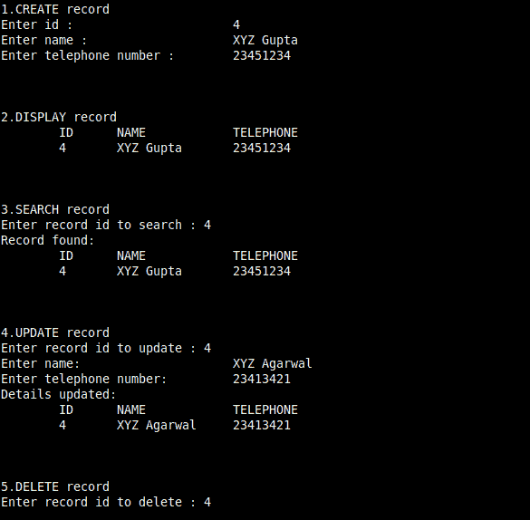

# 使用散列

> 原文：[https://www.geeksforgeeks.org/implement-phone-directory-using-hashing/](https://www.geeksforgeeks.org/implement-phone-directory-using-hashing/)

实施电话簿

[散列](https://www.geeksforgeeks.org/hashing-set-1-introduction/)是一种使用键比较次数较少的技术，在最坏的情况下以`O(n)`时间搜索元素，而在一般情况下以`O(1)`时间搜索元素。

2.  **create_record**

3.  **display_record**

4.  **delete_record**

5.  **search_record**

6.  **update_record**

以下数据将从客户端获取：

```
ID, Name, Telephone number
```

**方法**：

我们正在创建一个哈希表，并插入记录。 为了删除，搜索或更新实体，将询问客户 ID，并根据等价运算符显示或处理详细信息。 如果找不到该记录，则会显示一条相应的消息。

冲突是哈希技术中的主要问题。 在[开放地址](https://www.geeksforgeeks.org/hashing-set-3-open-addressing/)（封闭散列）中，所有冲突都在主要区域（即包含所有归属地址的区域）中解决。

发生冲突时，使用线性探测在主要区域地址中搜索开放或未占用的元素。

在哈希表中插入实体的步骤：

`1`。 如果该位置为空，则直接插入实体。

`2`。 如果已占用映射位置，则继续进行探测，直到找到一个空插槽。 找到空插槽后，插入实体。

1.  **创建记录**：此方法从用户那里获取 ID，姓名和电话号码等详细信息，并在哈希表中创建新记录。

2.  **显示记录**：创建此功能以显示日记的所有记录。

3.  **删除记录**：此方法采用要删除的记录的键。 然后，它在哈希表中搜索记录 ID 是否与键匹配。 然后，该记录被删除。

4.  **搜索记录**：此方法采用要搜索的记录的关键字。 然后，它遍历哈希表，如果记录 ID 与键匹配，则显示记录详细信息。

5.  **更新记录**：此方法采用要搜索的记录的键。 然后，它遍历哈希表，如果记录 ID 与键匹配，则显示记录详细信息。

下面是上述方法的实现：

## C++

```cpp

#include <iostream> 
using namespace std; 

// Class to store contact 
// details 
class node { 
    string name; 
    long int tel; 
    int id; 

public: 
    node() 
    { 
        tel = 0; 
        id = 0; 
    } 
    friend class hashing; 
}; 

class hashing { 

    // Maximum size of 
    // directory is 100 
    node data[100]; 
    string n; 
    long int t; 
    int i, index; 

public: 
    hashing() 
    { 
        i = 0; 
        t = 0; 
    } 

    // This method takes details 
    // from the user like ID, 
    // Name and Telephone number 
    // and create new record in 
    // the hashtable. 
    void create_record(int size) 
    { 
        // Enter ID 
        i = 4; 

        // Enter Name 
        n = "XYZ Gupta"; 

        // Enter telephone number 
        t = 23451234; 
        cout << "\nEnter id :"; 
        cout << " \t\t\t"
             << i; 
        cout << "\nEnter name :"; 
        cout << " \t\t\t " << n; 
        cout 
            << "\nEnter telephone"; 
        cout << " number :\t"
             << t; 
        index = i % size; 

        // Inserting record using linear 
        // probing in case of collision 
        for (int j = 0; j < size; j++) { 
            if (data[index].id == 0) { 
                data[index].id = i; 
                data[index].name = n; 
                data[index].tel = t; 
                break; 
            } 
            else
                index 
                    = (index + 1) % size; 
        } 
    } 

    // This method takes the key of 
    // the record to be searched. 
    // Then, it traverses the hash 
    // table, if record id matches 
    // with the key it displays the 
    // record detail. 
    void search_record(int size) 
    { 
        int index1, key, flag = 0; 
        key = 4; 
        cout << "\nEnter record"; 
        cout << " id to search : "
             << key; 
        index1 = key % size; 

        // Traversing the directory 
        // linearly inorder to search 
        // record detail 
        for (int a = 0; a < size; a++) { 
            if (data[index1].id == key) { 
                flag = 1; 
                cout << "\nRecord found:"; 
                cout << "\n\tID "; 
                cout << "\tNAME "; 
                cout << "\t\tTELEPHONE "; 
                cout << "\n\t"
                     << data[index1].id 
                     << " \t"
                     << data[index1].name 
                     << " \t"
                     << data[index1].tel; 
                break; 
            } 
            else
                index1 
                    = (index1 + 1) % size; 
        } 
        if (flag == 0) 
            cout << "\nRecord"; 
        cout << " not found"; 
    } 

    // This method takes the key 
    // of the record to be deleted. 
    // Then, it searches in hash 
    // table if record id matches 
    // with the key. Then, that 
    // record is deleted. 
    void delete_record(int size) 
    { 
        int index1, key, flag = 0; 
        key = 4; 
        cout << "\nEnter record"; 
        cout << " id to delete : "
             << key << "\n "; 
        index1 = key % size; 
        // Traversing the directory 
        // linearly inorder to delete 
        // the record detail 
        for (int a = 0; a < size; a++) { 
            if (data[index1].id 
                == key) { 
                flag = 1; 
                data[index1].id = 0; 
                data[index1].name = " "; 
                data[index1].tel = 0; 
                cout << "\nRecord"; 
                cout << " deleted"; 
                cout << " successfully"; 
                break; 
            } 
            else
                index1 
                    = (index1 + 1) % size; 
        } 
        if (flag == 0) 
            cout << "\nRecord"; 
        cout << " not found"; 
    } 

    // This method takes the key 
    // of the record to be searched. 
    // Then, it traverses the hash table, 
    // if record id matches with the 
    // key then it displays the record 
    // detail. 
    void update_record(int size) 
    { 
        int index1, key, flag = 0; 
        key = 4; 
        cout << "\nEnter record"; 
        cout << " id to update : "
             << key; 
        index1 = key % size; 
        // Traversing the directory 
        // linearly inorder to search 
        // record detail 
        for (int a = 0; a < size; a++) { 
            if (data[index1].id 
                == key) { 
                flag = 1; 
                break; 
            } 
            else
                index1 
                    = (index1 + 1) % size; 
        } 
        // If the record is found 
        // the details are updated 
        if (flag == 1) { 
            n = "XYZ Agarwal"; 
            t = 23413421; 
            data[index1].name = n; 
            data[index1].tel = t; 
            cout << "\nEnter"; 
            cout << " name: \t\t\t"
                 << n; 
            cout << "\nEnter"; 
            cout << " telephone number: \t"
                 << t; 
            cout << "\nDetails updated: "; 
            cout << "\n\tID \tNAME"; 
            cout << " \t\tTELEPHONE "; 
            cout << "\n\t"
                 << data[index1].id 
                 << " \t"
                 << data[index1].name 
                 << " \t"
                 << data[index1].tel; 
        } 
    } 

    // This function is created to 
    // display all the record of 
    // the diary. 
    void display_record(int size) 
    { 
        cout << "\n\tID \tNAME"; 
        cout << " \t\tTELEPHONE "; 
        // Displaying the details of 
        // all records of the directory. 
        for (int a = 0; a < size; a++) { 
            if (data[a].id != 0) { 
                cout << "\n\t"
                     << data[a].id 
                     << " \t"
                     << data[a].name 
                     << " \t"
                     << data[a].tel; 
            } 
        } 
    } 
}; 

// Driver code 
int main() 
{ 
    // size of directory 
    int size; 

    // creating object of hashing 
    // class 
    hashing s; 
    size = 20; 

    // Creating a record in 
    // directory 
    cout << "\n1.CREATE record "; 
    s.create_record(size); 

    // Display available 
    // record details 
    cout << "\n\n\n\n2.DISPLAY"; 
    cout << " record "; 
    s.display_record(size); 

    // Searching a record detail 
    // in the directory 
    cout << "\n\n\n\n3.SEARCH"; 
    cout << " record"; 
    s.search_record(size); 

    // Updating the existing 
    // details of a record 
    cout << "\n\n\n\n4.UPDATE"; 
    cout << " record "; 
    s.update_record(size); 

    // Removing specified 
    // existing record 
    // from dictionary 
    cout << "\n\n\n\n5.DELETE"; 
    cout << " record "; 
    s.delete_record(size); 

    return 0; 
} 

```

**输出**：




* * *

* * *


