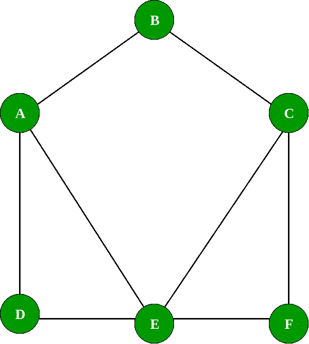

# JavaScript 中图形的实现

> 原文： [https://www.geeksforgeeks.org/implementation-graph-javascript/](https://www.geeksforgeeks.org/implementation-graph-javascript/)

在本文中，我们将在 JavaScript 中实现 [Graph 数据结构](https://www.geeksforgeeks.org/graph-data-structure-and-algorithms/)。 图是一种非线性数据结构。 图`G`包含一组顶点`V`和一组边线`E`。 Graph 在计算机科学中有许多应用。
**图基本上分为两大类**：

*   **有向图（图）** –边缘具有方向的位置。
*   **无向图** –边缘不代表任何有向图

有多种表示图表的方法：-

*   **邻接矩阵**
*   **邻接列表**

还有其他几种方式，例如入射矩阵等，但是这两种方式最常用。 有关邻接矩阵和列表的说明，请参见[图及其表示](https://www.geeksforgeeks.org/graph-and-its-representations/)。
在本文中，我们将使用**邻接表**来表示图，因为在大多数情况下，它比其他表示具有一定的优势。
现在让我们看一下 Graph 类的示例-

## Java

```java

// create a graph class
class Graph {
    // defining vertex array and
    // adjacent list
    constructor(noOfVertices)
    {
        this.noOfVertices = noOfVertices;
        this.AdjList = new Map();
    }

    // functions to be implemented

    // addVertex(v)
    // addEdge(v, w)
    // printGraph()

    // bfs(v)
    // dfs(v)
}

```

上面的示例显示了*图*类的框架。 我们定义了两个私有变量，即 *noOfVertices* 来存储图中的顶点数，以及 *AdjList* ，后者存储特定顶点的邻接表。 我们使用 ES6 提供的 **Map** Object 来实现邻接表。 映射的键包含一个顶点，值包含一个相邻节点的数组。
现在，我们实现在图表上执行基本操作的功能：

1.  **addVertex（v）** –将顶点 *v* 作为键添加到 *adjList* ，并使用数组初始化其值。

## Java

```java

// add vertex to the graph
addVertex(v)
{
    // initialize the adjacent list with a
    // null array
    this.AdjList.set(v, []);
}

```

2.  **addEdge（src，dest）** –在 *src* 和 *dest* 之间添加一条边。

## Java

```java

// add edge to the graph
addEdge(v, w)
{
    // get the list for vertex v and put the
    // vertex w denoting edge between v and w
    this.AdjList.get(v).push(w);

    // Since graph is undirected,
    // add an edge from w to v also
    this.AdjList.get(w).push(v);
}

```

1.  为了添加边，我们获得了相应 *src* 顶点的邻接列表，并将 *dest* 添加到邻接列表中。
2.  **printGraph（）** –打印顶点及其邻接列表。

## Java

```java

// Prints the vertex and adjacency list
printGraph()
{
    // get all the vertices
    var get_keys = this.AdjList.keys();

    // iterate over the vertices
    for (var i of get_keys) 
{
        // great the corresponding adjacency list
        // for the vertex
        var get_values = this.AdjList.get(i);
        var conc = "";

        // iterate over the adjacency list
        // concatenate the values into a string
        for (var j of get_values)
            conc += j + " ";

        // print the vertex and its adjacency list
        console.log(i + " -> " + conc);
    }
}

```

让我们看一下图表
的示例



现在我们将使用图类来实现上面显示的图：

## Java

```java

// Using the above implemented graph class
var g = new Graph(6);
var vertices = [ 'A', 'B', 'C', 'D', 'E', 'F' ];

// adding vertices
for (var i = 0; i < vertices.length; i++) {
    g.addVertex(vertices[i]);
}

// adding edges
g.addEdge('A', 'B');
g.addEdge('A', 'D');
g.addEdge('A', 'E');
g.addEdge('B', 'C');
g.addEdge('D', 'E');
g.addEdge('E', 'F');
g.addEdge('E', 'C');
g.addEdge('C', 'F');

// prints all vertex and
// its adjacency list
// A -> B D E
// B -> A C
// C -> B E F
// D -> A E
// E -> A D F C
// F -> E C
g.printGraph();

```

**图形遍历**

我们将实现最常见的图遍历算法：

*   [图](https://www.geeksforgeeks.org/breadth-first-traversal-for-a-graph/)的广度优先遍历
*   [图](https://www.geeksforgeeks.org/depth-first-traversal-for-a-graph/)的深度优先遍历

BFS 和 DFS 的实施：

1.  **bfs（startingNode）** –它从给定的 *startingNode* 中执行广度优先搜索

## Java

```java

// function to performs BFS
bfs(startingNode)
{

    // create a visited object
    var visited = {};

    // Create an object for queue
    var q = new Queue();

    // add the starting node to the queue
    visited[startingNode] = true;
    q.enqueue(startingNode);

    // loop until queue is element
    while (!q.isEmpty()) {
        // get the element from the queue
        var getQueueElement = q.dequeue();

        // passing the current vertex to callback funtion
        console.log(getQueueElement);

        // get the adjacent list for current vertex
        var get_List = this.AdjList.get(getQueueElement);

        // loop through the list and add the element to the
        // queue if it is not processed yet
        for (var i in get_List) {
            var neigh = get_List[i];

            if (!visited[neigh]) {
                visited[neigh] = true;
                q.enqueue(neigh);
            }
        }
    }
}

```

1.  在以上方法中，我们已经实现了 BFS 算法。 [队列](https://www.geeksforgeeks.org/implementation-queue-javascript/)用于保留未访问的节点。
    让我们使用上述方法并沿图
    遍历

## Java

```java

// prints
// BFS
// A B D E C F
console.log("BFS");
g.bfs('A');

```

1.  下图在示例图上显示了 BFS：


2.  **dfs（startingNode）** –它在图形上执行深度优先遍历

## Java

```java

// Main DFS method
dfs(startingNode)
{

    var visited = {};

    this.DFSUtil(startingNode, visited);
}

// Recursive function which process and explore
// all the adjacent vertex of the vertex with which it is called
DFSUtil(vert, visited)
{
    visited[vert] = true;
    console.log(vert);

    var get_neighbours = this.AdjList.get(vert);

    for (var i in get_neighbours) {
        var get_elem = get_neighbours[i];
        if (!visited[get_elem])
            this.DFSUtil(get_elem, visited);
    }
}

```

1.  在上面的示例中， *dfs（startingNode）*用于初始化访问数组， *DFSutil（vert，Visited）*。
    包含 DFS 算法的实现。
    让我们使用上面的例子 沿图遍历的方法

## Java

```java

// prints
// DFS
// A B C E D F
console.log("DFS");
g.dfs('A');

```

1.  下图在示例图上显示了 DFS。


本文由 **Sumit Ghosh** 提供。 如果您喜欢 GeeksforGeeks 并希望做出贡献，则还可以使用 [tribution.geeksforgeeks.org](http://www.contribute.geeksforgeeks.org) 撰写文章，或将您的文章邮寄至 tribution@geeksforgeeks.org。 查看您的文章出现在 GeeksforGeeks 主页上，并帮助其他 Geeks。
如果发现任何不正确的内容，或者想分享有关上述主题的更多信息，请发表评论。

