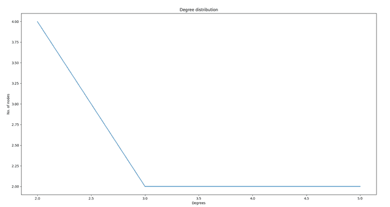

# 在社交网络上实现 Erdos-Renyi 模型

> 原文： [https://www.geeksforgeeks.org/implementation-of-erdos-renyi-model-on-social-networks/](https://www.geeksforgeeks.org/implementation-of-erdos-renyi-model-on-social-networks/)

**先决条件：** [社交网络简介](https://www.geeksforgeeks.org/introduction-to-social-networks-using-networkx-in-python/)，[鄂尔多斯-仁伊模型](https://www.geeksforgeeks.org/erdos-renyl-model-generating-random-graphs/)

Erdos Renyi 模型用于在社交网络上创建随机网络或图形。 在 Erdos Reny 模型中，每个边缘都有固定的概率出现，而与网络中的边缘无关地不存在。

### 使用 Erdos-Renyi 模型实施社交网络：

**步骤 1）**导入必要的模块，例如 [*networkx*](https://www.geeksforgeeks.org/networkx-python-software-package-study-complex-networks/) ， [*matplotlib.pyplot*](https://www.geeksforgeeks.org/pyplot-in-matplotlib/) 和 [*随机*](https://www.geeksforgeeks.org/random-random-function-in-python/) 模块。

## Python3

```

# Import Required modules 
import networkx as nx 
import matplotlib.pyplot as plt 
import random

```

**步骤 2）**为模型创建分布图。

## Python3

```

# Distribution graph for Erdos_Renyi model 
def distribution_graph(g): 
    print(nx.degree(g)) 
    all_node_degree = list(dict((nx.degree(g))).values()) 

    unique_degree = list(set(all_node_degree)) 
    unique_degree.sort() 
    nodes_with_degree = [] 
    for i in unique_degree: 
        nodes_with_degree.append(all_node_degree.count(i)) 

    plt.plot(unique_degree, nodes_with_degree) 
    plt.xlabel("Degrees") 
    plt.ylabel("No. of nodes") 
    plt.title("Degree distribution") 
    plt.show()

```

**步骤 3）**取 *N* 个用户的节点数。

## Python3

```

# Take N number of nodes as input 
print("Enter number of nodes") 
N = int(input())

```

**步骤 4）**现在取 *P* ，即来自用户的边缘概率。

## Python3

```

# Take P probability value for edges 
print("Enter value of probability of every node") 
P = float(input())

```

**步骤 5）**创建一个具有 N 个节点且没有任何边的图形。

## Python3

```

# Create an empty graph object 
g = nx.Graph() 

# Adding nodes 
g.add_nodes_from(range(1, N + 1))

```

**步骤 6）**将边随机添加到图中，获取一对节点，然后获得一个随机数 *R* 。 如果 *R < P* （概率），则添加一条边。 对所有可能的节点对重复步骤 5 和 6，然后显示形成的整个社交网络（图）。

## Python3

```

# Add edges to the graph randomly. 
for i in g.nodes(): 
    for j in g.nodes(): 
        if (i < j): 

            # Take random number R. 
            R = random.random() 

            # Check if R<P add the edge  
            # to the graph else ignore. 
            if (R < P): 
                g.add_edge(i, j) 
    pos = nx.circular_layout(g) 

    # Display the social network  
    nx.draw(g, pos, with_labels=1) 
    plt.show()

```

**步骤 7）**显示连接节点。

## Python3

```

# Display connection between nodes     
distribution_graph(g)

```

### 以下是上述逐步方法的完整程序：

## Python3

```

# Implementation of Erdos-Renyi Model on a Social Network 

# Import Required modules 
import networkx as nx 
import matplotlib.pyplot as plt 
import random 

# Distribution graph for Erdos_Renyi model 
def distribution_graph(g): 
    print(nx.degree(g)) 
    all_node_degree = list(dict((nx.degree(g))).values()) 

    unique_degree = list(set(all_node_degree)) 
    unique_degree.sort() 
    nodes_with_degree = [] 
    for i in unique_degree: 
        nodes_with_degree.append(all_node_degree.count(i)) 

    plt.plot(unique_degree, nodes_with_degree) 
    plt.xlabel("Degrees") 
    plt.ylabel("No. of nodes") 
    plt.title("Degree distribution") 
    plt.show() 

# Take N number of nodes from user 
print("Enter number of nodes") 
N = int(input()) 

# Take P probability value for edges 
print("Enter value of probability of every node") 
P = float(input()) 

# Create an empty graph object 
g = nx.Graph() 

# Adding nodes 
g.add_nodes_from(range(1, N + 1)) 

# Add edges to the graph randomly. 
for i in g.nodes(): 
    for j in g.nodes(): 
        if (i < j): 

            # Take random number R. 
            R = random.random() 

            # Check if R<P add the edge to the graph else ignore. 
            if (R < P): 
                g.add_edge(i, j) 
    pos = nx.circular_layout(g) 

    # Display the social network  
    nx.draw(g, pos, with_labels=1) 
    plt.show() 

# Display connection between nodes     
distribution_graph(g) 

```

**输出：**

> 输入节点数
> 10
> 输入每个节点的概率值
> 0.4
> [（1，5），（2，3），（3，4），（4，2）， （5，3），（6，5），（7，4），（8，2），（9，2），（10，2）]


在图中随机添加边

**程度**在上述程序**中执行 Erdos-Renyi 模型的分布图：**



注意怪胎！ 通过 [**Python 编程基础**](https://practice.geeksforgeeks.org/courses/Python-Foundation?utm_source=geeksforgeeks&utm_medium=article&utm_campaign=GFG_Article_Bottom_Python_Foundation) 课程加强基础，并学习基础知识。

首先，您的面试准备将通过 [**Python DS**](https://practice.geeksforgeeks.org/courses/Data-Structures-With-Python?utm_source=geeksforgeeks&utm_medium=article&utm_campaign=GFG_Article_Bottom_Python_DS) 课程来增强您的数据结构概念。

* * *

* * *

如果您喜欢 GeeksforGeeks 并希望做出贡献，则还可以使用 [tribution.geeksforgeeks.org](https://contribute.geeksforgeeks.org/) 撰写文章，或将您的文章邮寄至 tribution@geeksforgeeks.org。 查看您的文章出现在 GeeksforGeeks 主页上，并帮助其他 Geeks。

如果您发现任何不正确的地方，请单击下面的“改进文章”按钮，以改进本文。