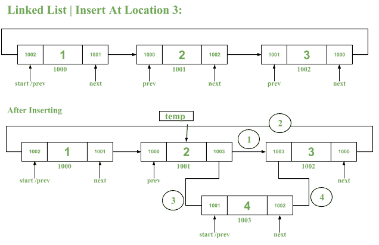

# 在圆形双链接列表

中的特定位置插入

**前提条件**：

*   [插入元素圆形双链表](https://www.geeksforgeeks.org/doubly-circular-linked-list-set-1-introduction-and-insertion/)。
*   [将数组转换为循环双链表。](https://www.geeksforgeeks.org/convert-array-to-circular-doubly-linked-list/)

给定*起始*指针，该指针指向循环双链表的起点，*元素*和*位置*。 任务是将*元素*插入给定循环双链表中指定的*位置*。

这个想法是计算列表中元素的总数。 检查指定的位置是否有效，即位置是否在计数范围内。

如果位置有效：

1.  在内存中创建一个newNode。
2.  使用临时指针（ **temp** ）在列表中遍历，直到节点恰好在需要插入新节点的给定位置之前。
3.  通过执行以下操作来插入新节点：
    *   分配newNode-> next = temp-> next
    *   将newNode-> prev分配为temp-> next
    *   将temp-> next分配为newNode
    *   假设（temp-> next）-> prev as newNode-> next

以下是上述想法的实现：

## C ++

*filter_none*

*编辑*
*关闭*

*play_arrow*

*链接*
*亮度_4*
*代码*

| `// CPP program to convert insert an element at a specific``// position in a circular doubly linked list``#include <bits/stdc++.h>``using` `namespace` `std;``// Doubly linked list node``struct` `node {` `int` `data;` `struct` `node* next;` `struct` `node* prev;``};``// Utility function to create a node in memory``struct` `node* getNode()``{` `return` `((` `struct` `node*)` `malloc` `(` `sizeof` `(` `struct` `node)));``}``// Function to display the list``int` `displayList(` `struct` `node* temp)``{` `struct` `node* t = temp;` `if` `(temp == NULL)` `return` `0;` `else` `{` `cout <<` `"The list is: "` `;`] `while` `(temp->next != t) {` `cout << temp->data <<` `" "` `;` `temp = temp->next;` `}` `cout << temp->data << endl;` `return` `1;` `}``}``// Function to count nunmber of``// elements in the list``int` `countList(` `struct` `node* start)``{` `// Declare temp pointer to` `// traverse the list` `struct` `node* temp = start;` `// Variable to store the count` `int` `count = 0;` `// Iterate the list and increment the count` `while` `(temp->next != start) {` `temp = temp->next;` `count++;` `}` `// As the list is circular, increment the` `// counter at last` `count++;` `return` `count;``}``// Function to insert a node at a given position``// in the circular doubly linked list``bool` `insertAtLocation(` `struct` `node* start,` `int` `data,` `int` `loc)``{` `// Declare two pointers` `struct` `node *temp, *newNode;` `int` `i, count;` [ `// Create a new node in memory` `newNode = getNode();` [HT G503] `// Point temp to start` `temp = start;` `// count of total elements in the list` `count = countList(start);` `// If list is empty or the position is` `// not valid, return false`] `if` `(temp == NULL &#124;&#124; count < loc)` `return` `false` `;` `else` `{` `// Assign the data` `newNode->data = data;` `// Iterate till the loc` `for` `(i = 1; i < loc - 1; i++) {` `temp = temp->next;` `}`] `// See in Image, circle 1` `newNode->next = temp->next;` `// See in Image, Circle 2` `(temp->next)->prev = newNode;` `// See in Image, Circle 3` `temp->next = newNode;` `// See in Image, Circle 4` `newNode->prev = temp;` `return` `true` `;` `}` `return` `false` `;``}``// Function to create circular doubly linked list``// from array elements``void` `createList(` `int` `arr[],` `int` `n,` `struct` `node** start)``{` `// Declare newNode and temporary pointer` `struct` `node *newNode, *temp;` `int` `i;` `// Iterate the loop until array length` `for` `(i = 0; i < n; i++) {` `// Create new node` `newNode = getNode();`]  `// Assign the array data` `newNode->data = arr[i];` `// If it is first element` `// Put that node prev and next as start` `// as it is circular` `if` `(i == 0) {` ​​ `*start = newNode;` `newNode->prev = *start;` `newNode->next = *start;` `}` `else` `{` `// Find the last node` `temp = (*start)->prev;` `// Add the last node to make them` `// in circular fashion` `temp->next = newNode;` `newNode->next = *start;` `newNode->prev = temp;` `temp = *start;` `temp->prev = newNode;` `}` `}``}``// Driver Code``int` `main()``{` `// Array elements to create` `// circular doubly linked list` `int` `arr[] = { 1, 2, 3, 4, 5, 6 };` `int` `n =` `sizeof` `(arr) /` `sizeof` `(arr[0]);` `// Start Pointer` `struct` `node* start = NULL;` `// Create the List` `createList(arr, n, &start);` `// Display the list before insertion` `displayList(start);` `// Inserting 8 at 3rd position` [HTG6 97] `insertAtLocation(start, 8, 3);` `// Display the list after insertion` `displayList(start);` ［HTG707］ ［HTG708］ ［HTG353］ ［HTG354］ ［HTG355］ ［HTG709］ ［HTG710］ ［HTG356］ ［HTG711］ ［HTG712］ |

*chevron_right**filter_none*