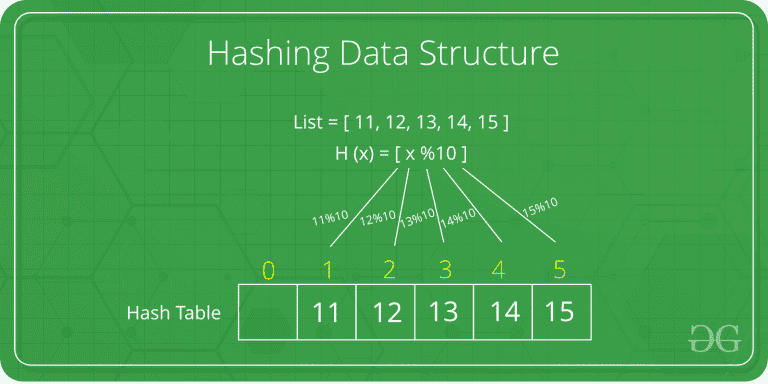
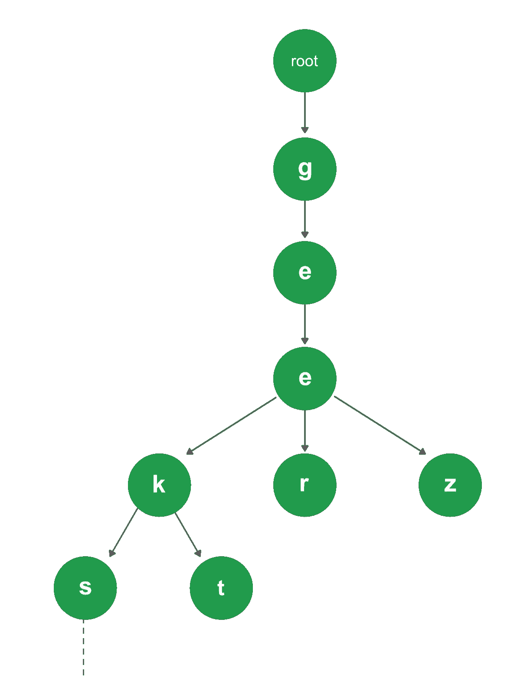

# 数据结构简介 | 10 种最常用的数据结构

> 原文：[https://www.geeksforgeeks.org/introduction-to-data-structures-10-most-commonly-used-data-structures/](https://www.geeksforgeeks.org/introduction-to-data-structures-10-most-commonly-used-data-structures/)

[数据结构](https://www.geeksforgeeks.org/data-structures/)是在计算机中组织数据的一种特殊方式，因此可以有效地使用它。 这个想法是为了减少不同任务的时间和空间复杂度。

以下是一些流行的数据结构的概述：

1.  [**数组**](https://www.geeksforgeeks.org/array-data-structure/)：数组是存储在连续内存位置的项目的集合。 想法是将相同类型的多个项目存储在一起。 通过简单地将偏移量添加到基本值（即数组的第一个元素的存储位置（通常由数组的名称表示），可以更轻松地计算每个元素的位置。

    

2.  [**链表**](https://www.geeksforgeeks.org/data-structures/linked-list/)：像数组一样，链表是线性数据结构。 与数组不同，链接列表元素不存储在连续的位置； 元素使用指针链接。

    

3.  [**栈**](http://www.geeksforgeeks.org/stack-data-structure/)：栈是遵循特定操作顺序的线性数据结构。 该顺序可以是 LIFO（后进先出）或 FILO（后进先出）。

    

    主要在栈中执行以下三个基本操作：

    *   `push`：在栈中添加一个项目。 如果栈已满，则称其为溢出条件。

    *   `pop`：从栈中删除一个项目。 这些项目以推入的相反顺序弹出。 如果栈为空，则称其为下溢条件。

    *   `peek/top`：返回栈的顶部元素。

    *   `isEmpty`：如果栈为空，则返回`true`，否则返回`false`。

4.  [**队列**](http://www.geeksforgeeks.org/queue-data-structure/)：像栈一样，队列是一种线性结构，遵循执行操作的特定顺序。 顺序为先进先出（FIFO）。 队列的一个很好的例子是资源的任何使用者队列，其中首先服务于第一位的使用者。 栈和队列之间的区别在于删除。 在栈中，我们删除最近添加的项目； 在队列中，我们删除了最远添加的项目。

    

    主要在队列上执行以下四个基本操作：

    *   `enqueue`：将项目添加到队列。 如果队列已满，则称其为溢出条件。

    *   `dequeue`：从队列中删除项目。 这些项目会以与推送相同的顺序弹出。 如果队列为空，则称其为下溢条件。

    *   `front`：从队列中获取前一项。

    *   `rear`：从队列中获取最后一个项目。

5.  [**二叉树**](https://www.geeksforgeeks.org/binary-tree-data-structure/)：与数组，链表，堆栈和队列（它们是线性数据结构）不同，树是分层数据结构。 二叉树是一种树数据结构，其中每个节点最多具有两个子节点，称为左子节点和右子节点。 它主要使用链接来实现。

    二叉树由指向树中最高节点的指针表示。 如果树为空，则根的值为`NULL`。 二叉树节点包含以下部分。

    ```
    1\. Data
    2\. Pointer to left child
    3\. Pointer to the right child
    ```

<<<<<<< HEAD
6.  [**二分搜索树**](http://www.geeksforgeeks.org/binary-search-tree-set-1-search-and-insertion/) ：在二分搜索树中是具有以下附加属性的二进制树：
=======
6.  [**二叉搜索树**](http://www.geeksforgeeks.org/binary-search-tree-set-1-search-and-insertion/) ：在二叉搜索树中是具有以下附加属性的二进制树：
>>>>>>> 67ea03ac9ece65f623a6b1a9a1311be605210497

    *   节点的左子树仅包含键小于节点键的节点。

    *   节点的右子树仅包含键大于该节点的键的节点。

    *   左和右子树也都必须是二叉搜索树。

7.  [**堆**](https://www.geeksforgeeks.org/heap-data-structure/)：堆是一种特殊的基于树的数据结构，其中树是完整的二叉树。 通常，堆可以有两种类型：

    *   **最大堆**：在最大堆中，根节点上存在的密钥必须在所有子节点上存在的密钥中最大。 对于该二叉树中的所有子树，相同的属性必须递归地为`true`。

    *   **最小堆**：在最小堆中，根节点上存在的密钥必须在所有子节点上存在的密钥中最小。 对于该二叉树中的所有子树，相同的属性必须递归地为`true`。

    

8.  [**散列数据结构**](https://www.geeksforgeeks.org/hashing-data-structure/)：散列是重要的数据结构，其设计为使用一种称为散列函数的特殊函数，该函数用于使用特定键映射给定值以更快地访问元素。 映射的效率取决于所使用的哈希函数的效率。

    让哈希函数`H(x)`将值`x`映射到数组中的索引`x % 10`处。 例如，如果值列表为`[11, 12, 13, 14, 15]`，它将分别存储在数组或哈希表中的位置`{1, 2, 3, 4, 5}`。

    

9.  [**矩阵**](https://www.geeksforgeeks.org/matrix/)：矩阵表示按行和列顺序排列的数字的集合。 必须将矩阵的元素括在括号或方括号中。

    包含 9 个元素的矩阵如下所示。

    

10.  [**Trie**](http://www.geeksforgeeks.org/trie-insert-and-search/)：Trie 是一种有效的信息检索数据结构。 使用 Trie，可以使搜索复杂度达到最佳极限（密钥长度）。 如果我们将密钥存储在二叉搜索树中，那么均衡的 BST 将需要与`M * log N`成比例的时间，其中`M`是最大字符串长度，`N`是树中密钥的数量。 使用 Trie，我们可以在`O(M)`时间中搜索的键。 但是，惩罚取决于 Trie 的存储要求。

    


* * *

* * *

如果您喜欢 GeeksforGeeks 并希望做出贡献，则还可以使用 [tribution.geeksforgeeks.org](https://contribute.geeksforgeeks.org/) 撰写文章，或将您的文章邮寄至 tribution@geeksforgeeks.org。 查看您的文章出现在 GeeksforGeeks 主页上，并帮助其他 Geeks。

如果您发现任何不正确的地方，请单击下面的“改进文章”按钮，以改进本文。