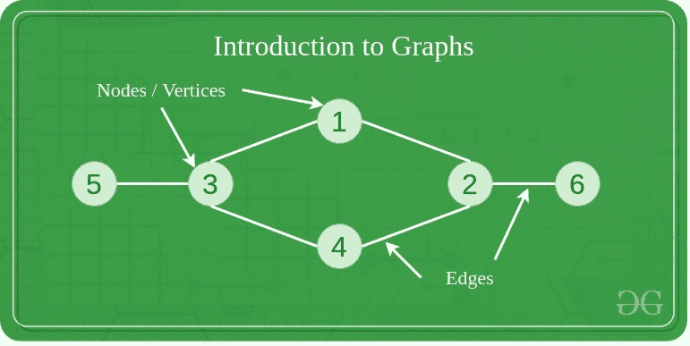
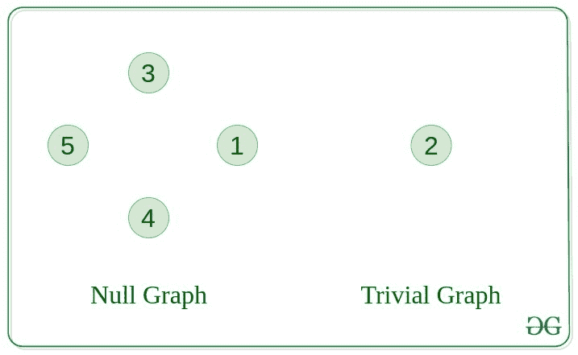
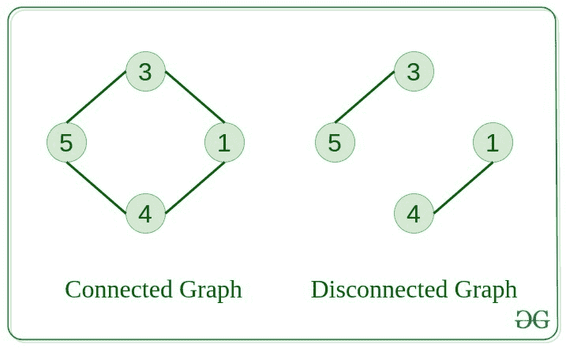
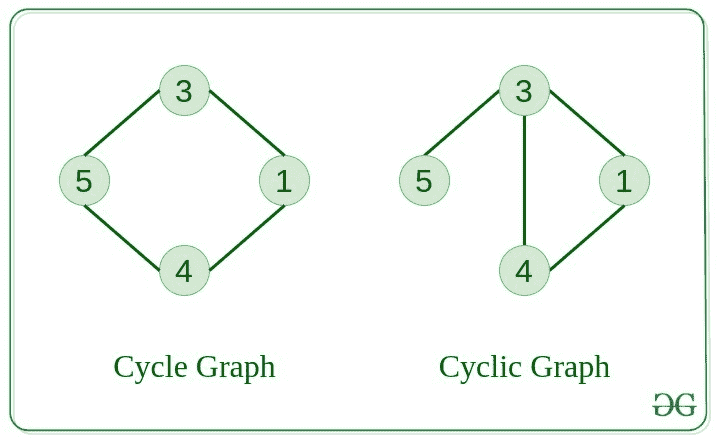
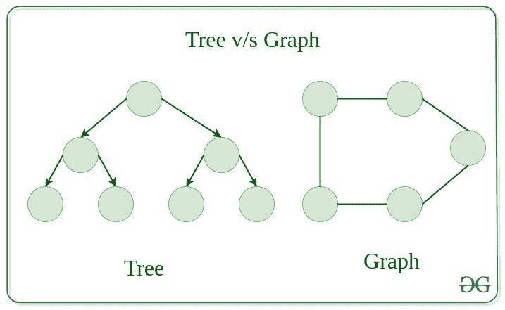
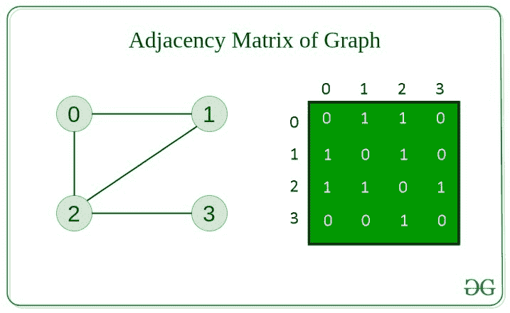
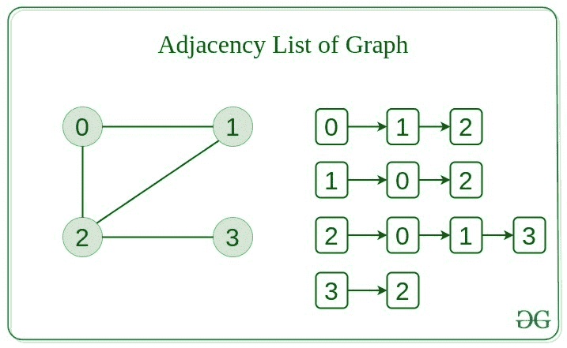

# 图形简介

> 原文： [https://www.geeksforgeeks.org/introduction-to-graphs/](https://www.geeksforgeeks.org/introduction-to-graphs/)

[图](https://www.geeksforgeeks.org/graph-data-structure-and-algorithms/)由一组顶点（表示为 **V** ）和一组边缘（表示为 **E** ）组成。

> 该图由 G（E，V）表示。

## 图的组成

1.  **顶点：**顶点是图形的基本单位。 有时，顶点也称为顶点或节点。 每个节点/顶点都可以标记或不标记。
2.  **边：**边是绘制的或用于连接图形的两个节点。 它可以是有向图中节点的有序对。 边缘可以任何可能的方式连接任何两个节点。 没有规则。 有时，边缘也称为圆弧。 每个边缘都可以贴标签/不贴标签。

## [图的类型](https://www.geeksforgeeks.org/graph-types-and-applications/)

1.  #### 空图

    如果图中没有边，则该图称为空图。

    

2.  #### 平凡图

    仅具有单个顶点的图，它是可能的最小图。

3.  #### 无向图

    边没有任何方向的图形。 也就是说，在每个边缘的定义中，节点都是无序对。

    

4.  #### 有向图

    边具有方向的图。 也就是说，节点在每个边缘的定义中都是有序对。

5.  #### 连接图

    从一个节点我们可以访问该图中任何其他节点的图称为连通图。

    

6.  #### 断开图

    至少一个节点无法从一个节点到达的图称为断开连接图。

7.  #### 正则图

    每个顶点的度等于该图的其他顶点的图。
    假设每个顶点的度为 **K** ，则该图称为 **K-正则**。

    

8.  #### 完整图

    从每个节点到另一个节点都有一条边的图。

9.  #### 循环图

    该图本身是一个循环，每个顶点的度为 2。

    

10.  #### 循环图

    包含至少一个循环的图称为循环图。

11.  #### 有向无环图

    不包含任何循环的有向图。

    

12.  #### [二分图](http://www.geeksforgeeks.org/bipartite-graph/)

    可以将顶点分为两组的图形，这样每组中的顶点之间就不包含任何边。

## 树 v / s 图

树是图形的受限类型，只是带有更多规则。 每棵树将始终是图，但并非所有图都将是树。
[链表](https://www.geeksforgeeks.org/data-structures/linked-list/)，[树](https://www.geeksforgeeks.org/binary-tree-data-structure/)和[堆](https://www.geeksforgeeks.org/heap-data-structure/)都是图的特殊情况。

## 图的表示

有两种存储图的方法：

*   邻接矩阵
*   邻接表

#### 邻接矩阵

在这种方法中，图形以 2D 矩阵的形式存储，其中行和列表示顶点。
矩阵中的每个条目代表这些顶点之间的边缘权重。

#### 邻接表

此图表示为链接列表的集合。
有一个指针数组，指向与该顶点连接的边。

#### 他们之间的比较

当图形包含大量边时，最好将其存储为矩阵，因为矩阵中只有一些条目为空。
一种算法，例如 [Prim 的](https://www.geeksforgeeks.org/prims-minimum-spanning-tree-mst-greedy-algo-5/)和 [Dijkstra](https://www.geeksforgeeks.org/dijkstras-shortest-path-algorithm-greedy-algo-7/) 邻接矩阵，其复杂度较低。

| 行动 | 邻接矩阵 | 邻接表 |
| --- | --- | --- |
| 加边 | O（1） | O（1） |
| 移除并修边 | O（1） | 上） |
| 初始化中 | O（N * N） | 上） |

## 解决问题的步骤

*   将[问题](https://practice.geeksforgeeks.org/explore/?category%5B%5D=Graph&page=1)识别为图形问题。
*   找到解决问题的[算法](https://www.geeksforgeeks.org/graph-data-structure-and-algorithms/)
*   设计[数据结构和算法](https://www.geeksforgeeks.org/data-structures/)以实现图形解决方案。
*   [编码](https://ide.geeksforgeeks.org/)！

## 图的基本操作

以下是该图的基本操作：

*   在图中插入节点/边–将节点插入图中。
*   图中节点/边的删除–从图中删除节点。
*   在图形上搜索–在图形中搜索实体。
*   图的遍历–遍历图中的所有节点。

## 图的用法

*   可以使用图形表示地图，然后计算机可以使用它来提供各种服务，例如两个城市之间的最短路径。
*   当各种任务相互依赖时，可以使用有向无环图表示这种情况，我们可以使用拓扑排序找到执行任务的顺序。
*   状态转换图表示从当前状态可以采取的合法措施。 在井字游戏中可以使用此功能。
*   杀死[面试](https://www.geeksforgeeks.org/category/interview-experiences/)！

## 图的实际应用

**图的更多资源：**

*   [关于图](https://www.geeksforgeeks.org/graph-data-structure-and-algorithms/)的最新文章
*   [图](https://practice.geeksforgeeks.org/explore/?category%5B%5D=Graph&page=1)上的练习题
*   [图上的算法](https://www.geeksforgeeks.org/graph-data-structure-and-algorithms/)

* * *

* * *

如果您喜欢 GeeksforGeeks 并希望做出贡献，则还可以使用 [tribution.geeksforgeeks.org](https://contribute.geeksforgeeks.org/) 撰写文章，或将您的文章邮寄至 tribution@geeksforgeeks.org。 查看您的文章出现在 GeeksforGeeks 主页上，并帮助其他 Geeks。

如果您发现任何不正确的地方，请单击下面的“改进文章”按钮，以改进本文。