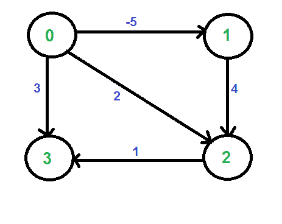
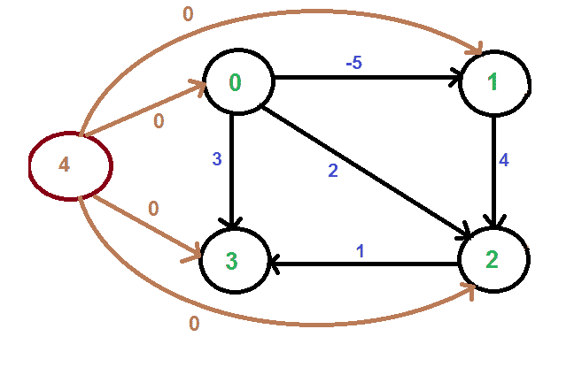
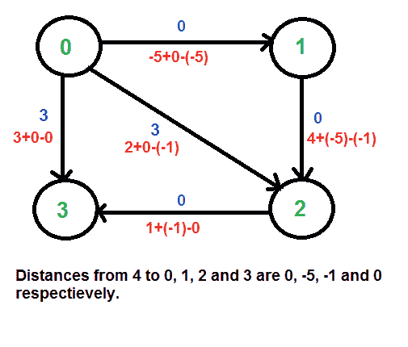

# 约翰逊全对最短路径算法| 实施

> 原文： [https://www.geeksforgeeks.org/johnsons-algorithm-for-all-pairs-shortest-paths-implementation/](https://www.geeksforgeeks.org/johnsons-algorithm-for-all-pairs-shortest-paths-implementation/)

给定一个权重可能为负的加权有向图，请使用 Johnson 的算法在图中的每对顶点之间找到最短路径。

Johnson 算法的详细解释已经在[先前的文章](https://www.geeksforgeeks.org/johnsons-algorithm/)中进行了讨论。

**请参阅**：[约翰逊全对最短路径算法](https://www.geeksforgeeks.org/johnsons-algorithm/)。

本文着重介绍 Johnson 算法的实现。

**算法**：

1.  假设给定的图为 G。向图中添加新的顶点 s，将新顶点的边添加至 G 的所有顶点。让修改后的图为 G’。
2.  在 s 作为来源的 G’上运行 [Bellman-Ford 算法](https://www.geeksforgeeks.org/dynamic-programming-set-23-bellman-ford-algorithm/)。 令由 Bellman-Ford 计算的距离为 h [0]，h [1]，.. h [V-1]。 如果我们发现负体重循环，则返回。 请注意，负权重循环无法由新顶点 s 创建，因为 s 没有边。 所有边均来自。
3.  重新加权原始图形的边缘。 对于每个边缘（u，v），将新权重分配为“原始权重+ h [u] – h [v]”。
4.  删除添加的顶点，并为每个顶点运行 [Dijkstra 的算法](https://www.geeksforgeeks.org/greedy-algorithms-set-6-dijkstras-shortest-path-algorithm/)。

**示例**：
让我们考虑下图。



我们添加一个 source，并将 s 的边添加到原始图的所有顶点。 在下图中，s 为 4。



我们使用 Bellman-Ford 算法计算从 4 到所有其他顶点的最短距离。 从 4 到 0、1、2 和 3 的最短距离分别为 0，-5，-1 和 0，即 h [] = {0，-5，-1、0}。 一旦获得这些距离，就可以删除源顶点 4 并使用以下公式对边缘进行加权。 w（u，v）= w（u，v）+ h [u] – h [v]。



由于现在所有权重都为正，因此我们可以对每个顶点作为源运行 Dijkstra 的最短路径算法。

下面是上述方法的实现

```

# Implementation of Johnson's algorithm in Python3 

# Import function to initialize the dictionary 
from collections import defaultdict 
MAX_INT = float('Inf') 

# Returns the vertex with minimum  
# distance from the source 
def minDistance(dist, visited): 

    (minimum, minVertex) = (MAX_INT, 0) 
    for vertex in range(len(dist)): 
        if minimum > dist[vertex] and visited[vertex] == False: 
            (minimum, minVertex) = (dist[vertex], vertex) 

    return minVertex 

# Dijkstra Algorithm for Modified  
# Graph (removing negative weights) 
def Dijkstra(graph, modifiedGraph, src): 

    # Number of vertices in the graph 
    num_vertices = len(graph) 

    # Dictionary to check if given vertex is  
    # already included in the shortest path tree 
    sptSet = defaultdict(lambda : False) 

    # Shortest distance of all vertices from the source 
    dist = [MAX_INT] * num_vertices 

    dist[src] = 0

    for count in range(num_vertices): 

        # The current vertex which is at min Distance  
        # from the source and not yet included in the  
        # shortest path tree 
        curVertex = minDistance(dist, sptSet) 
        sptSet[curVertex] = True

        for vertex in range(num_vertices): 
            if ((sptSet[vertex] == False) and
                (dist[vertex] > (dist[curVertex] + 
                modifiedGraph[curVertex][vertex])) and
                (graph[curVertex][vertex] != 0)): 

                dist[vertex] = (dist[curVertex] +
                                modifiedGraph[curVertex][vertex]); 

    # Print the Shortest distance from the source 
    for vertex in range(num_vertices): 
        print ('Vertex ' + str(vertex) + ': ' + str(dist[vertex])) 

# Function to calculate shortest distances from source 
# to all other vertices using Bellman-Ford algorithm 
def BellmanFord(edges, graph, num_vertices): 

    # Add a source s and calculate its min 
    # distance from every other node 
    dist = [MAX_INT] * (num_vertices + 1) 
    dist[num_vertices] = 0

    for i in range(num_vertices): 
        edges.append([num_vertices, i, 0]) 

    for i in range(num_vertices): 
        for (src, des, weight) in edges: 
            if((dist[src] != MAX_INT) and 
                    (dist[src] + weight < dist[des])): 
                dist[des] = dist[src] + weight 

    # Don't send the value for the source added 
    return dist[0:num_vertices] 

# Function to implement Johnson Algorithm 
def JohnsonAlgorithm(graph): 

    edges = [] 

    # Create a list of edges for Bellman-Ford Algorithm 
    for i in range(len(graph)): 
        for j in range(len(graph[i])): 

            if graph[i][j] != 0: 
                edges.append([i, j, graph[i][j]]) 

    # Weights used to modify the original weights 
    modifyWeights = BellmanFord(edges, graph, len(graph)) 

    modifiedGraph = [[0 for x in range(len(graph))] for y in
                    range(len(graph))] 

    # Modify the weights to get rid of negative weights 
    for i in range(len(graph)): 
        for j in range(len(graph[i])): 

            if graph[i][j] != 0: 
                modifiedGraph[i][j] = (graph[i][j] + 
                        modifyWeights[i] - modifyWeights[j]); 

    print ('Modified Graph: ' + str(modifiedGraph)) 

    # Run Dijkstra for every vertex as source one by one 
    for src in range(len(graph)): 
        print ('\nShortest Distance with vertex ' +
                        str(src) + ' as the source:\n') 
        Dijkstra(graph, modifiedGraph, src) 

# Driver Code 
graph = [[0, -5, 2, 3],  
         [0, 0, 4, 0],  
         [0, 0, 0, 1],  
         [0, 0, 0, 0]] 

JohnsonAlgorithm(graph) 

```

**Output:**

```
Modified Graph: [[0, 0, 3, 3], [0, 0, 0, 0], [0, 0, 0, 0], [0, 0, 0, 0]]

Shortest Distance with vertex 0 as the source:

Vertex 0: 0
Vertex 1: 0
Vertex 2: 0
Vertex 3: 0

Shortest Distance with vertex 1 as the source:

Vertex 0: inf
Vertex 1: 0
Vertex 2: 0
Vertex 3: 0

Shortest Distance with vertex 2 as the source:

Vertex 0: inf
Vertex 1: inf
Vertex 2: 0
Vertex 3: 0

Shortest Distance with vertex 3 as the source:

Vertex 0: inf
Vertex 1: inf
Vertex 2: inf
Vertex 3: 0

```

**时间复杂度**：上述算法的时间复杂度为，因为 Dijkstra 的算法将用于邻接矩阵。 注意，通过使用邻接表代替邻接矩阵来表示图，可以使上述算法更加有效。


* * *

* * *

如果您喜欢 GeeksforGeeks 并希望做出贡献，则还可以使用 [tribution.geeksforgeeks.org](https://contribute.geeksforgeeks.org/) 撰写文章，或将您的文章邮寄至 tribution@geeksforgeeks.org。 查看您的文章出现在 GeeksforGeeks 主页上，并帮助其他 Geeks。

如果您发现任何不正确的地方，请单击下面的“改进文章”按钮，以改进本文。