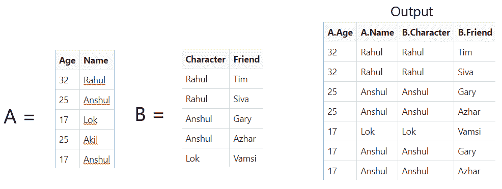

# 使用 MultiMaps 联接表

可以使用嵌套的[循环](https://www.geeksforgeeks.org/loops-in-c-and-cpp/)将两个不同的表连接到它们的匹配列上，但是更有效和可扩展的方法是使用[多图](https://www.geeksforgeeks.org/multimap-associative-containers-the-c-standard-template-library-stl/)。 我们的想法是从我们要联接到包含它的所有行的每个列值中映射 [](http://www.geeksforgeeks.org/map-associative-containers-the-c-standard-template-library-stl/) ，以从两个表中的一个表生成一个多图。

生成的多图必须基于哈希。 [散列](http://www.geeksforgeeks.org/hashing-data-structure/)本质上是一种将大元素转换为代表相同元素的小元素的技术。 因此，为较小的表生成多图，从而减少其生成时间和内存大小。

**示例：**

[](https://media.geeksforgeeks.org/wp-content/uploads/20200803045046/t.png)

**方法：**

*   创建两个表。
*   现在，获得两个表中列的 **ID** 。
*   然后创建并实现一个[多重映射](https://www.geeksforgeeks.org/multimap-associative-containers-the-c-standard-template-library-stl/)以映射到表 B 的各个行。
*   完成上述步骤后，打印结果。

下面是上述方法的实现：

## C ++

```

// C++ program for hashjoin on two tables 
#include <iostream> 
#include <string> 
#include <unordered_map> 
#include <vector> 
using namespace std; 

// Generate two tables to join 
using tab_t = vector<vector<string> >; 

// Table 1 
tab_t tab1{ // Age  Name 
            { "32", "Rahul" }, 
            { "25", "Anshul" }, 
            { "17", "Lok" }, 
            { "25", "Akil" }, 
            { "17", "Anshul" } 
}; 

// Table 2 
tab_t tab2{ // Student  Friend 
            { "Rahul", "Tim" }, 
            { "Rahul", "Siva" }, 
            { "Anshul", "Gary" }, 
            { "Anshul", "Azhar" }, 
            { "Lok", "Vamsi" } 
}; 

// Overloading of Output Operator 
ostream& operator<<(ostream& o, 
                    const tab_t& t) 
{ 
    // Iterate through the tablt t 
    for (size_t i = 0; i < t.size(); ++i) { 
        o << i << ":"; 
        for (const auto& e : t[i]) 
            o << '\t' << e; 
        o << endl; 
    } 
    return o; 
} 

// Function that perform join operation 
// on the two tables 
tab_t Join(const tab_t& a, size_t columna, 
           const tab_t& b, size_t columnb) 
{ 
    unordered_multimap<string, size_t> hashmap; 

    // Use of Hashmap 
    for (size_t i = 0; 
         i < a.size(); ++i) { 
        hashmap.insert({ a[i][columna], i }); 
    } 

    // Perform Mapping 
    tab_t result; 
    for (size_t i = 0; i < b.size(); ++i) { 

        auto range = hashmap.equal_range( 
            b[i][columnb]); 

        // Create new joined table 
        for (auto it = range.first; 
             it != range.second; ++it) { 

            tab_t::value_type row; 

            // Insert values to row 
            row.insert(row.end(), 
                       a[it->second].begin(), 
                       a[it->second].end()); 
            row.insert(row.end(), 
                       b[i].begin(), 
                       b[i].end()); 

            // Push the row 
            result.push_back(move(row)); 
        } 
    } 
    return result; 
} 

// Driver Code 
int main(int argc, char const* argv[]) 
{ 
    int ret = 0; 

    // Given Tables 
    cout << "Table A: " << endl 
         << tab1 << endl; 
    cout << "Table B: " << endl 
         << tab2 << endl; 

    // Function Call 
    auto tab3 = Join(tab1, 1, tab2, 0); 

    // Print the joined table 
    cout << "Joined tables: " << endl 
         << tab3 << endl; 
    return ret; 
} 

```

## Python3

```

# Python program for hashjoin on two tables 
from collections import defaultdict 

# Function that perform join operation 
# on the two tables 
def hashJoin(table1, index1, table2, index2): 

    h = defaultdict(list) 

    # Hash 
    for s in table1: 
        h[s[index1]].append(s) 

    # Perform join operation 
    return [(s, r) for r in table2 for s in h[r[index2]]] 

# Driver Code 

# Given two tables 
table1 = [("32", "Rahul"), 
           ("25", "Anshul"), 
           ("17", "Lok"), 
           ("25", "Akil"), 
           ("17", "Anshul")] 

table2 = [("Rahul", "Tim"), 
          ("Rahul", "Siva"), 
          ("Anshul", "Gary"), 
          ("Anshul", "Azhar"), 
          ("Lok", "Vamsi")] 

# Print the resultant table 
for row in hashJoin(table1, 1, table2, 0): 
    print(row) 

```

**Output:**

```
Table A: 
0:    32    Rahul
1:    25    Anshul
2:    17    Lok
3:    25    Akil
4:    17    Anshul

Table B: 
0:    Rahul    Tim
1:    Rahul    Siva
2:    Anshul    Gary
3:    Anshul    Azhar
4:    Lok    Vamsi

Joined tables: 
0:    32    Rahul    Rahul    Tim
1:    32    Rahul    Rahul    Siva
2:    17    Anshul    Anshul    Gary
3:    25    Anshul    Anshul    Gary
4:    17    Anshul    Anshul    Azhar
5:    25    Anshul    Anshul    Azhar
6:    17    Lok    Lok    Vamsi

```

注意读者！ 现在不要停止学习。 通过 [**DSA 自学课程**](https://practice.geeksforgeeks.org/courses/dsa-self-paced?utm_source=geeksforgeeks&utm_medium=article&utm_campaign=gfg_article_dsa_content_bottom) 以对学生方便的价格掌握所有重要的 DSA 概念，并为行业做好准备。

* * *

* * *

如果您喜欢 GeeksforGeeks 并希望做出贡献，则还可以使用 [tribution.geeksforgeeks.org](https://contribute.geeksforgeeks.org/) 撰写文章，或将您的文章邮寄至 tribution@geeksforgeeks.org。 查看您的文章出现在 GeeksforGeeks 主页上，并帮助其他 Geeks。

如果您发现任何不正确的地方，请单击下面的“改进文章”按钮，以改进本文。