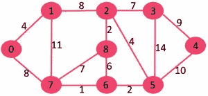
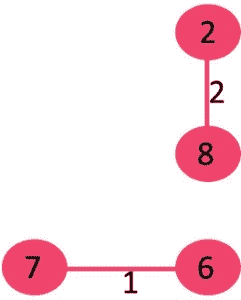
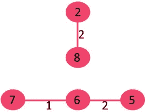
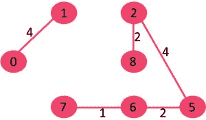
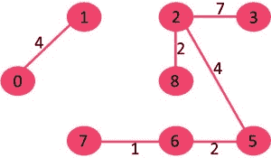
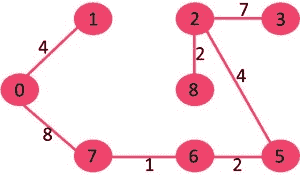
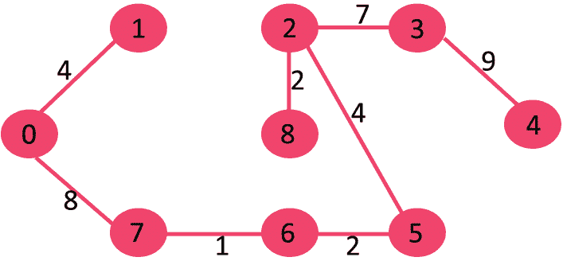

# Kruskal 的最小生成树算法| 贪婪算法 2

> 原文： [https://www.geeksforgeeks.org/kruskals-minimum-spanning-tree-algorithm-greedy-algo-2/](https://www.geeksforgeeks.org/kruskals-minimum-spanning-tree-algorithm-greedy-algo-2/)

***什么是最小生成树？***

给定一个连接且无向的图，该图的*生成树*是一个子图，它是一棵树并将所有顶点连接在一起。 单个图可以具有许多不同的生成树。 加权，连接和无向图的*最小生成树（MST）*或最小权重生成树是权重小于或等于其他所有生成树的权重的生成树。 生成树的权重是赋予生成树的每个边的权重之和。

*最小生成树有几个边？*

最小生成树具有（V – 1）个边，其中 V 是给定图中顶点的数量。

*最小生成树的应用是什么？*

有关 MST 的应用，请参见此的[。](https://www.geeksforgeeks.org/applications-of-minimum-spanning-tree/)

以下是使用 Kruskal 算法查找 MST 的步骤

> **1\.** 对所有边按其权重的非降序排序。
> **2\.** 选取最小的边。 检查它是否与形成的生成树形成一个循环。 如果未形成循环，则包括该边。 否则，将其丢弃。
> **3\.** 重复步骤 2，直到生成树中有（V-1）个边。

步骤 2 使用[联合查找算法](https://www.geeksforgeeks.org/union-find/)检测周期。 因此，我们建议您先阅读以下内容。

[联合查找算法 | 系列 1（图形中的检测周期）](https://www.geeksforgeeks.org/union-find/)，

[联合查找算法 | 系列 2（按等级和路径压缩的并集）](https://www.geeksforgeeks.org/union-find-algorithm-set-2-union-by-rank/)

该算法是贪婪算法。 贪婪的选择是选择重量最小的边沿，该边沿不会在到目前为止构造的 MST 中引起循环。 让我们以一个示例来理解它：考虑以下输入图。



该图包含 9 个顶点和 14 个边。 因此，形成的最小生成树将具有（9 – 1）= 8 个边。

```
After sorting:

Weight   Src    Dest
1         7      6
2         8      2
2         6      5
4         0      1
4         2      5
6         8      6
7         2      3
7         7      8
8         0      7
8         1      2
9         3      4
10        5      4
11        1      7
14        3      5

```

现在从排序的边列表中逐个拾取所有边。

**1。** *拾取边 7-6：*没有形成循环，包括在内。


**2\.** *拾取边 8-2：*没有形成循环，包括在内。



**3\.** *拾取边 6-5：*没有形成循环，包括在内。



**4\.** *拾取边 0-1：*没有形成循环，包括在内。


**5\.** *拾取边 2-5：*没有形成循环，包括在内。



**6\.** *拾取边 8-6：*由于包括该边会导致循环，因此请将其丢弃。

**7\.** *拾取边 2-3：*没有形成循环，包括在内。



**8\.** *拾取边 7-8：*由于包括该边会导致循环，因此请将其丢弃。

**9\.** *拾取边 0-7：*没有形成循环，包括在内。



**10\.** *拾取边 1-2：*由于包括该边会导致循环，因此请将其丢弃。

**11\.** *拾取边 3-4：*没有形成循环，包括在内。



由于包含的边数等于（V – 1），因此算法在此处停止。

以下是上述想法的实现：

## C++

```cpp

// C++ program for Kruskal's algorithm
//  to find Minimum Spanning Tree of a
//  given connected, undirected and weighted
//  graph
#include <bits/stdc++.h>
using namespace std;

// a structure to represent a 
// weighted edge in graph
class Edge {
public:
    int src, dest, weight;
};

// a structure to represent a connected, 
// undirected and weighted graph
class Graph {
public:

    // V-> Number of vertices, E-> Number of edges
    int V, E;

    // graph is represented as an array of edges.
    // Since the graph is undirected, the edge
    // from src to dest is also edge from dest
    // to src. Both are counted as 1 edge here.
    Edge* edge;
};

// Creates a graph with V vertices and E edges
Graph* createGraph(int V, int E)
{
    Graph* graph = new Graph;
    graph->V = V;
    graph->E = E;

    graph->edge = new Edge[E];

    return graph;
}

// A structure to represent a subset for union-find
class subset {
public:
    int parent;
    int rank;
};

// A utility function to find set of an element i
// (uses path compression technique)
int find(subset subsets[], int i)
{
    // find root and make root as parent of i
    // (path compression)
    if (subsets[i].parent != i)
        subsets[i].parent
            = find(subsets, subsets[i].parent);

    return subsets[i].parent;
}

// A function that does union of two sets of x and y
// (uses union by rank)
void Union(subset subsets[], int x, int y)
{
    int xroot = find(subsets, x);
    int yroot = find(subsets, y);

    // Attach smaller rank tree under root of high
    // rank tree (Union by Rank)
    if (subsets[xroot].rank < subsets[yroot].rank)
        subsets[xroot].parent = yroot;
    else if (subsets[xroot].rank > subsets[yroot].rank)
        subsets[yroot].parent = xroot;

    // If ranks are same, then make one as root and
    // increment its rank by one
    else {
        subsets[yroot].parent = xroot;
        subsets[xroot].rank++;
    }
}

// Compare two edges according to their weights.
// Used in qsort() for sorting an array of edges
int myComp(const void* a, const void* b)
{
    Edge* a1 = (Edge*)a;
    Edge* b1 = (Edge*)b;
    return a1->weight > b1->weight;
}

// The main function to construct MST using Kruskal's
// algorithm
void KruskalMST(Graph* graph)
{
    int V = graph->V;
    Edge result[V]; // Tnis will store the resultant MST
    int e = 0; // An index variable, used for result[]
    int i = 0; // An index variable, used for sorted edges

    // Step 1: Sort all the edges in non-decreasing
    // order of their weight. If we are not allowed to
    // change the given graph, we can create a copy of
    // array of edges
    qsort(graph->edge, graph->E, sizeof(graph->edge[0]),
          myComp);

    // Allocate memory for creating V ssubsets
    subset* subsets = new subset[(V * sizeof(subset))];

    // Create V subsets with single elements
    for (int v = 0; v < V; ++v) 
    {
        subsets[v].parent = v;
        subsets[v].rank = 0;
    }

    // Number of edges to be taken is equal to V-1
    while (e < V - 1 && i < graph->E) 
    {
        // Step 2: Pick the smallest edge. And increment
        // the index for next iteration
        Edge next_edge = graph->edge[i++];

        int x = find(subsets, next_edge.src);
        int y = find(subsets, next_edge.dest);

        // If including this edge does't cause cycle,
        // include it in result and increment the index
        // of result for next edge
        if (x != y) {
            result[e++] = next_edge;
            Union(subsets, x, y);
        }
        // Else discard the next_edge
    }

    // print the contents of result[] to display the
    // built MST
    cout << "Following are the edges in the constructed "
            "MST\n";
    int minimumCost = 0;
    for (i = 0; i < e; ++i) 
    {
        cout << result[i].src << " -- " << result[i].dest
             << " == " << result[i].weight << endl;
        minimumCost = minimumCost + result[i].weight;
    }
    // return;
    cout << "Minimum Cost Spanning Tree: " << minimumCost
         << endl;
}

// Driver code
int main()
{
    /* Let us create following weighted graph
            10
        0--------1
        | \ |
    6| 5\ |15
        | \ |
        2--------3
            4 */
    int V = 4; // Number of vertices in graph
    int E = 5; // Number of edges in graph
    Graph* graph = createGraph(V, E);

    // add edge 0-1
    graph->edge[0].src = 0;
    graph->edge[0].dest = 1;
    graph->edge[0].weight = 10;

    // add edge 0-2
    graph->edge[1].src = 0;
    graph->edge[1].dest = 2;
    graph->edge[1].weight = 6;

    // add edge 0-3
    graph->edge[2].src = 0;
    graph->edge[2].dest = 3;
    graph->edge[2].weight = 5;

    // add edge 1-3
    graph->edge[3].src = 1;
    graph->edge[3].dest = 3;
    graph->edge[3].weight = 15;

    // add edge 2-3
    graph->edge[4].src = 2;
    graph->edge[4].dest = 3;
    graph->edge[4].weight = 4;

    // Function call
    KruskalMST(graph);

    return 0;
}

// This code is contributed by rathbhupendra

```

## C

```c

// C program for Kruskal's algorithm to find Minimum
// Spanning Tree of a given connected, undirected and
// weighted graph
#include <stdio.h>
#include <stdlib.h>
#include <string.h>

// a structure to represent a weighted edge in graph
struct Edge {
    int src, dest, weight;
};

// a structure to represent a connected, undirected
// and weighted graph
struct Graph {
    // V-> Number of vertices, E-> Number of edges
    int V, E;

    // graph is represented as an array of edges.
    // Since the graph is undirected, the edge
    // from src to dest is also edge from dest
    // to src. Both are counted as 1 edge here.
    struct Edge* edge;
};

// Creates a graph with V vertices and E edges
struct Graph* createGraph(int V, int E)
{
    struct Graph* graph = new Graph;
    graph->V = V;
    graph->E = E;

    graph->edge = new Edge[E];

    return graph;
}

// A structure to represent a subset for union-find
struct subset {
    int parent;
    int rank;
};

// A utility function to find set of an element i
// (uses path compression technique)
int find(struct subset subsets[], int i)
{
    // find root and make root as parent of i
    // (path compression)
    if (subsets[i].parent != i)
        subsets[i].parent
            = find(subsets, subsets[i].parent);

    return subsets[i].parent;
}

// A function that does union of two sets of x and y
// (uses union by rank)
void Union(struct subset subsets[], int x, int y)
{
    int xroot = find(subsets, x);
    int yroot = find(subsets, y);

    // Attach smaller rank tree under root of high
    // rank tree (Union by Rank)
    if (subsets[xroot].rank < subsets[yroot].rank)
        subsets[xroot].parent = yroot;
    else if (subsets[xroot].rank > subsets[yroot].rank)
        subsets[yroot].parent = xroot;

    // If ranks are same, then make one as root and
    // increment its rank by one
    else
    {
        subsets[yroot].parent = xroot;
        subsets[xroot].rank++;
    }
}

// Compare two edges according to their weights.
// Used in qsort() for sorting an array of edges
int myComp(const void* a, const void* b)
{
    struct Edge* a1 = (struct Edge*)a;
    struct Edge* b1 = (struct Edge*)b;
    return a1->weight > b1->weight;
}

// The main function to construct MST using Kruskal's
// algorithm
void KruskalMST(struct Graph* graph)
{
    int V = graph->V;
    struct Edge
        result[V]; // Tnis will store the resultant MST
    int e = 0; // An index variable, used for result[]
    int i = 0; // An index variable, used for sorted edges

    // Step 1:  Sort all the edges in non-decreasing
    // order of their weight. If we are not allowed to
    // change the given graph, we can create a copy of
    // array of edges
    qsort(graph->edge, graph->E, sizeof(graph->edge[0]),
          myComp);

    // Allocate memory for creating V ssubsets
    struct subset* subsets
        = (struct subset*)malloc(V * sizeof(struct subset));

    // Create V subsets with single elements
    for (int v = 0; v < V; ++v) {
        subsets[v].parent = v;
        subsets[v].rank = 0;
    }

    // Number of edges to be taken is equal to V-1
    while (e < V - 1 && i < graph->E) {
        // Step 2: Pick the smallest edge. And increment
        // the index for next iteration
        struct Edge next_edge = graph->edge[i++];

        int x = find(subsets, next_edge.src);
        int y = find(subsets, next_edge.dest);

        // If including this edge does't cause cycle,
        // include it in result and increment the index
        // of result for next edge
        if (x != y) {
            result[e++] = next_edge;
            Union(subsets, x, y);
        }
        // Else discard the next_edge
    }

    // print the contents of result[] to display the
    // built MST
    printf(
        "Following are the edges in the constructed MST\n");
    int minimumCost = 0;
    for (i = 0; i < e; ++i)
    {
        printf("%d -- %d == %d\n", result[i].src,
               result[i].dest, result[i].weight);
        minimumCost += result[i].weight;
    }
    printf("Minimum Cost Spanning tree : %d",minimumCost);
    return;
}

// Driver program to test above functions
int main()
{
    /* Let us create following weighted graph
             10
        0--------1
        |  \     |
       6|   5\   |15
        |      \ |
        2--------3
            4       */
    int V = 4; // Number of vertices in graph
    int E = 5; // Number of edges in graph
    struct Graph* graph = createGraph(V, E);

    // add edge 0-1
    graph->edge[0].src = 0;
    graph->edge[0].dest = 1;
    graph->edge[0].weight = 10;

    // add edge 0-2
    graph->edge[1].src = 0;
    graph->edge[1].dest = 2;
    graph->edge[1].weight = 6;

    // add edge 0-3
    graph->edge[2].src = 0;
    graph->edge[2].dest = 3;
    graph->edge[2].weight = 5;

    // add edge 1-3
    graph->edge[3].src = 1;
    graph->edge[3].dest = 3;
    graph->edge[3].weight = 15;

    // add edge 2-3
    graph->edge[4].src = 2;
    graph->edge[4].dest = 3;
    graph->edge[4].weight = 4;

    KruskalMST(graph);

    return 0;
}

```

## Java

```java

// Java program for Kruskal's algorithm to 
// find Minimum Spanning Tree of a given 
//connected, undirected and  weighted graph
import java.util.*;
import java.lang.*;
import java.io.*;

class Graph {
    // A class to represent a graph edge
    class Edge implements Comparable<Edge> 
    {
        int src, dest, weight;

        // Comparator function used for 
        // sorting edgesbased on their weight
        public int compareTo(Edge compareEdge)
        {
            return this.weight - compareEdge.weight;
        }
    };

    // A class to represent a subset for 
    // union-find
    class subset 
    {
        int parent, rank;
    };

    int V, E; // V-> no. of vertices & E->no.of edges
    Edge edge[]; // collection of all edges

    // Creates a graph with V vertices and E edges
    Graph(int v, int e)
    {
        V = v;
        E = e;
        edge = new Edge[E];
        for (int i = 0; i < e; ++i)
            edge[i] = new Edge();
    }

    // A utility function to find set of an 
    // element i (uses path compression technique)
    int find(subset subsets[], int i)
    {
        // find root and make root as parent of i 
        // (path compression)
        if (subsets[i].parent != i)
            subsets[i].parent
                = find(subsets, subsets[i].parent);

        return subsets[i].parent;
    }

    // A function that does union of two sets 
    // of x and y (uses union by rank)
    void Union(subset subsets[], int x, int y)
    {
        int xroot = find(subsets, x);
        int yroot = find(subsets, y);

        // Attach smaller rank tree under root 
        // of high rank tree (Union by Rank)
        if (subsets[xroot].rank 
            < subsets[yroot].rank)
            subsets[xroot].parent = yroot;
        else if (subsets[xroot].rank 
                 > subsets[yroot].rank)
            subsets[yroot].parent = xroot;

        // If ranks are same, then make one as 
        // root and increment its rank by one
        else {
            subsets[yroot].parent = xroot;
            subsets[xroot].rank++;
        }
    }

    // The main function to construct MST using Kruskal's
    // algorithm
    void KruskalMST()
    {
        // Tnis will store the resultant MST
        Edge result[] = new Edge[V]; 

        // An index variable, used for result[]
        int e = 0; 

        // An index variable, used for sorted edges
        int i = 0; 
        for (i = 0; i < V; ++i)
            result[i] = new Edge();

        // Step 1:  Sort all the edges in non-decreasing
        // order of their weight.  If we are not allowed to
        // change the given graph, we can create a copy of
        // array of edges
        Arrays.sort(edge);

        // Allocate memory for creating V ssubsets
        subset subsets[] = new subset[V];
        for (i = 0; i < V; ++i)
            subsets[i] = new subset();

        // Create V subsets with single elements
        for (int v = 0; v < V; ++v) 
        {
            subsets[v].parent = v;
            subsets[v].rank = 0;
        }

        i = 0; // Index used to pick next edge

        // Number of edges to be taken is equal to V-1
        while (e < V - 1) 
        {
            // Step 2: Pick the smallest edge. And increment
            // the index for next iteration
            Edge next_edge = new Edge();
            next_edge = edge[i++];

            int x = find(subsets, next_edge.src);
            int y = find(subsets, next_edge.dest);

            // If including this edge does't cause cycle,
            // include it in result and increment the index
            // of result for next edge
            if (x != y) {
                result[e++] = next_edge;
                Union(subsets, x, y);
            }
            // Else discard the next_edge
        }

        // print the contents of result[] to display
        // the built MST
        System.out.println("Following are the edges in "
                           + "the constructed MST");
        int minimumCost = 0;
        for (i = 0; i < e; ++i)
        {
            System.out.println(result[i].src + " -- "
                               + result[i].dest
                               + " == " + result[i].weight);
            minimumCost += result[i].weight;
        }
        System.out.println("Minimum Cost Spanning Tree "
                           + minimumCost);
    }

    // Driver Code
    public static void main(String[] args)
    {

        /* Let us create following weighted graph
                 10
            0--------1
            |  \     |
           6|   5\   |15
            |      \ |
            2--------3
                4       */
        int V = 4; // Number of vertices in graph
        int E = 5; // Number of edges in graph
        Graph graph = new Graph(V, E);

        // add edge 0-1
        graph.edge[0].src = 0;
        graph.edge[0].dest = 1;
        graph.edge[0].weight = 10;

        // add edge 0-2
        graph.edge[1].src = 0;
        graph.edge[1].dest = 2;
        graph.edge[1].weight = 6;

        // add edge 0-3
        graph.edge[2].src = 0;
        graph.edge[2].dest = 3;
        graph.edge[2].weight = 5;

        // add edge 1-3
        graph.edge[3].src = 1;
        graph.edge[3].dest = 3;
        graph.edge[3].weight = 15;

        // add edge 2-3
        graph.edge[4].src = 2;
        graph.edge[4].dest = 3;
        graph.edge[4].weight = 4;

        // Function call
        graph.KruskalMST();
    }
}
// This code is contributed by Aakash Hasija

```

## Python

```py

# Python program for Kruskal's algorithm to find
# Minimum Spanning Tree of a given connected,
# undirected and weighted graph

from collections import defaultdict

# Class to represent a graph

class Graph:

    def __init__(self, vertices):
        self.V = vertices  # No. of vertices
        self.graph = []  # default dictionary
        # to store graph

    # function to add an edge to graph
    def addEdge(self, u, v, w):
        self.graph.append([u, v, w])

    # A utility function to find set of an element i
    # (uses path compression technique)
    def find(self, parent, i):
        if parent[i] == i:
            return i
        return self.find(parent, parent[i])

    # A function that does union of two sets of x and y
    # (uses union by rank)
    def union(self, parent, rank, x, y):
        xroot = self.find(parent, x)
        yroot = self.find(parent, y)

        # Attach smaller rank tree under root of
        # high rank tree (Union by Rank)
        if rank[xroot] < rank[yroot]:
            parent[xroot] = yroot
        elif rank[xroot] > rank[yroot]:
            parent[yroot] = xroot

        # If ranks are same, then make one as root
        # and increment its rank by one
        else:
            parent[yroot] = xroot
            rank[xroot] += 1

    # The main function to construct MST using Kruskal's
        # algorithm
    def KruskalMST(self):

        result = []  # This will store the resultant MST

        # An index variable, used for sorted edges
        i = 0

        # An index variable, used for result[]
        e = 0

        # Step 1:  Sort all the edges in 
        # non-decreasing order of their
        # weight.  If we are not allowed to change the
        # given graph, we can create a copy of graph
        self.graph = sorted(self.graph, 
                            key=lambda item: item[2])

        parent = []
        rank = []

        # Create V subsets with single elements
        for node in range(self.V):
            parent.append(node)
            rank.append(0)

        # Number of edges to be taken is equal to V-1
        while e < self.V - 1:

            # Step 2: Pick the smallest edge and increment
            # the index for next iteration
            u, v, w = self.graph[i]
            i = i + 1
            x = self.find(parent, u)
            y = self.find(parent, v)

            # If including this edge does't
            #  cause cycle, include it in result 
            #  and increment the indexof result 
            # for next edge
            if x != y:
                e = e + 1
                result.append([u, v, w])
                self.union(parent, rank, x, y)
            # Else discard the edge

        minimumCost = 0
        print "Edges in the constructed MST"
        for u, v, weight in result:
            minimumCost += weight
            print("%d -- %d == %d" % (u, v, weight))
        print("Minimum Spanning Tree" , minimumCost)

# Driver code
g = Graph(4)
g.addEdge(0, 1, 10)
g.addEdge(0, 2, 6)
g.addEdge(0, 3, 5)
g.addEdge(1, 3, 15)
g.addEdge(2, 3, 4)

# Function call
g.KruskalMST()

# This code is contributed by Neelam Yadav

```

## C#

```cs

// C# Code for above approach
using System;

class Graph {

    // A class to represent a graph edge
    class Edge : IComparable<Edge> {
        public int src, dest, weight;

        // Comparator function used for sorting edges
        // based on their weight
        public int CompareTo(Edge compareEdge)
        {
            return this.weight 
                   - compareEdge.weight;
        }
    }

    // A class to represent 
    // a subset for union-find
    public class subset 
    {
        public int parent, rank;
    };

    int V, E; // V-> no. of vertices & E->no.of edges
    Edge[] edge; // collection of all edges

    // Creates a graph with V vertices and E edges
    Graph(int v, int e)
    {
        V = v;
        E = e;
        edge = new Edge[E];
        for (int i = 0; i < e; ++i)
            edge[i] = new Edge();
    }

    // A utility function to find set of an element i
    // (uses path compression technique)
    int find(subset[] subsets, int i)
    {
        // find root and make root as
        // parent of i (path compression)
        if (subsets[i].parent != i)
            subsets[i].parent
                = find(subsets, subsets[i].parent);

        return subsets[i].parent;
    }

    // A function that does union of
    // two sets of x and y (uses union by rank)
    void Union(subset[] subsets, int x, int y)
    {
        int xroot = find(subsets, x);
        int yroot = find(subsets, y);

        // Attach smaller rank tree under root of
        // high rank tree (Union by Rank)
        if (subsets[xroot].rank < subsets[yroot].rank)
            subsets[xroot].parent = yroot;
        else if (subsets[xroot].rank > subsets[yroot].rank)
            subsets[yroot].parent = xroot;

        // If ranks are same, then make one as root
        // and increment its rank by one
        else {
            subsets[yroot].parent = xroot;
            subsets[xroot].rank++;
        }
    }

    // The main function to construct MST
    // using Kruskal's algorithm
    void KruskalMST()
    {
        // This will store the
        // resultant MST
        Edge[] result = new Edge[V]; 
        int e = 0; // An index variable, used for result[]
        int i
            = 0; // An index variable, used for sorted edges
        for (i = 0; i < V; ++i)
            result[i] = new Edge();

        // Step 1: Sort all the edges in non-decreasing
        // order of their weight. If we are not allowed
        // to change the given graph, we can create
        // a copy of array of edges
        Array.Sort(edge);

        // Allocate memory for creating V ssubsets
        subset[] subsets = new subset[V];
        for (i = 0; i < V; ++i)
            subsets[i] = new subset();

        // Create V subsets with single elements
        for (int v = 0; v < V; ++v) {
            subsets[v].parent = v;
            subsets[v].rank = 0;
        }

        i = 0; // Index used to pick next edge

        // Number of edges to be taken is equal to V-1
        while (e < V - 1) 
        {
            // Step 2: Pick the smallest edge. And increment
            // the index for next iteration
            Edge next_edge = new Edge();
            next_edge = edge[i++];

            int x = find(subsets, next_edge.src);
            int y = find(subsets, next_edge.dest);

            // If including this edge does't cause cycle,
            // include it in result and increment the index
            // of result for next edge
            if (x != y) {
                result[e++] = next_edge;
                Union(subsets, x, y);
            }
            // Else discard the next_edge
        }

        // print the contents of result[] to display
        // the built MST
        Console.WriteLine("Following are the edges in "
                          + "the constructed MST");

        int minimumCost = 0
        for (i = 0; i < e; ++i)
        {
            Console.WriteLine(result[i].src + " -- "
                              + result[i].dest
                              + " == " + result[i].weight);
          minimumCost += result[i].weight;
        }

        Console.WriteLine("Minimum Cost Spanning Tree"
                          + minimumCost);
        Console.ReadLine();
    }

    // Driver Code
    public static void Main(String[] args)
    {

        /* Let us create following weighted graph
                10
            0--------1
            | \ |
        6| 5\ |15
            | \ |
            2--------3
                4 */
        int V = 4; // Number of vertices in graph
        int E = 5; // Number of edges in graph
        Graph graph = new Graph(V, E);

        // add edge 0-1
        graph.edge[0].src = 0;
        graph.edge[0].dest = 1;
        graph.edge[0].weight = 10;

        // add edge 0-2
        graph.edge[1].src = 0;
        graph.edge[1].dest = 2;
        graph.edge[1].weight = 6;

        // add edge 0-3
        graph.edge[2].src = 0;
        graph.edge[2].dest = 3;
        graph.edge[2].weight = 5;

        // add edge 1-3
        graph.edge[3].src = 1;
        graph.edge[3].dest = 3;
        graph.edge[3].weight = 15;

        // add edge 2-3
        graph.edge[4].src = 2;
        graph.edge[4].dest = 3;
        graph.edge[4].weight = 4;

        // Function call
        graph.KruskalMST();
    }
}

// This code is contributed by Aakash Hasija

```

输出：

```
Following are the edges in the constructed MST
2 -- 3 == 4
0 -- 3 == 5
0 -- 1 == 10
Minimum Cost Spanning Tree: 19

```

**时间复杂度**：O（ElogE）或 O（ElogV）。 边排序需要 O（ELogE）时间。 排序后，我们遍历所有边并应用 find-union 算法。 查找和联合操作最多需要 O（LogV）时间。 因此，总体复杂度为 O（ELogE + ELogV）时间。 E 的值最多为 O（V <sup>2</sup> ），因此 O（LogV）等于 O（LogE）。 因此，总体时间复杂度为 O（ElogE）或 O（ElogV）

参考文献：

[http://www.ics.uci.edu/~eppstein/161/960206.html](http://www.ics.uci.edu/~eppstein/161/960206.html)

本文由 [Aashish Barnwal](https://www.facebook.com/barnwal.aashish) 编译，并由 GeeksforGeeks 团队进行了审核。 如果发现任何不正确的地方，或者想分享有关上述主题的更多信息，请写评论。

