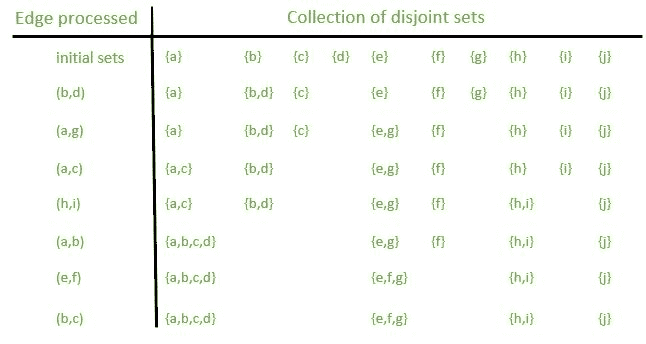
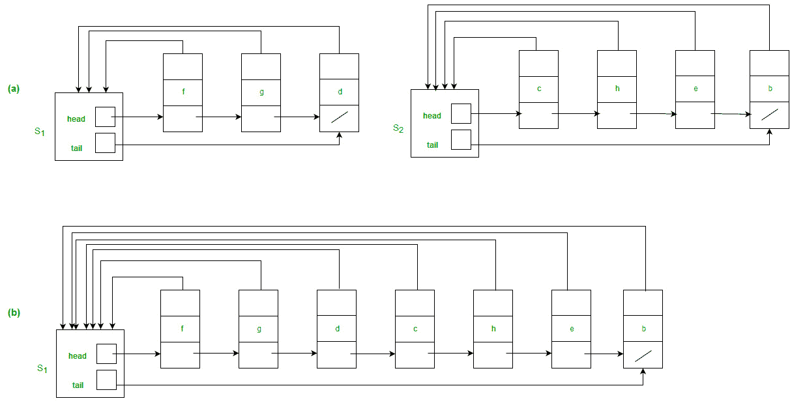

# 不相交集数据结构的链接列表表示形式

> 原文：[https://www.geeksforgeeks.org/linked-list-representation-disjoint-set-data-structures/](https://www.geeksforgeeks.org/linked-list-representation-disjoint-set-data-structures/)

先决条件：[联合查找（或不交集）](https://www.geeksforgeeks.org/union-find/)和[不交集数据结构（Java 实现）](https://www.geeksforgeeks.org/disjoint-set-data-structures-java-implementation/)

***脱节集数据结构*** 维护集合 S = {S <sub>1</sub> ，S <sub>2</sub> ....，S <sub>k</sub> }不相交的动态集。 我们通过 ***代表*** 来识别每个集合，这是集合的某个成员。 在某些应用中，使用哪个成员作为代表并不重要。 我们只关心如果我们两次请求动态集的代表而不修改请求之间的集，那么两次我们都会得到相同的答案。 其他应用程序可能需要用于选择代表的预定规则，例如选择集合中的最小成员。

**示例**：

确定无向图的连接分量。 下图显示了具有四个连接组件的图形。

[](https://media.geeksforgeeks.org/wp-content/uploads/Linked_List_representation_of_Disjoint_Set_Data_Structures_1-1.jpg)

解决方案：随后的一个过程 X 使用不相交集运算来计算图形的连接分量。 一旦 X 对图形进行了预处理，过程 Y 将回答有关两个顶点是否在同一连接的组件中的查询。 下图显示了处理每个边后不相交集的集合。

[](https://media.geeksforgeeks.org/wp-content/uploads/Linked_List_representation_of_Disjoint_Set_Data_Structures_2.jpg) 

参见[此处](https://www.geeksforgeeks.org/union-find/)，如上文所述。

[](https://media.geeksforgeeks.org/wp-content/uploads/Linked_List_representation_of_Disjoint_Set_Data_Structures_3.jpg) 

**图（a）**两组链接列表表示。 集合 S1 包含成员 d，f 和 g，代表为 f，集合 S2 包含成员 b，c，e 和 h，代表为 c。 列表中的每个对象都包含一个 set 成员，一个指向列表中下一个对象的指针以及一个指向该 set 对象的指针。 每个设置的对象分别具有指向第一个和最后一个对象的头和尾的指针。 **（b）** UNION（e，g）的结果，它将包含 e 的链表附加到包含 g 的链表。 结果集的代表是 f。 e 列表的设置对象 S2 被销毁。

以上三个数字取自 Cormen（CLRS）书。 上图显示了一种实现不相交集数据结构的简单方法：每个集由其自己的链表表示。 每个集合的对象都有属性 head 和 tail，分别指向列表中的第一个对象和最后一个对象。

列表中的每个对象都包含一个 set 成员，一个指向列表中下一个对象的指针以及一个指向 set 对象的指针。 在每个链接列表中，对象可以按任何顺序出现。 代表是列表中第一个对象中的集合成员。

为了执行 MAKE-SET（x），我们创建了一个新的链表，其唯一的对象是 x。 对于 FIND-SET（x），我们只需将指针从 x 跟随回到其设置的对象，然后返回指向该对象的对象中的成员。 例如，在图中，调用 FIND-SET（g）将返回 f。

**算法**：

让 x 代表对象，我们希望支持以下操作：

**MAKE-SET（x）**创建一个新集合，其唯一成员（因此是代表）是 x。 由于集合是不相交的，因此我们要求 x 不在其他集合中。

**UNION（x，y）**将包含 x 和 y 的动态集（例如 S <sub>x</sub> 和 S <sub>y</sub> ）组合为一个新集合，该集合是 这两套。 我们假设这两个集合在操作之前是不相交的。 结果集的代表是 S <sub>x</sub> US <sub>y</sub> 的任何成员，尽管 UNION 的许多实现都专门选择了 S <sub>x</sub> 或 S <sub>的代表。 ] y</sub> 作为新的代表。 由于我们要求集合中的集合不相交，因此从概念上讲，我们销毁集合 S <sub>x</sub> 和 S <sub>y</sub> ，将它们从集合 S 中删除。实际上，我们经常吸收 其中一组进入另一组。

**FIND-SET（x）**返回一个指向包含 x 的（唯一）集合的代表的指针。

根据以上说明，以下是实现：

```

// C++ program for implementation of disjoint 
// set data structure using linked list 
#include <bits/stdc++.h> 
using namespace std; 

// to represent linked list which is a set 
struct Item; 

// to represent Node of linked list. Every 
// node has a pointer to representative 
struct Node 
{ 
    int val; 
    Node *next; 
    Item *itemPtr; 
}; 

// A list has a pointer to head and tail 
struct Item 
{ 
    Node *hd, *tl; 
}; 

// To represent union set 
class ListSet 
{ 
private: 

    // Hash to store addresses of set representatives 
    // for given values. It is made global for ease of 
    // implementation. And second part of hash is actually 
    // address of Nodes. We typecast addresses to long 
    // before storing them. 
    unordered_map<int, Node *> nodeAddress; 

public: 
    void makeset(int a); 
    Item* find(int key); 
    void Union(Item *i1, Item *i2); 
}; 

// To make a set with one object 
// with its representative 
void ListSet::makeset(int a) 
{ 
    // Create a new Set 
    Item *newSet = new Item; 

    // Create a new linked list node 
    // to store given key 
    newSet->hd = new Node; 

    // Initialize head and tail 
    newSet->tl = newSet->hd; 
    nodeAddress[a] = newSet->hd; 

    // Create a new set 
    newSet->hd->val = a; 
    newSet->hd->itemPtr = newSet; 
    newSet->hd->next = NULL; 
} 

// To find representative address of a 
// key 
Item *ListSet::find(int key) 
{ 
    Node *ptr = nodeAddress[key]; 
    return (ptr->itemPtr); 
} 

// union function for joining two subsets 
// of a universe.  Mergese set2 into set1 
// and deletes set1\. 
void ListSet::Union(Item *set1, Item *set2) 
{ 
    Node *cur = set2->hd; 
    while (cur != 0) 
    { 
        cur->itemPtr = set1; 
        cur = cur->next; 
    } 

    // Join the tail of the set to head 
    // of the input set 
    (set1->tl)->next = set2->hd; 
    set1->tl = set2->tl; 

    delete set2; 
} 

// Driver code 
int main() 
{ 
    ListSet a; 
    a.makeset(13);  //a new set is made with one object only 
    a.makeset(25); 
    a.makeset(45); 
    a.makeset(65); 

    cout << "find(13): " << a.find(13) << endl; 
    cout << "find(25): "
         << a.find(25) << endl; 
    cout << "find(65): "
         << a.find(65) << endl; 
    cout << "find(45): "
         << a.find(45) << endl << endl; 
    cout << "Union(find(65), find(45)) \n"; 

    a.Union(a.find(65), a.find(45)); 

    cout << "find(65]): "
         << a.find(65) << endl; 
    cout << "find(45]): "
         << a.find(45) << endl; 
    return 0; 
} 

```

输出：

```
find(13): 0x1aa3c20
find(25): 0x1aa3ca0
find(65): 0x1aa3d70
find(45): 0x1aa3c80

Union(find(65), find(45)) 
find(65]): 0x1aa3d70
find(45]): 0x1aa3d70

```

**注意**：每次运行程序时，节点地址都会更改。

MAKE-SET 和 FIND-SET 的时间复杂度为`O(1)`。 UNION 的时间复杂度为`O(n)`。

本文由 **Yash Sangai** 提供。 如果您喜欢 GeeksforGeeks 并希望做出贡献，则还可以使用 [tribution.geeksforgeeks.org](http://www.contribute.geeksforgeeks.org) 撰写文章，或将您的文章邮寄至 tribution@geeksforgeeks.org。 查看您的文章出现在 GeeksforGeeks 主页上，并帮助其他 Geeks。

如果发现任何不正确的地方，或者您想分享有关上述主题的更多信息，请发表评论。

