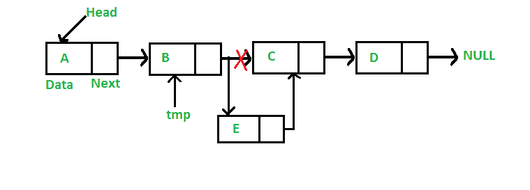

# 链表| 设置2（插入节点）

我们在[先前的文章](http://quiz.geeksforgeeks.org/linked-list-set-1-introduction/)中介绍了链接列表。 我们还创建了一个具有3个节点的简单链表，并讨论了链表遍历。
本文中讨论的所有程序均考虑以下链表的表示形式。

## C ++

```

// A linked list node  
class Node  
{  
    public: 
    int data;  
    Node *next;  
};  
// This code is contributed by rathbhupendra 

```

## C

```

// A linked list node 
struct Node 
{ 
  int data; 
  struct Node *next; 
}; 

```

## 爪哇

```

// Linked List Class 
class LinkedList 
{ 
    Node head;  // head of list 

    /* Node Class */
    class Node 
    { 
        int data; 
        Node next; 

        // Constructor to create a new node 
        Node(int d) {data = d; next = null; } 
    } 
}

```

## 蟒蛇

```

# Node class 
class Node: 

    # Function to initialize the node object 
    def __init__(self, data): 
        self.data = data  # Assign data 
        self.next = None  # Initialize next as null 

# Linked List class 
class LinkedList: 

    # Function to initialize the Linked List object 
    def __init__(self):  
        self.head = None

```

## C＃

```

/* Linked list Node*/
public class Node 
{ 
    public int data; 
    public Node next; 
    public Node(int d) {data = d; next = null; } 
} 

```

在这篇文章中，讨论了在链表中插入新节点的方法。 可以通过三种方式添加节点。
**1）**在链表的最前面
**2）**在给定节点之后。
**3）**在链接列表的末尾。

**在最前面添加一个节点：（4个步骤）**
新节点总是添加在给定链接列表的开头之前。 新添加的节点成为链接列表的新头。 例如，如果给定的链接列表为10- > 15- > 20- > 25，而我们在前面添加了项目5，则链接列表将变为5- > 10- > 15 -> 20- > 25.让我们调用添加到列表前面的函数push（）。 push（）必须接收一个指向head指针的指针，因为push必须将head指针更改为指向新节点（请参见[此](https://www.geeksforgeeks.org/how-to-write-functions-that-modify-the-head-pointer-of-a-linked-list/)）。

[](https://media.geeksforgeeks.org/wp-content/cdn-uploads/gq/2013/03/Linkedlist_insert_at_start.png)

以下是在最前面添加节点的4个步骤。

## C ++

```

/* Given a reference (pointer to pointer)  
to the head of a list and an int,  
inserts a new node on the front of the list. */
void push(Node** head_ref, int new_data)  
{  
    /* 1\. allocate node */
    Node* new_node = new Node();  

    /* 2\. put in the data */
    new_node->data = new_data;  

    /* 3\. Make next of new node as head */
    new_node->next = (*head_ref);  

    /* 4\. move the head to point to the new node */
    (*head_ref) = new_node;  
}  

// This code is contributed by rathbhupendra 

```

## C

```

/* Given a reference (pointer to pointer) to the head of a list 
   and an int,  inserts a new node on the front of the list. */
void push(struct Node** head_ref, int new_data) 
{ 
    /* 1\. allocate node */
    struct Node* new_node = (struct Node*) malloc(sizeof(struct Node)); 

    /* 2\. put in the data  */
    new_node->data  = new_data; 

    /* 3\. Make next of new node as head */
    new_node->next = (*head_ref); 

    /* 4\. move the head to point to the new node */
    (*head_ref)    = new_node; 
} 

```

## 爪哇

```

/* This function is in LinkedList class. Inserts a 
   new Node at front of the list. This method is  
   defined inside LinkedList class shown above */
public void push(int new_data) 
{ 
    /* 1 & 2: Allocate the Node & 
              Put in the data*/
    Node new_node = new Node(new_data); 

    /* 3\. Make next of new Node as head */
    new_node.next = head; 

    /* 4\. Move the head to point to new Node */
    head = new_node; 
} 

```

## 蟒蛇

```

# This function is in LinkedList class 
# Function to insert a new node at the beginning 
def push(self, new_data): 

    # 1 & 2: Allocate the Node & 
    #        Put in the data 
    new_node = Node(new_data) 

    # 3\. Make next of new Node as head 
    new_node.next = self.head 

    # 4\. Move the head to point to new Node  
    self.head = new_node 

```

## C＃

```

/* Inserts a new Node at front of the list. */
public void push(int new_data) 
{ 
    /* 1 & 2: Allocate the Node & 
               Put in the data*/
    Node new_node = new Node(new_data); 

    /* 3\. Make next of new Node as head */
    new_node.next = head; 

    /* 4\. Move the head to point to new Node */
    head = new_node; 
} 

```

push（）的时间复杂度为O（1），因为它要做的工作量是恒定的。
**在给定节点之后添加一个节点：（5个步骤的过程）**
我们得到指向节点的指针，并将新节点插入给定节点之后。

[](https://media.geeksforgeeks.org/wp-content/cdn-uploads/gq/2013/03/Linkedlist_insert_middle.png) 

## C ++

*filter_none*

*编辑*
*关闭*

*play_arrow*

*链接*
*亮度_4*
*代码*

| `// Given a node prev_node, insert a ``// new node after the given  ``// prev_node``void` `insertAfter(Node* prev_node,` `int` `new_data)  ``{` `// 1\. Check if the given prev_node is NULL ` `if` `(prev_node == NULL)  ` `{  ` `cout <<` `"the given previous node cannot be NULL"` `;  ` `return` `;  ` `} ` `// 2\. Allocate new node` `Node* new_node =` `new` `Node(); `]  `// 3\. Put in the data ` `new_node->data = new_data;  ` `// 4\. Make next of new node as` HTG41] `new_node->next = prev_node->next;  ` `// 5\. move the next of prev_node` `// as new_node ` `prev_node->next = new_node;  ``} `[`// This code is contributed by anmolgautam818` |

*chevron_right**filter_none*