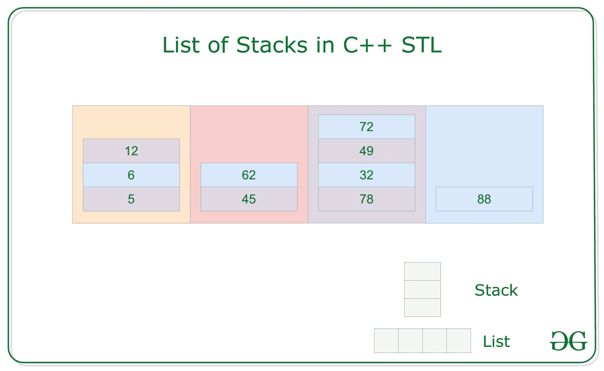

# C++ STL 中的堆栈列表

> 原文：[https://www.geeksforgeeks.org/list-of-stacks-in-c-stl/](https://www.geeksforgeeks.org/list-of-stacks-in-c-stl/)

**先决条件**：[列表](https://www.geeksforgeeks.org/list-cpp-stl/)，[堆栈](https://www.geeksforgeeks.org/stack-data-structure/)

**列表**是允许[非连续内存分配](https://www.geeksforgeeks.org/non-contiguous-allocation-in-operating-system/)的序列容器。 与[矢量](http://www.geeksforgeeks.org/vector-in-cpp-stl/)相比，列表的遍历速度较慢，但​​是一旦找到位置，插入和删除速度就会很快。

**语法**：

> 列表<类型> name_of_list；

[**堆栈**](http://www.geeksforgeeks.org/stack-data-structure/) 是一种容器适配器，具有的 LIFO（后进先出）类型，其中有一个新元素 在一端添加，并且（顶部）仅从该端删除元素。

**语法**：

> 堆栈 <type>name_of_stack;</type>

**堆栈列表**是具有一系列堆栈的容器的类型，这是一个二维容器，其中 **N** 行的列表和 **M** 列的堆栈 ，两个尺寸的大小都是不固定的。 可以使用 [迭代器](https://www.geeksforgeeks.org/iterators-c-stl/) 遍历和访问的。

**语法**：

> 列表<stack>> name_of_container（size）;
> ，尺寸可选</stack>

[](https://media.geeksforgeeks.org/wp-content/uploads/20200928102759/ListofStacks.jpg)

**示例**：

> 列表<stack>> ls（10）;
> 堆栈列表的大小为 10</stack>

**<u>插入</u>**：[使用 **push（）**函数完成堆栈列表](https://www.geeksforgeeks.org/linked-list-set-2-inserting-a-node/)的插入。

**示例**：

## C++

```cpp

// Loop to push element 
// into a stack 
for
    i in[0, n] 
    { 
        s.push(i) 
    } 

// Push Stack into the list 
ls.push_back(s); 

```

**<u>遍历</u>**：[使用](https://www.geeksforgeeks.org/recursive-insertion-and-traversal-linked-list/)[迭代器](https://www.geeksforgeeks.org/iterators-c-stl/)进行堆栈列表中的遍历。

## C++

```cpp

// Loop to iterate over list 
for (iterator it = ls.begin(); 
     it != ls.end(); it++) { 

    // Stack of the List 
    stack<int> 
        st = *it; 

    while (!st.empty()) { 
        cout << st.top(); 
        st.pop(); 
    } 
} 

```

上面的代码使用开始迭代器 **ls.begin（）**和结束迭代器 **ls.end（）**在每个索引处遍历**列表< int > ls** 。 为了访问元素，它使用**（* it）**作为堆栈，而[指针](https://www.geeksforgeeks.org/pointers-in-c-and-c-set-1-introduction-arithmetic-and-array/)指向**列表中的元素<堆栈< int > > ls [** 。

下面是说明堆栈列表中的插入和遍历的程序：

## C++

```cpp

// C++ program for implementation 
// of the lists of stack 

#include <bits/stdc++.h> 
using namespace std; 

// Function for printing the 
// elements in a list 
void showlist(list<stack<int> > ls) 
{ 

    // Traverse the list and 
    // print row wise stack 
    for (list<stack<int> >::iterator it1 
         = ls.begin(); 
         it1 != ls.end(); ++it1) { 

        // Copy rows in stack 
        stack<int> it2 = *it1; 

        // Print stack elements while 
        // it is not empty 
        while (!it2.empty()) { 
            cout << it2.top() << " "; 
            it2.pop(); 
        } 
        cout << endl; 
    } 
} 

// Driver Code 
int main() 
{ 
    // List of stacks 
    list<stack<int> > ls; 

    // Insert rows in list 
    for (int i = 0; i < 10; ++i) { 
        // Insert element in 
        // stack as column 
        stack<int> s; 

        for (int j = i; j < 10; j++) { 
            s.push(j); 
        } 

        ls.push_back(s); 
    } 

    cout << "List of stack is : \n"; 
    showlist(ls); 

    return 0; 
} 

```

**Output:**

```
List of stack is : 
9 8 7 6 5 4 3 2 1 0 
9 8 7 6 5 4 3 2 1 
9 8 7 6 5 4 3 2 
9 8 7 6 5 4 3 
9 8 7 6 5 4 
9 8 7 6 5 
9 8 7 6 
9 8 7 
9 8 
9

```

被誉为业界最抢手的技能之一，拥有我们的 [**C++ STL**](https://practice.geeksforgeeks.org/courses/cpp-stl?utm_source=geeksforgeeks&utm_medium=article&utm_campaign=GFG_Article_Bottom_CPP_STL) 课程的编码基础，并通过严格的问题解决方法掌握了这些概念。

* * *

* * *

如果您喜欢 GeeksforGeeks 并希望做出贡献，则还可以使用 [tribution.geeksforgeeks.org](https://contribute.geeksforgeeks.org/) 撰写文章，或将您的文章邮寄至 tribution@geeksforgeeks.org。 查看您的文章出现在 GeeksforGeeks 主页上，并帮助其他 Geeks。

如果您发现任何不正确的地方，请单击下面的“改进文章”按钮，以改进本文。