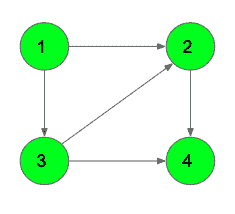
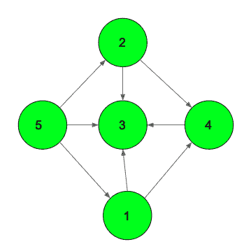

# 有向无环图中的最长路径| 动态编程

> 原文： [https://www.geeksforgeeks.org/longest-path-in-a-directed-acyclic-graph-dynamic-programming/](https://www.geeksforgeeks.org/longest-path-in-a-directed-acyclic-graph-dynamic-programming/)

给定有向图`G`，其中 *N 个顶点*和 *M 个边缘*。 任务是在 Graph 中找到最长的有向路径的长度。

**注意**：定向路径的长度是其中的边数。

**示例**：

> **输入**：N = 4，M = 5
> 
> **输出**：3
> 定向路径 1- > 3- > 2 -> 4
> 
> **输入**：N = 5，M = 8
> 
> **输出**：3

**简单方法**：天真的方法是使用 [DFS](http://www.geeksforgeeks.org/depth-first-traversal-for-a-graph/) 计算来自每个节点的最长路径的长度。

该方法的时间复杂度为 O（N <sup>2</sup> ）。

**有效方法**：一种有效方法是一起使用[动态编程](http://www.geeksforgeeks.org/dynamic-programming/)和 [DFS](http://www.geeksforgeeks.org/depth-first-traversal-for-a-graph/) 在图中找到最长路径。

令 **dp [i]** 为从节点`i`开始的最长路径的长度。 最初 dp 的所有位置均为 0。我们可以从每个节点调用 DFS 函数，并遍历其所有子节点。 递归公式将是：

> **dp [node] = max（dp [node]，1 + max（dp [child1]，dp [child2]，dp [child3 ...）））**

最后，检查 dp []数组中的最大值，它将是 DAG 中的最长路径。

下面是上述方法的实现：

## C++

```cpp

// C++ program to find the longest 
// path in the DAG 

#include <bits/stdc++.h> 
using namespace std; 

// Function to traverse the DAG 
// and apply Dynamic Programming 
// to find the longest path 
void dfs(int node, vector<int> adj[], int dp[], bool vis[]) 
{ 
    // Mark as visited 
    vis[node] = true; 

    // Traverse for all its children 
    for (int i = 0; i < adj[node].size(); i++) { 

        // If not visited 
        if (!vis[adj[node][i]]) 
            dfs(adj[node][i], adj, dp, vis); 

        // Store the max of the paths 
        dp[node] = max(dp[node], 1 + dp[adj[node][i]]); 
    } 
} 

// Function to add an edge 
void addEdge(vector<int> adj[], int u, int v) 
{ 
    adj[u].push_back(v); 
} 

// Function that returns the longest path 
int findLongestPath(vector<int> adj[], int n) 
{ 
    // Dp array 
    int dp[n + 1]; 
    memset(dp, 0, sizeof dp); 

    // Visited array to know if the node 
    // has been visited previously or not 
    bool vis[n + 1]; 
    memset(vis, false, sizeof vis); 

    // Call DFS for every unvisited vertex 
    for (int i = 1; i <= n; i++) { 
        if (!vis[i]) 
            dfs(i, adj, dp, vis); 
    } 

    int ans = 0; 

    // Traverse and find the maximum of all dp[i] 
    for (int i = 1; i <= n; i++) { 
        ans = max(ans, dp[i]); 
    } 
    return ans; 
} 

// Driver Code 
int main() 
{ 
    int n = 5; 
    vector<int> adj[n + 1]; 

    // Example-1 
    addEdge(adj, 1, 2); 
    addEdge(adj, 1, 3); 
    addEdge(adj, 3, 2); 
    addEdge(adj, 2, 4); 
    addEdge(adj, 3, 4); 

    cout << findLongestPath(adj, n); 
    return 0; 
} 

```

## Java

```java

// Java program to find the longest 
// path in the DAG 

import java.util.ArrayList; 

// graph class 
class Graph 
{ 

    int vertices; 
    ArrayList<Integer> edge[]; 

    Graph(int vertices)  
    { 
        this.vertices = vertices; 
        edge = new ArrayList[vertices+1]; 
        for (int i = 0; i <= vertices; i++)  
        { 
            edge[i] = new ArrayList<>(); 
        } 
    } 
    void addEdge(int a,int b) 
    { 
        edge[a].add(b); 
    } 

    void dfs(int node, ArrayList<Integer> adj[], int dp[], 
                                    boolean visited[]) 
    { 
        // Mark as visited 
        visited[node] = true; 

        // Traverse for all its children 
        for (int i = 0; i < adj[node].size(); i++)  
        { 

            // If not visited 
            if (!visited[adj[node].get(i)]) 
                dfs(adj[node].get(i), adj, dp, visited); 

            // Store the max of the paths 
            dp[node] = Math.max(dp[node], 1 + dp[adj[node].get(i)]); 
        } 
    } 

    // Function that returns the longest path 
    int findLongestPath( int n) 
    { 
        ArrayList<Integer> adj[] = edge; 
        // Dp array 
        int[] dp = new int[n+1]; 

        // Visited array to know if the node 
        // has been visited previously or not 
        boolean[] visited = new boolean[n + 1]; 

        // Call DFS for every unvisited vertex 
        for (int i = 1; i <= n; i++)  
        { 
            if (!visited[i]) 
                dfs(i, adj, dp, visited); 
        } 

        int ans = 0; 

        // Traverse and find the maximum of all dp[i] 
        for (int i = 1; i <= n; i++)  
        { 
            ans = Math.max(ans, dp[i]); 
        } 
        return ans; 
    } 
} 

public class Main 
{ 
    // Driver code 
    public static void main(String[] args) 
    { 
        int n = 5; 
        Graph graph = new Graph(n); 
        // Example-1 
        graph.addEdge( 1, 2); 
        graph.addEdge( 1, 3); 
        graph.addEdge( 3, 2); 
        graph.addEdge( 2, 4); 
        graph.addEdge( 3, 4); 
        graph.findLongestPath(n); 
        System.out.println( graph.findLongestPath( n)); 

    } 
} 

// This code is contributed by SumanSaurav 

```

## Python

```py

# Python3 program to find the  
# longest path in the DAG  

# Function to traverse the DAG  
# and apply Dynamic Programming  
# to find the longest path  
def dfs(node, adj, dp, vis):  

    # Mark as visited  
    vis[node] = True 

    # Traverse for all its children  
    for i in range(0, len(adj[node])):   

        # If not visited  
        if not vis[adj[node][i]]: 
            dfs(adj[node][i], adj, dp, vis)  

        # Store the max of the paths  
        dp[node] = max(dp[node], 1 + dp[adj[node][i]])  

# Function to add an edge  
def addEdge(adj, u, v):  

    adj[u].append(v)  

# Function that returns the longest path  
def findLongestPath(adj, n):  

    # Dp array  
    dp = [0] * (n + 1)  

    # Visited array to know if the node  
    # has been visited previously or not  
    vis = [False] * (n + 1) 

    # Call DFS for every unvisited vertex  
    for i in range(1, n + 1):   
        if not vis[i]:  
            dfs(i, adj, dp, vis)  

    ans = 0 

    # Traverse and find the maximum of all dp[i]  
    for i in range(1, n + 1):   
        ans = max(ans, dp[i])  

    return ans  

# Driver Code  
if __name__ == "__main__":  

    n = 5 
    adj = [[] for i in range(n + 1)] 

    # Example-1  
    addEdge(adj, 1, 2)  
    addEdge(adj, 1, 3)  
    addEdge(adj, 3, 2)  
    addEdge(adj, 2, 4)  
    addEdge(adj, 3, 4)  

    print(findLongestPath(adj, n)) 

# This code is contributed by Rituraj Jain 

```

## C#

```cs

// C# program to find the longest 
// path in the DAG 
using System; 
using System.Collections.Generic; 

// graph class 
class Graph 
{ 
    public int vertices; 
    public List<int> []edge; 

    public Graph(int vertices)  
    { 
        this.vertices = vertices; 
        edge = new List<int>[vertices + 1]; 
        for (int i = 0; i <= vertices; i++)  
        { 
            edge[i] = new List<int>(); 
        } 
    } 
    public void addEdge(int a, int b) 
    { 
        edge[a].Add(b); 
    } 

    public void dfs(int node, List<int> []adj,  
                    int []dp, Boolean []visited) 
    { 
        // Mark as visited 
        visited[node] = true; 

        // Traverse for all its children 
        for (int i = 0; i < adj[node].Count; i++)  
        { 

            // If not visited 
            if (!visited[adj[node][i]]) 
                dfs(adj[node][i], adj, dp, visited); 

            // Store the max of the paths 
            dp[node] = Math.Max(dp[node], 1 + 
                                dp[adj[node][i]]); 
        } 
    } 

    // Function that returns the longest path 
    public int findLongestPath( int n) 
    { 
        List<int> []adj = edge; 
        // Dp array 
        int[] dp = new int[n + 1]; 

        // Visited array to know if the node 
        // has been visited previously or not 
        Boolean[] visited = new Boolean[n + 1]; 

        // Call DFS for every unvisited vertex 
        for (int i = 1; i <= n; i++)  
        { 
            if (!visited[i]) 
                dfs(i, adj, dp, visited); 
        } 

        int ans = 0; 

        // Traverse and find the maximum of all dp[i] 
        for (int i = 1; i <= n; i++)  
        { 
            ans = Math.Max(ans, dp[i]); 
        } 
        return ans; 
    } 
} 

class GFG 
{ 
    // Driver code 
    public static void Main(String[] args) 
    { 
        int n = 5; 
        Graph graph = new Graph(n); 
        // Example-1 
        graph.addEdge( 1, 2); 
        graph.addEdge( 1, 3); 
        graph.addEdge( 3, 2); 
        graph.addEdge( 2, 4); 
        graph.addEdge( 3, 4); 
        graph.findLongestPath(n); 
        Console.WriteLine(graph.findLongestPath(n)); 
    } 
} 

// This code is contributed by Princi Singh 

```

**Output:**

```
3

```

**时间复杂度**：O（N）
**辅助空间**：O（N）


* * *

* * *

如果您喜欢 GeeksforGeeks 并希望做出贡献，则还可以使用 [tribution.geeksforgeeks.org](https://contribute.geeksforgeeks.org/) 撰写文章，或将您的文章邮寄至 tribution@geeksforgeeks.org。 查看您的文章出现在 GeeksforGeeks 主页上，并帮助其他 Geeks。

如果您发现任何不正确的地方，请单击下面的“改进文章”按钮，以改进本文。