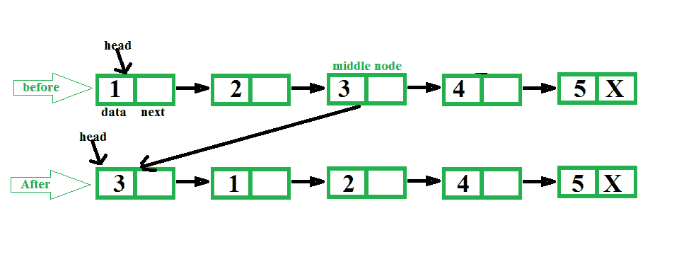

# 将中间节点放在链接列表中

给定一个单链表，找到链表的中间，并在链表的开头设置链表的中间节点。

**示例：**

```
Input  : 1 2 3 4 5 
Output : 3 1 2 4 5

Input  : 1 2 3 4 5 6
Output : 4 1 2 3 5 6 

```



这个想法是首先[使用两个指针](https://www.geeksforgeeks.org/write-a-c-function-to-print-the-middle-of-the-linked-list/)找到一个链表的中间，第一个指针一次移动一个，第二个指针一次移动两个。 当第二个指针到达终点时，第一个指针到达中间。 我们还跟踪第一个指针的前一个，以便我们可以从中间节点的当前位置删除中间节点并使它成为头部。

## C ++

*filter_none*

*编辑*
*关闭*

*play_arrow*

*链接*
*亮度_4*
*代码*

| `// C++ program to make middle node as head of ``// linked list. ``#include <bits/stdc++.h>``using` `namespace` `std;``/* Link list node */``class` `Node ``{ ` `public` `:` `int` `data; ` `Node* next; ``}; ``/* Function to get the middle and set at ``beginning of the linked list*/``void` `setMiddleHead(Node** head) ``{ ` `if` `(*head == NULL) ` `return` `; ` `// To traverse list nodes one by one ` `Node* one_node = (*head); `[ `// To traverse list nodes by skipping ` `// one. ` `Node* two_node = (*head); ` `// To keep track of previous of middle ` `Node* prev = NULL; ` `while` `(two_node != NULL && two_node->next != NULL) ` `{ ` `/* for previous node of middle node */` `prev = one_node; ` `/* move one node each time*/` `two_node = two_node->next->next; ` `/* move two node each time*/` `one_node = one_node->next; ` ] `} ` `/* set middle node at head */` `prev->next = prev->next->next; ` `one_node->next = (*head); ` `(*head) = one_node; ``} ``// To insert a node at the beginning of linked `​​ `// list. ``void` `push(Node** head_ref,` `int` `new_data) ``{ ` `/* allocate node */` `Node* new_node =` `new` `Node(); ` `new_node->data = new_data; ` `/* link the old list off the new node */` `new_node->next = (*head_ref); ` `/* move the head to point to the new node */` `(*head_ref) = new_node; ``} ` [`// A function to print a given linked list ``void` `printList(Node* ptr) ``{ ` `while` `(ptr != NULL)` `{ ` `cout << ptr->data <<` `" "` `; ` `ptr = ptr->next; ` `} ` `cout<<endl; ``} ``/* Driver code*/``int` `main() ``{ ` `// Create a list of 5 nodes ` `Node* head = NULL; ` `int` `i; ` `for` `(i = 5; i > 0; i--) ` `push(&head, i); `的 `cout <<` `" list before: "` `; ` `printList(head); ` `setMiddleHead(&head); ` `cout <<` `" list After: "` `; ` `printList(head); ` `return` `0; ``} ``// This is code is contributed by rathbhupendra` |

*chevron_right**filter_none*