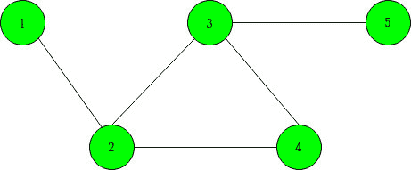

# 通过添加单个边

来最大化给定顶点之间的最短路径

> 原文： [https://www.geeksforgeeks.org/maximize-shortest-path-between-given-vertices-by-adding-a-single-edge/](https://www.geeksforgeeks.org/maximize-shortest-path-between-given-vertices-by-adding-a-single-edge/)

给定 **N** 个节点和 **M** 顶点的无向图。 你还给出一个 **K** 边缘为**中选择[]** 。 通过在给定选定边的任意两个顶点之间添加单个边来最大化节点 **1** 到节点 **N** 之间的最短路径长度的任务。
**注意：**您可以在任意两个选定的顶点之间添加一条边，而这些顶点之间已经有一条边。

> **输入：** N = 5，M = 4，K = 2，已选择[] = {2，4}。
> 下面是给定的图形：
> 
> 
> 
> **输出：** 3
> **说明：**
> 在 2 和 4 之间添加边线之前，最短路径变为：1– > 2– > 3– > 4– > 5\.
> 在 2 和 4 之间添加边后，最短路径变为 1– > 2– > 4– > 5.下面是添加边后的图形。 用虚线表示。
> 
> 
> 
> **输入：** N = 5 M = 5 K = 3 个已选择[] = {1，3，5}
> 下面是给定的图形：
> 
> 
> 
> **输出：** 3
> **说明：**
> 我们可以在 3 和 5 之间添加一条边，因为它们之间已经有一条边了。 因此，最短路径变为 1 – > 2– > 3– >5。下面是添加边后的图形。 用虚线表示。
> 
> 

**方法：**的想法是使用[广度优先搜索](https://www.geeksforgeeks.org/breadth-first-search-or-bfs-for-a-graph/)查找从顶点 **1** 和 **N** 到每个选定顶点的距离。 对于选定的顶点 i，令 **x <sub>i</sub>** 表示到节点 1 的距离， **y <sub>i</sub>** 表示到节点**的距离。 N** 。 步骤如下：

1.  维护一个二维矩阵（例如 **dist [2] []** ），该矩阵具有 **2** 行和 **N** 列。
2.  在第一行中，使用 BFS 遍历保持节点 **1** 与图形中其他顶点之间的最短距离。
3.  在第二行中，使用 BFS 遍历保持节点 **N** 与图形的其他顶点之间的最短距离。
4.  现在，从[选择的中选择两个选择的顶点 **a** 和 **b** 以最小化 min（xa + yb，ya + xb）的值。 为此，请执行以下操作：
    *   创建一个向量对，并将（x <sub>i</sub> – y <sub>i</sub> ）的值与它们各自的选定节点一起存储。
    *   [对上述](https://www.geeksforgeeks.org/sorting-vector-of-pairs-in-c-set-1-sort-by-first-and-second/)对向量进行排序。
    *   最好将**初始化为 0** ，将 **max 初始化为-INF** 。
    *   现在遍历上述向量对，并为每个选定的节点（例如 a）将**最佳**的值更新为最大值（best，max + dist [1] [a]），并将 max 更新为最大值（（ 最大值，dist [0] [a]）。
5.  经过上述操作后，**的最大值（dist [0] [N-1]和最佳+1）**给出了最短的最小路径。

下面是上述方法的实现：

## C ++

```

// C++ program for the above approach
#include <bits/stdc++.h>
using namespace std;
const int INF = 1e9 + 7;
int N, M;

// To store graph as adjacency list
vector<int> edges[200005];

// To store the shortest path
int dist[2][200000];

// Function that performs BFS Traversal
void bfs(int* dist, int s)
{
    int q[200000];

    // Fill initially each distance as INF
    fill(dist, dist + N, INF);
    int qh = 0, qt = 0;
    q[qh++] = s;
    dist[s] = 0;

    // Perform BFS
    while (qt < qh) {

        int x = q[qt++];

        // Traverse the current edges
        for (int y : edges[x]) {
            if (dist[y] == INF) {

                // Update the distance
                dist[y] = dist[x] + 1;

                // Insert in queue
                q[qh++] = y;
            }
        }
    }
}

// Function that maximizes the shortest
// path between source and destination
// vertex by adding a single edge between
// given selected nodes
void shortestPathCost(int selected[], int K)
{
    vector<pair<int, int> > data;

    // To update the shortest distance
    // between node 1 to other vertices
    bfs(dist[0], 0);

    // To update the shortest distance
    // between node N to other vertices
    bfs(dist[1], N - 1);

    for (int i = 0; i < K; i++) {

        // Store the values x[i] - y[i]
        data.emplace_back(dist[0][selected[i]]
                              - dist[1][selected[i]],
                          selected[i]);
    }

    // Sort all the vectors of pairs
    sort(data.begin(), data.end());
    int best = 0;
    int MAX = -INF;

    // Traverse data[]
    for (auto it : data) {
        int a = it.second;
        best = max(best,
                   MAX + dist[1][a]);

        // Maximize x[a] - y[b]
        MAX= max(MAX, dist[0][a]);
    }

    // Print minimum cost
    printf("%d\n", min(dist[0][N - 1], best + 1));
}

// Driver Code
int main()
{
    // Given nodes and edges
    N = 5, M = 4;
    int K = 2;
    int selected[] = { 1, 3 };

    // Sort the selected nodes
    sort(selected, selected + K);

    // Given edges
    edges[0].push_back(1);
    edges[1].push_back(0);
    edges[1].push_back(2);
    edges[2].push_back(1);
    edges[2].push_back(3);
    edges[3].push_back(2);
    edges[3].push_back(4);
    edges[4].push_back(3);

    // Function Call
    shortestPathCost(selected, K);
    return 0;
}

```

## 爪哇

```

// Java program for the above approach
import java.util.*;
import java.lang.*;

class GFG{

static int INF = (int)1e9 + 7; 
static int N, M; 

// To store graph as adjacency list 
static ArrayList<ArrayList<Integer>> edges; 

// To store the shortest path 
static int[][] dist = new int[2][200000]; 

// Function that performs BFS Traversal 
static void bfs(int[] dist, int s) 
{ 
    int[] q = new int[200000]; 

    // Fill initially each distance as INF 
    Arrays.fill(dist, INF); 

    int qh = 0, qt = 0; 
    q[qh++] = s; 
    dist[s] = 0; 

    // Perform BFS 
    while (qt < qh) 
    { 
        int x = q[qt++]; 

        // Traverse the current edges 
        for(Integer y : edges.get(x))
        { 
            if (dist[y] == INF) 
            { 

                // Update the distance 
                dist[y] = dist[x] + 1; 

                // Insert in queue 
                q[qh++] = y; 
            } 
        } 
    } 
} 

// Function that maximizes the shortest 
// path between source and destination 
// vertex by adding a single edge between 
// given selected nodes 
static void shortestPathCost(int selected[], int K) 
{ 
    ArrayList<int[]> data = new ArrayList<>(); 

    // To update the shortest distance 
    // between node 1 to other vertices 
    bfs(dist[0], 0); 

    // To update the shortest distance 
    // between node N to other vertices 
    bfs(dist[1], N - 1); 

    for(int i = 0; i < K; i++) 
    { 

        // Store the values x[i] - y[i] 
        data.add(new int[]{dist[0][selected[i]] - 
                           dist[1][selected[i]], 
                                   selected[i]}); 
    } 

    // Sort all the vectors of pairs 
    Collections.sort(data, (a, b) -> a[0] - b[0]); 
    int best = 0; 
    int MAX = -INF; 

    // Traverse data[] 
    for(int[] it : data) 
    { 
        int a = it[1]; 
        best = Math.max(best, 
                        MAX + dist[1][a]); 

        // Maximize x[a] - y[b] 
        MAX = Math.max(MAX, dist[0][a]); 
    } 

    // Print minimum cost 
    System.out.println(Math.min(dist[0][N - 1],
                                     best + 1)); 
}

// Driver code
public static void main (String[] args)
{

    // Given nodes and edges 
    N = 5; M = 4; 
    int K = 2; 
    int selected[] = { 1, 3 }; 

    // Sort the selected nodes 
    Arrays.sort(selected);

    edges = new ArrayList<>();

    for(int i = 0; i < 200005; i++)
        edges.add(new ArrayList<Integer>());

    // Given edges 
    edges.get(0).add(1); 
    edges.get(1).add(0); 
    edges.get(1).add(2); 
    edges.get(2).add(1); 
    edges.get(2).add(3); 
    edges.get(3).add(2); 
    edges.get(3).add(4); 
    edges.get(4).add(3); 

    // Function Call 
    shortestPathCost(selected, K); 
}
}

// This code is contributed by offbeat

```

**Output:** 

```
3

```

***时间复杂度：** O（N * log N + M）*
***辅助空间：** O（N）*


* * *

* * *

如果您喜欢 GeeksforGeeks 并希望做出贡献，则还可以使用 [tribution.geeksforgeeks.org](https://contribute.geeksforgeeks.org/) 撰写文章，或将您的文章邮寄至 tribution@geeksforgeeks.org。 查看您的文章出现在 GeeksforGeeks 主页上，并帮助其他 Geeks。

如果您发现任何不正确的地方，请单击下面的“改进文章”按钮，以改进本文。