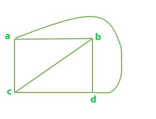
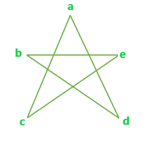

# 来自完整图形的最大可能边缘不交集生成树

> 原文： [https://www.geeksforgeeks.org/maximum-possible-edge-disjoint-spanning-tree-from-a-complete-graph/](https://www.geeksforgeeks.org/maximum-possible-edge-disjoint-spanning-tree-from-a-complete-graph/)

给出具有 N 个顶点的完整图形。 任务是找出可能的边缘不相交生成树的最大数量。

**边缘不相交的生成树**是生成树，其中集合中没有两个树具有相同的边缘。

**示例**：

```
Input : N = 4
Output : 2

Input : N = 5
Output : 2 

```

具有 N 个顶点的完整图的最大可能边不相交生成树的数量可以表示为：

```
Max Edge-disjoint spanning tree = floor(N / 2)

```

让我们看一些例子：

**示例 1** ：

**具有 4 个顶点的完整图形**


上图的所有可能的边缘不相交生成树是：


一种


乙

**示例 2** ：

**具有 5 个顶点的完整图形**


上图的所有可能的边缘不相交生成树是：



一种


乙

以下是查找可能的最大边缘不相交生成树数量的程序。

## C ++

```

// C++ program to find the maximum number of  
// Edge-Disjoint Spanning tree possible 

#include <bits/stdc++.h> 
using namespace std; 

// Function to calculate max number of  
// Edge-Disjoint Spanning tree possible 
float edgeDisjoint(int n) 
{ 
    float result = 0; 

    result = floor(n / 2); 

    return result; 
} 

// Driver code 
int main() 
{ 
    int n = 4; 

    cout << edgeDisjoint(n); 

    return 0; 
} 

```