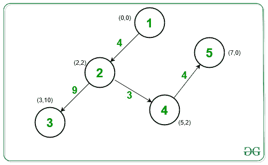

# 连接城市中所有房屋的最低成本

> 原文： [https://www.geeksforgeeks.org/minimum-cost-required-to-connect-all-houses-in-a-city/](https://www.geeksforgeeks.org/minimum-cost-required-to-connect-all-houses-in-a-city/)

给定 [2D 数组](https://www.geeksforgeeks.org/multidimensional-arrays-in-java/) **房屋[] []** 由 **N** 2D 坐标 **{x，y}** 组成，其中每个坐标代表 每个房屋的任务是找到连接城市所有房屋的最低成本。

> 连接两所房屋的成本是两点之间的 [**曼哈顿距离**](https://www.geeksforgeeks.org/maximum-manhattan-distance-between-a-distinct-pair-from-n-coordinates/) （x <sub>i</sub> y <sub>i</sub> ）和（x <sub>j</sub> ，y <sub>j</sub> ），即 **| x <sub>i</sub> – x <sub>j</sub> | + | y <sub>i</sub> – y <sub>j</sub> |** ，其中| p | 表示 p 的[绝对值](https://www.geeksforgeeks.org/program-to-find-absolute-value-of-a-given-number/)。

**示例：**

> **输入：**房子[] [] = [[0，0]，[2，2]，[3，10]，[5，2]，[7，0]]
> **输出：** 20
> **说明：**
> 
> [](https://media.geeksforgeeks.org/wp-content/uploads/20201027125012/UntitledDiagram5.jpg)
> 
> 将成本= 4 的房屋 1（0，0）与房屋 2（2，2）连接起来
> 将成本= 9 的房屋 2（2，2）与房屋 3（3，10）连接起来
> 连接房屋 2（ 2，2），房屋 4（5，2），成本= 3
> 最后，将房屋 4（5，2）与房屋 5（7，0），成本 4 连接。
> 所有房屋均已连接 现在。
> 整体最低费用为 4 + 9 + 3 + 4 = 20。
> 
> **输入：**房屋[] [] = [[3，12]，[-2、5]，[-4、1]]
> **输出：** 18
> **说明：**
> 以成本= 12 将房屋 1（3，12）与房屋 2（-2，5）连接
> 将房屋 2（-2，5）与房屋 3（-4）连接 ，1）的成本= 6
> 现在所有房屋都已连接。
> 整体最低费用为 12 + 6 = 18。

**方法：**的想法是根据给定的信息创建[加权图](https://www.geeksforgeeks.org/graph-and-its-representations/)，其中任意一对边之间的权重等于连接它们的成本，例如 **C <sub>i</sub>** ，即两个坐标之间的曼哈顿距离。 生成图形后，使用 [Kruskal 算法](https://www.geeksforgeeks.org/kruskals-minimum-spanning-tree-algorithm-greedy-algo-2/)使用[不交集](https://www.geeksforgeeks.org/disjoint-set-data-structures/)来找到图形的[最小生成树](https://www.geeksforgeeks.org/kruskals-minimum-spanning-tree-algorithm-greedy-algo-2/)。 最后，打印最低成本。

下面是上述方法的实现：

## C ++

```

// C++ program for the above approach

#include <bits/stdc++.h>
using namespace std;

vector<int> parent, size;

// Utility function to find set of an
// element v using path compression
// technique
int find_set(int v)
{
    // If v is the parent
    if (v == parent[v])
        return v;

    // Otherwsie, recursively
    // find its parent
    return parent[v]
           = find_set(parent[v]);
}

// Function to perform union
// of the sets a and b
int union_sets(int a, int b)
{
    // Find parent of a and b
    a = find_set(a);
    b = find_set(b);

    // If parent are different
    if (a != b) {

        // Swap Operation
        if (size[a] < size[b])
            swap(a, b);

        // Update parent of b as a
        parent[b] = a;
        size[a] += size[b];
        return 1;
    }

    // Otherwise, return 0
    return 0;
}

// Function to create a Minimum Cost
// Spanning tree for given houses
void MST(int houses[][2], int n)
{
    // Stores adjacency list of graph
    vector<pair<int, pair<int, int> > > v;

    // Traverse each coordinate
    for (int i = 0; i < n; i++) {

        for (int j = i + 1; j < n; j++) {

            // Find the Manhattan distance
            int p = abs(houses[i][0]
                        - houses[j][0]);

            p += abs(houses[i][1]
                     - houses[j][1]);

            // Add the edges
            v.push_back({ p, { i, j } });
        }
    }

    parent.resize(n);
    size.resize(n);

    // Sort all the edges
    sort(v.begin(), v.end());

    // Initialize parent[] and size[]
    for (int i = 0; i < n; i++) {
        parent[i] = i, size[i] = 1;
    }

    /// Stores the minimum cost
    int ans = 0;

    // Finding the minimum cost
    for (auto x : v) {

        // Perform the unioun operation
        if (union_sets(x.second.first,
                       x.second.second)) {
            ans += x.first;
        }
    }

    // Print the minimum cost
    cout << ans;
}

// Driver Code
int main()
{
    // Given houses
    int houses[][2] = { { 0, 0 }, { 2, 2 }, 
                        { 3, 10 }, { 5, 2 }, 
                        { 7, 0 }};

    int N = sizeof(houses)
            / sizeof(houses[0]);

    // Function Call
    MST(houses, N);

    return 0;
}

```

## Python3

```

# Python3 program for the above approach
parent = [0] * 100
size = [0] * 100

# Utility function to find set of an
# element v using path compression
# technique
def find_set(v):

    # If v is the parent
    if (v == parent[v]):
        return v

    # Otherwsie, recursively
    # find its parent
    parent[v] = find_set(parent[v])

    return parent[v]

# Function to perform union
# of the sets a and b
def union_sets(a, b):

    # Find parent of a and b
    a = find_set(a)
    b = find_set(b)

    # If parent are different
    if (a != b):

        # Swap Operation
        if (size[a] < size[b]):
            a, b = b, a

        # Update parent of b as a
        parent[b] = a
        size[a] += size[b]
        return 1

    # Otherwise, return 0
    return 0

# Function to create a Minimum Cost
# Spanning tree for given houses
def MST(houses, n):

    # Stores adjacency list of graph
    v = []

    # Traverse each coordinate
    for i in range(n):
        for j in range(i + 1, n):

            # Find the Manhattan distance
            p = abs(houses[i][0] -
                    houses[j][0])

            p += abs(houses[i][1] -
                     houses[j][1])

            # Add the edges
            v.append([p, i, j])

    # Sort all the edges
    v = sorted(v)

    # Initialize parent[] and size[]
    for i in range(n):
        parent[i] = i
        size[i] = 1

    # Stores the minimum cost
    ans = 0

    # Finding the minimum cost
    for x in v:

        # Perform the unioun operation
        if (union_sets(x[1], x[2])):
            ans += x[0]

    # Print the minimum cost
    print(ans)

# Driver Code
if __name__ == '__main__':

    # Given houses
    houses = [ [ 0, 0 ], [ 2, 2 ],
               [ 3, 10 ], [ 5, 2 ],
               [ 7, 0 ] ]

    N = len(houses)

    # Function Call
    MST(houses, N)

# This code is contributed by mohit kumar 29

```

**Output:** 

```
20

```

***时间复杂度：** O（N <sup>2</sup> ）*
***辅助空间：** O（N <sup>2</sup> ）*


* * *

* * *

如果您喜欢 GeeksforGeeks 并希望做出贡献，则还可以使用 [tribution.geeksforgeeks.org](https://contribute.geeksforgeeks.org/) 撰写文章，或将您的文章邮寄至 tribution@geeksforgeeks.org。 查看您的文章出现在 GeeksforGeeks 主页上，并帮助其他 Geeks。

如果您发现任何不正确的地方，请单击下面的“改进文章”按钮，以改进本文。