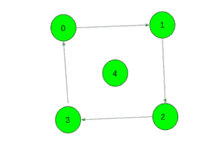

# 要在有向图中添加的最小边，以便从给定节点可以到达任何节点

> 原文： [https://www.geeksforgeeks.org/minimum-edges-to-be-added-in-a-directed-graph-so-that-any-node-can-be-reachable-from-a-given-node/](https://www.geeksforgeeks.org/minimum-edges-to-be-added-in-a-directed-graph-so-that-any-node-can-be-reachable-from-a-given-node/)

给定一个有向图和一个节点`X`。 任务是找到必须添加到图中的最小边数，以便从给定节点可以到达任何节点。

**示例**：

> **输入**：X = 0
> 
> **输出**：3
> 
> **输入**：X = 4
> 
> **输出**：1

**方法**：首先，使用简单的 [DFS](http://www.geeksforgeeks.org/depth-first-traversal-for-a-graph/) 将`X`可以到达的所有顶点标记为良好。 然后，对于每个坏顶点（无法从 X 到达的顶点）v，计算从 v 可以到达的坏顶点的数量（这也可以通过简单的 DFS 完成）。 将此数字设为 cnt <sub>v</sub> 。 现在，以 cnt <sub>v</sub> 的非递增顺序遍历所有坏顶点。 对于当前的不良顶点 v，如果仍未将其标记为好，请从其运行 DFS，将所有可到达的顶点标记为好，并将答案增加 1（实际上，我们隐含地添加了边（s，v ））。 可以证明该解决方案给出了最佳答案。

下面是上述方法的实现：

## C++

```cpp

// C++ implementation of the approach 

#include <bits/stdc++.h> 
using namespace std; 

const int N = 5010; 

int n, x; 

vector<int> g[N]; 

// To check if the vertex has been 
// visited or not 
bool vis[N]; 

// To store if vertex is reachable 
// from source or not 
bool good[N]; 

int cnt; 

void ADD_EDGE(int u, int v) 
{ 
    g[u].push_back(v); 
} 

// Function to find all good vertices 
void dfs1(int v) 
{ 
    good[v] = true; 
    for (auto to : g[v]) 
        if (!good[to]) 
            dfs1(to); 
} 

// Function to find cnt of all unreachable vertices 
void dfs2(int v) 
{ 
    vis[v] = true; 
    ++cnt; 
    for (auto to : g[v]) 
        if (!vis[to] && !good[to]) 
            dfs2(to); 
} 

// Function to return the minimum edges required 
int Minimum_Edges() 
{ 

    // Find all vertices reachable from the source 
    dfs1(x); 

    // To store all vertices with their cnt value 
    vector<pair<int, int> > val; 

    for (int i = 0; i < n; ++i) { 

        // If vertex is bad i.e. not reachable 
        if (!good[i]) { 
            cnt = 0; 
            memset(vis, false, sizeof(vis)); 

            // Find cnt of this vertex 
            dfs2(i); 
            val.push_back(make_pair(cnt, i)); 
        } 
    } 

    // Sort all unreachable vertices in 
    // non-decreasing order of their cnt values 
    sort(val.begin(), val.end()); 
    reverse(val.begin(), val.end()); 

    // Find the minimum number of edges 
    // needed to be added 
    int ans = 0; 
    for (auto it : val) { 
        if (!good[it.second]) { 
            ++ans; 
            dfs1(it.second); 
        } 
    } 

    return ans; 
} 

// Driver code 
int main() 
{ 
    // Number of nodes and source node 
    n = 5, x = 4; 

    // Add edges to the graph 
    ADD_EDGE(0, 1); 
    ADD_EDGE(1, 2); 
    ADD_EDGE(2, 3); 
    ADD_EDGE(3, 0); 

    cout << Minimum_Edges(); 

    return 0; 
} 

```

## Java

```java

// Java implementation of the approach  
import java.util.*; 

class GFG 
{ 

// pair 
static class pair 
{ 
    int first,second; 
    pair(int a,int b) 
    { 
        first = a; 
        second = b; 
    } 
} 

static int N = 5010;  

static int n, x;  

static Vector<Vector<Integer>> g = new Vector<Vector<Integer>>();  

// To check if the vertex has been  
// visited or not  
static boolean vis[] = new boolean[N];  

// To store if vertex is reachable  
// from source or not  
static boolean good[] = new boolean[N];  

static int cnt;  

static void ADD_EDGE(int u, int v)  
{  
    g.get(u).add(v);  
}  

// Function to find all good vertices  
static void dfs1(int v)  
{  
    good[v] = true;  
    for (int to = 0; to < g.get(v).size(); to++)  
        if (!good[g.get(v).get(to)])  
            dfs1(g.get(v).get(to));  
}  

// Function to find cnt of all unreachable vertices  
static void dfs2(int v)  
{  
    vis[v] = true;  
    ++cnt;  
    for (int to = 0; to < g.get(v).size(); to++)  
        if (!vis[g.get(v).get(to)] && !good[g.get(v).get(to)])  
            dfs2(g.get(v).get(to));  
}  

// Function to return the minimum edges required  
static int Minimum_Edges()  
{  

    // Find all vertices reachable from the source  
    dfs1(x);  

    // To store all vertices with their cnt value  
    Vector<pair> val = new Vector<pair>();  

    for (int i = 0; i < n; ++i)  
    {  

        // If vertex is bad i.e. not reachable  
        if (!good[i])  
        {  
            cnt = 0;  
            for(int j = 0; j < vis.length; j++) 
                vis[j] = false; 

            // Find cnt of this vertex  
            dfs2(i);  
            val.add(new pair(cnt, i));  
        }  
    }  

    // Sort all unreachable vertices in  
    // non-decreasing order of their cnt values  
    Collections.sort(val,new Comparator<pair>() 
    {  
            public int compare(pair p1, pair p2)  
            {  
                return p1.first - p2.first;  
            }  
    });  

    Collections.reverse(val);  

    // Find the minimum number of edges  
    // needed to be added  
    int ans = 0;  
    for (int it = 0; it < val.size(); it++)  
    {  
        if (!good[val.get(it).second])  
        {  
            ++ans;  
            dfs1(val.get(it).second);  
        }  
    }  

    return ans;  
}  

// Driver code  
public static void main(String args[]) 
{  
    // Number of nodes and source node  
    n = 5; x = 4;  

    for(int i = 0; i < N + 1; i++) 
    g.add(new Vector<Integer>()); 

    // Add edges to the graph  
    ADD_EDGE(0, 1);  
    ADD_EDGE(1, 2);  
    ADD_EDGE(2, 3);  
    ADD_EDGE(3, 0);  

    System.out.println( Minimum_Edges());  
} 
}  

// This code is contributed by Arnab Kundu 

```

## Python

```py

# Python3 implementation of the approach 
N = 5010
g = [[] for i in range(N)] 

# To check if the vertex  
# has been visited or not 
vis = [False for i in range(N)] 

# To store if vertex is reachable 
# from source or not 
good = [False for i in range(N)] 

def ADD_EDGE(u, v): 

    g[u].append(v) 

# Function to find all good vertices 
def dfs1(v): 

    good[v] = True
    for to in g[v]: 
        if not good[to]: 
            dfs1(to) 

# Function to find cnt of 
# all unreachable vertices 
def dfs2(v): 

    global cnt 
    vis[v] = True
    cnt += 1
    for to in g[v]: 
        if not vis[to] and not good[to]: 
            dfs2(to) 

# Function to return   
# the minimum edges required 
def Minimum_Edges(): 

    global vis, cnt 

    # Find all vertices reachable 
    # from the source 
    dfs1(x) 

    # To store all vertices  
    # with their cnt value 
    val = [] 

    for i in range(0, n):  

        # If vertex is bad i.e. not reachable 
        if not good[i]: 
            cnt = 0
            vis = [False for i in range(N)] 

            # Find cnt of this vertex 
            dfs2(i) 
            val.append((cnt, i)) 

    # Sort all unreachable vertices  
    # in non-decreasing order of 
    # their cnt values 
    val.sort(reverse = True) 

    # Find the minimum number of edges 
    # needed to be added 
    ans = 0
    for it in val:  
        if not good[it[1]]:  
            ans += 1
            dfs1(it[1]) 

    return ans 

# Driver code 
if __name__ == "__main__": 

    # Number of nodes and source node 
    n, x = 5, 4

    # Add edges to the graph 
    ADD_EDGE(0, 1) 
    ADD_EDGE(1, 2) 
    ADD_EDGE(2, 3) 
    ADD_EDGE(3, 0) 

    print(Minimum_Edges()) 

# This code is contributed by Rituraj Jain 

```

**Output:**

```
1

```

[](https://practice.geeksforgeeks.org/courses/competitive-programming-live?utm_source=geeksforgeeks&utm_medium=article&utm_campaign=gfg_article_cp)

* * *

* * *

如果您喜欢 GeeksforGeeks 并希望做出贡献，则还可以使用 [tribution.geeksforgeeks.org](https://contribute.geeksforgeeks.org/) 撰写文章，或将您的文章邮寄至 tribution@geeksforgeeks.org。 查看您的文章出现在 GeeksforGeeks 主页上，并帮助其他 Geeks。

如果您发现任何不正确的地方，请单击下面的“改进文章”按钮，以改进本文。