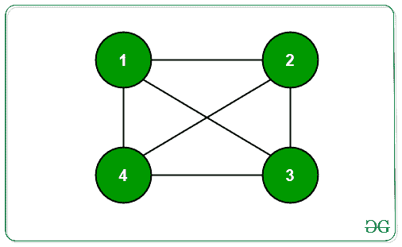
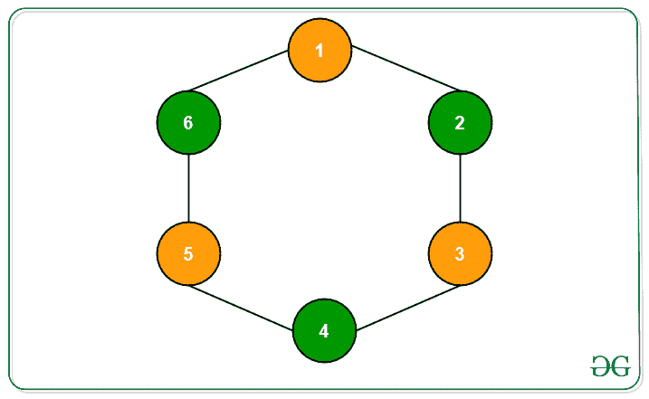

# 图中要着色的最小节点，以便每个节点都有一个已着色的邻居

> 原文： [https://www.geeksforgeeks.org/minimum-nodes-to-be-colored-in-a-graph-such-that-every-node-has-a-colored-neighbour/](https://www.geeksforgeeks.org/minimum-nodes-to-be-colored-in-a-graph-such-that-every-node-has-a-colored-neighbour/)

给定具有`V`节点和`E`边缘的图形`G`，任务是为不超过 **floor（V / 2）**节点着色 使得每个节点在至少 1 个单位的距离处具有*至少一个有色节点*。 图的任何两个连接节点之间的距离始终精确为 1 个单位。 打印需要着色的节点。

**示例**：

> **输入**：N = 4，
> G：
> [](https://media.geeksforgeeks.org/wp-content/uploads/20200624201103/Untitled-Diagram212.png) 
> **输出**：1
> [](https://media.geeksforgeeks.org/wp-content/uploads/20200624201147/Untitled-Diagram312.png)
> 
> **输入**：N = 6，
> G：
> [](https://media.geeksforgeeks.org/wp-content/uploads/20200624201321/Untitled-Diagram146.png) 
> **输出**：3
> [](https://media.geeksforgeeks.org/wp-content/uploads/20200624201433/Untitled-Diagram147.png)

**方法**：可以使用 [**BFS**](https://en.wikipedia.org/wiki/Breadth-first_search) 遍历来解决。 请按照以下步骤解决问题：

*   初始化数组**奇数[]** 和**偶数[]** ，以存储与源分别处于奇数和偶数节点距离的节点。
*   从源节点开始，以**距离**初始化为 0（表示距源节点的距离）执行 BFS 遍历。 根据 **distance** 的值，将所有节点存储在奇数[]或偶数[]中。
*   如果距离为奇数，即**（距离& 1）**为 1，则将该节点插入奇数[]。 否则，插入 even []。
*   现在，使用最少的元素打印数组中的节点。
*   由于奇数距离或偶数距离的节点数中的最小值不超过 **floor（V / 2）**，因此答案保持正确，因为奇数距离的每个节点都连接到偶数距离的节点，反之亦然。
*   因此，如果到源的偶数距离处的节点数较少，则从 even []中打印节点。 否则，从奇数[]打印所有节点。

> **插图**：
> 对于下面给出的图形 G，
> 源节点 S = 1
> [](https://media.geeksforgeeks.org/wp-content/uploads/20200624201321/Untitled-Diagram146.png)
> 
> *   偶[] = {1、3、5}
> *   奇数[] = {2，6，4}
> *   最小值（偶数大小（），奇数大小（））=最小值（3，3）= 3
> *   因此，为所有节点着色距源奇数个距离或距源偶数个距离是正确的，因为它们的计数相同。

下面是上述方法的实现：

## C ++

```

// C++ Program to implement the 
// above approach 

#include <bits/stdc++.h> 
using namespace std; 

// Stores the graph 
map<int, vector<int> > graph; 

// Stores the visited nodes 
map<int, int> vis; 

// Stores the nodes 
// at odd distance 
vector<int> odd; 

// Stores the nodes at 
// even distance 
vector<int> even; 

// Function to seperate and 
// store the odd and even 
// distant nodes from source 
void bfs() 
{ 
    // Source node 
    int src = 1; 

    // Stores the nodes and their 
    // respective distances from 
    // the source 
    queue<pair<int, int> > q; 

    // Insert the source 
    q.push({ src, 0 }); 

    // Mark the source visited 
    vis[src] = 1; 

    while (!q.empty()) { 

        // Extract a node from the 
        // front of the queue 
        int node = q.front().first; 
        int dist = q.front().second; 
        q.pop(); 

        // If distance from source 
        // is odd 
        if (dist & 1) { 
            odd.push_back(node); 
        } 

        // Otherwise 
        else { 
            even.push_back(node); 
        } 

        // Traverse its neighbors 
        for (auto i : graph[node]) { 

            // Insert its unvisited 
            // neighbours into the queue 
            if (!vis.count(i)) { 

                q.push({ i, (dist + 1) }); 
                vis[i] = 1; 
            } 
        } 
    } 
} 

// Driver Program 
int main() 
{ 
    graph[1].push_back(2); 
    graph[2].push_back(1); 
    graph[2].push_back(3); 
    graph[3].push_back(2); 
    graph[3].push_back(4); 
    graph[4].push_back(3); 
    graph[4].push_back(5); 
    graph[5].push_back(4); 
    graph[5].push_back(6); 
    graph[6].push_back(5); 
    graph[6].push_back(1); 
    graph[1].push_back(6); 

    bfs(); 

    if (odd.size() < even.size()) { 
        for (int i : odd) { 
            cout << i << " "; 
        } 
    } 
    else { 
        for (int i : even) { 
            cout << i << " "; 
        } 
    } 
    return 0; 
} 

```

**Output:**

```
1 3 5

```

***时间复杂度**：O（V + E）*


* * *

* * *

如果您喜欢 GeeksforGeeks 并希望做出贡献，则还可以使用 [tribution.geeksforgeeks.org](https://contribute.geeksforgeeks.org/) 撰写文章，或将您的文章邮寄至 tribution@geeksforgeeks.org。 查看您的文章出现在 GeeksforGeeks 主页上，并帮助其他 Geeks。

如果您发现任何不正确的地方，请单击下面的“改进文章”按钮，以改进本文。