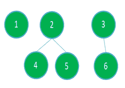

# 要删除的最小节点数，以使子树不超过 K 个节点

> 原文： [https://www.geeksforgeeks.org/minimum-number-of-nodes-to-be-removed-such-that-no-subtree-has-more-than-k-nodes/](https://www.geeksforgeeks.org/minimum-number-of-nodes-to-be-removed-such-that-no-subtree-has-more-than-k-nodes/)

给定一棵树，其中`N`个节点的值从`1`到`N`和**（N – 1）**边，数字为 **K [** 的任务是从树中删除最少数量的节点，以便每个子树最多具有`K`个节点。 移除节点会将边缘从该节点移除到所有其他连接的节点。

**示例**：

> **输入**：N = 10，K = 3，下图是：
> 
> [](https://media.geeksforgeeks.org/wp-content/uploads/20200722134450/rszscreenshot53.png)
> 
> **输出**：
> 删除的节点数：2
> 删除的节点：2 1
> **说明**：
> 删除节点 1 和 2 之后，此处没有 子树或树具有 3 个以上的节点。 下面是结果图：
> 
> [](https://media.geeksforgeeks.org/wp-content/uploads/20200722140935/rszscreenshot54.png)
> 
> **输入**：N = 6，K = 3，下图是：
> 
> [](https://media.geeksforgeeks.org/wp-content/uploads/20200801132537/rsz1rsz1screenshot55.png)
> 
> **输出**：
> 删除的节点数：1
> 删除的节点：1
> **说明**：
> 删除节点 1 之后，此处没有子树或树 有 3 个以上的节点。 下面是结果图：
> 
> [](https://media.geeksforgeeks.org/wp-content/uploads/20200801132919/rsz2screenshot55.png)

**方法**：想法是观察节点 X 的子树中的节点数是其子节点和节点本身的子树中的节点数的**和**。 步骤如下：

*   使用[动态编程](https://www.geeksforgeeks.org/dynamic-programming/)和 [DFS](https://www.geeksforgeeks.org/depth-first-search-or-dfs-for-a-graph/) 将节点的**计数**轻松存储在每个节点的子树中。
*   现在，要使子树的节点数不超过 K 个节点，则其想法是在子树中的节点数超过 K 个节点时删除该节点，并将 0 传递给其父节点。
*   在上面的步骤中，我们让每个节点的子树中的节点不大于 K，并最大程度地减少了节点删除的次数。

下面是上述方法的实现：

## Java

```java

// Java program for the above approach
import java.util.*;

class GFG {

    // Variables used to store data globally
    static final int N = 20;
    static boolean visited[] = new boolean[N];
    static int K;
    static int removals = 0;
    static ArrayList<Integer> removed_nodes
        = new ArrayList<>();

    // Adjacency list representation of tree
    static ArrayList<ArrayList<Integer> > adj
        = new ArrayList<>();

    // Function to perform DFS Traversal
    static int dfs(int s)
    {
        // Mark the node as true
        visited[s] = true;
        int nodes = 1;

        // Traverse adjacency list
        // of child node
        for (Integer child : adj.get(s)) {

            // If already visited then
            // omit the node
            if (visited[child])
                continue;

            // Add number of nodes
            // in subtree
            nodes += dfs(child);
        }

        if (nodes > K) {

            // Increment the count
            removals++;
            removed_nodes.add(s);
            nodes = 0;
        }

        // Return the nodes
        return nodes;
    }

    // Function to add edges in graph
    static void addEdge(int a, int b)
    {
        adj.get(a).add(b);
        adj.get(b).add(a);
    }

    // Function that finds the number
    // of nodes to be removed such that
    // every subtree has size at most K
    public static void findRemovedNodes(int K)
    {
        // Function Call to find the
        // number of nodes to remove
        dfs(1);

        // Print Removed Nodes
        System.out.println("Number of nodes"
                           + " removed: "
                           + removals);

        System.out.print("Removed Nodes: ");
        for (int node : removed_nodes)
            System.out.print(node + " ");
    }

    // Driver Code
    public static void main(String[] args)
    {
        // Creating list for all nodes
        for (int i = 0; i < N; i++)
            adj.add(new ArrayList<>());

        // Insert of nodes in graph
        addEdge(1, 2);
        addEdge(1, 3);
        addEdge(2, 4);
        addEdge(2, 5);
        addEdge(3, 6);

        // Required subtree size
        K = 3;

        // Function Call
        findRemovedNodes(K);
    }
}

```

## Python

```py

# Python3 program for the above approach

# Variables used to store data globally
N = 20
visited = [False for i in range(N)]
K = 0
removals = 0
removed_nodes = []

# Adjacency list representation of tree
adj = [[] for i in range(N)]

# Function to perform DFS Traversal
def dfs(s):

    global removals

    # Mark the node as true
    visited[s] = True
    nodes = 1

    # Traverse adjacency list
    # of child node
    for child in adj[s]:

        # If already visited then
        # omit the node
        if (visited[child]):
            continue

        # Add number of nodes
        # in subtree
        nodes += dfs(child)

    if (nodes > K):

        # Increment the count
        removals += 1
        removed_nodes.append(s)
        nodes = 0

    # Return the nodes
    return nodes

# Function to add edges in graph
def addEdge(a, b):

    adj[a].append(b)
    adj[b].append(a)

# Function that finds the number
# of nodes to be removed such that
# every subtree has size at most K
def findRemovedNodes(K):

    # Function Call to find the
    # number of nodes to remove
    dfs(1)

    # Print Removed Nodes
    print("Number of nodes removed: ", removals)

    print("Removed Nodes: ", end = ' ')

    for node in removed_nodes:
        print(node, end = ' ')

# Driver Code
if __name__ == "__main__":

    # Insert of nodes in graph
    addEdge(1, 2)
    addEdge(1, 3)
    addEdge(2, 4)
    addEdge(2, 5)
    addEdge(3, 6)

    # Required subtree size
    K = 3

    # Function Call
    findRemovedNodes(K)

# This code is contributed by rutvik_56

```

## C#

```cs

// C# program for the above approach
using System;
using System.Collections.Generic;

class GFG{

  // Variables used to store data globally
  static readonly int N = 20;
  static bool []visited = new bool[N];
  static int K;
  static int removals = 0;
  static List<int> removed_nodes
    = new List<int>();

  // Adjacency list representation of tree
  static List<List<int> > adj
    = new List<List<int>>();

  // Function to perform DFS Traversal
  static int dfs(int s)
  {
    // Mark the node as true
    visited[s] = true;
    int nodes = 1;

    // Traverse adjacency list
    // of child node
    foreach (int child in adj[s]) 
    {

      // If already visited then
      // omit the node
      if (visited[child])
        continue;

      // Add number of nodes
      // in subtree
      nodes += dfs(child);
    }

    if (nodes > K)
    {

      // Increment the count
      removals++;
      removed_nodes.Add(s);
      nodes = 0;
    }

    // Return the nodes
    return nodes;
  }

  // Function to add edges in graph
  static void addEdge(int a, int b)
  {
    adj[a].Add(b);
    adj[b].Add(a);
  }

  // Function that finds the number
  // of nodes to be removed such that
  // every subtree has size at most K
  public static void findRemovedNodes(int K)
  {
    // Function Call to find the
    // number of nodes to remove
    dfs(1);

    // Print Removed Nodes
    Console.WriteLine("Number of nodes" +     
                           " removed: " +
                               removals);

    Console.Write("Removed Nodes: ");
    foreach (int node in removed_nodes)
      Console.Write(node + " ");
  }

  // Driver Code
  public static void Main(String[] args)
  {
    // Creating list for all nodes
    for (int i = 0; i < N; i++)
      adj.Add(new List<int>());

    // Insert of nodes in graph
    addEdge(1, 2);
    addEdge(1, 3);
    addEdge(2, 4);
    addEdge(2, 5);
    addEdge(3, 6);

    // Required subtree size
    K = 3;

    // Function Call
    findRemovedNodes(K);
  }
}

// This code is contributed by Rohit_ranjan

```

**Output:** 

```
Number of nodes removed: 1
Removed Nodes: 1

```

***时间复杂度**：O（N）*
***辅助空间**：O（N）*


* * *

* * *

如果您喜欢 GeeksforGeeks 并希望做出贡献，则还可以使用 [tribution.geeksforgeeks.org](https://contribute.geeksforgeeks.org/) 撰写文章，或将您的文章邮寄至 tribution@geeksforgeeks.org。 查看您的文章出现在 GeeksforGeeks 主页上，并帮助其他 Geeks。

如果您发现任何不正确的地方，请单击下面的“改进文章”按钮，以改进本文。