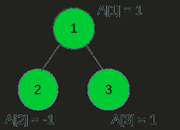
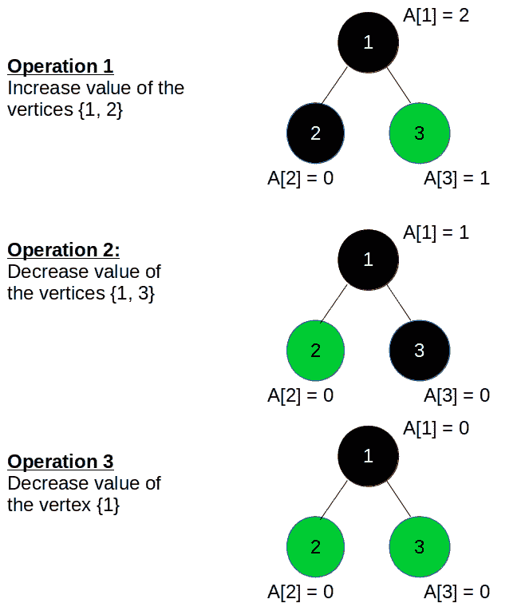

# 使树的所有顶点均为零的最小运算

> 原文： [https://www.geeksforgeeks.org/minimum-operations-to-make-value-of-all-vertices-of-the-tree-zero/](https://www.geeksforgeeks.org/minimum-operations-to-make-value-of-all-vertices-of-the-tree-zero/)

给定一棵树，其中每个顶点 V 都有一个值 A [V]存储在其中。 任务是找到使存储在树的所有顶点中的值等于零的最小操作数。

每个操作包括以下 2 个步骤：

1.  选择一个子树，使该子树包含顶点 1。
2.  将子树的所有顶点的值增加/减少 1。

**考虑以下树**：



**注意**：如上所述，顶点中的数字表示顶点数，而 A [V]表示顶点的值。

对于下面的树，我们执行以下 3 个操作以使所有顶点
的值等于零：

**注意**：黑色的顶点表示所选的子树。

我们可以使用动态编程解决此问题。

令 dp [i] [0]表示选择以`i`为根的任何子树并且所有顶点的值增加 1 的操作数。
类似地，dp [i] [1 ]表示选择以`i`为根的任何子树并将所有顶点的值减少 1 的操作数。

对于所有叶子，如果说叶子节点 V 使得某个叶子节点 U 的 A [V] = 0，即 dp [i] [ 1] = A [V]和 dp [i] [0] = 0

现在，如果我们在某个非叶节点中说 v，我们看一下它的所有子节点，如果说对 V 的子节点 i 进行 X <sub>i</sub> 次加法运算，则需要应用 max（X [ 对于节点 v）的所有子节点 i <sub>i</sub> ，增加以 v 为根的任何子树的操作。类似地，对于节点 V 的减少操作，我们执行相同的操作。

答案是节点 1 的增加和减少操作的总和，因为这些操作仅应用于具有节点 1 的子树。

下面是上述方法的实现：

## C++

```cpp

// CPP program to find the Minimum Operations 
// to modify values of all tree vertices to zero 
#include <bits/stdc++.h> 

using namespace std; 

// A utility function to add an edge in an 
// undirected graph 
void addEdge(vector<int> adj[], int u, int v) 
{ 
    adj[u].push_back(v); 
    adj[v].push_back(u); 
} 

// A utility function to print the adjacency list 
// representation of graph 
void printGraph(vector<int> adj[], int V) 
{ 
    for (int v = 0; v < V; ++v) { 
        cout << "\n Adjacency list of vertex "
             << v << "\n head "; 
        for (auto x : adj[v]) 
            cout << "-> " << x; 
        printf("\n"); 
    } 
} 

// Utility Function for findMinOperation() 
void findMinOperationUtil(int dp[][2], vector<int> adj[], 
                          int A[], int src, int parent) 
{ 
    // Base Case for current node 
    dp[src][0] = dp[src][1] = 0; 

    // iterate over the adjacency list for src 
    for (auto V : adj[src]) { 
        if (V == parent) 
            continue; 

        // calculate DP table for each child V 
        findMinOperationUtil(dp, adj, A, V, src); 

        // Number of Increase Type operations for node src 
        // is equal to maximum of number of increase operations 
        // required by each of its child 
        dp[src][0] = max(dp[src][0], dp[V][0]); 

        // Number of Decrease Type operations for node src 
        // is equal to maximum of number of decrease operations 
        // required by each of its child 
        dp[src][1] = max(dp[src][1], dp[V][1]); 
    } 

    // After performing operations for subtree rooted at src 
    // A[src] changes by the net difference of increase and 
    // decrease type operations 
    A[src - 1] += dp[src][0] - dp[src][1]; 

    // for negative value of node src 
    if (A[src - 1] > 0) { 
        dp[src][1] += A[src - 1]; 
    } 
    else { 
        dp[src][0] += abs(A[src - 1]); 
    } 
} 

// Returns the minimum operations required to make 
// value of all vertices equal to zero, uses 
// findMinOperationUtil() 
int findMinOperation(vector<int> adj[], int A[], int V) 
{ 

    // Initialise DP table 
    int dp[V + 1][2]; 
    memset(dp, 0, sizeof dp); 

    // find dp[1][0] and dp[1][1] 
    findMinOperationUtil(dp, adj, A, 1, 0); 

    int minOperations = dp[1][0] + dp[1][1]; 
    return minOperations; 
} 

// Driver code 
int main() 
{ 
    int V = 5; 

    // Build the Graph/Tree 
    vector<int> adj[V + 1]; 
    addEdge(adj, 1, 2); 
    addEdge(adj, 1, 3); 

    int A[] = { 1, -1, 1 }; 
    int minOperations = findMinOperation(adj, A, V); 
    cout << minOperations; 

    return 0; 
} 

```

## Python3

```

# Python3 program to find the Minimum Operations  
# to modify values of all tree vertices to zero  

# A utility function to add an  
# edge in an undirected graph  
def addEdge(adj, u, v):  

    adj[u].append(v)  
    adj[v].append(u)  

# A utility function to print the adjacency  
# list representation of graph  
def printGraph(adj, V):  

    for v in range(0, V):  
        print("Adjacency list of vertex", v) 
        print("head", end = " ") 

        for x in adj[v]:  
            print("->", x, end = "")  
        print()  

# Utility Function for findMinOperation()  
def findMinOperationUtil(dp, adj, A, src, parent):  

    # Base Case for current node  
    dp[src][0] = dp[src][1] = 0

    # Iterate over the adjacency list for src  
    for V in adj[src]:  
        if V == parent:  
            continue

        # calculate DP table for each child V  
        findMinOperationUtil(dp, adj, A, V, src)  

        # Number of Increase Type operations for node src  
        # is equal to maximum of number of increase operations  
        # required by each of its child  
        dp[src][0] = max(dp[src][0], dp[V][0])  

        # Number of Decrease Type operations for node  
        # src is equal to maximum of number of decrease  
        # operations required by each of its child  
        dp[src][1] = max(dp[src][1], dp[V][1])  

    # After performing operations for subtree rooted  
    # at src A[src] changes by the net difference of  
    # increase and decrease type operations  
    A[src - 1] += dp[src][0] - dp[src][1]  

    # for negative value of node src  
    if A[src - 1] > 0: 
        dp[src][1] += A[src - 1]  

    else: 
        dp[src][0] += abs(A[src - 1])  

# Returns the minimum operations required to  
# make value of all vertices equal to zero,  
# uses findMinOperationUtil()  
def findMinOperation(adj, A, V):  

    # Initialise DP table  
    dp = [[0, 0] for i in range(V + 1)]  

    # find dp[1][0] and dp[1][1]  
    findMinOperationUtil(dp, adj, A, 1, 0)  

    minOperations = dp[1][0] + dp[1][1]  
    return minOperations  

# Driver code  
if __name__ == "__main__":  

    V = 5

    # Build the Graph/Tree  
    adj = [[] for i in range(V + 1)] 
    addEdge(adj, 1, 2)  
    addEdge(adj, 1, 3)  

    A = [1, -1, 1] 
    minOperations = findMinOperation(adj, A, V)  
    print(minOperations)  

# This code is contributed by Rituraj Jain 

```

**Output:**

```
3

```

**时间复杂度**：O（V），其中 V 是树中的节点数。
**辅助空间**：O（V），其中 V 是树中节点的数量。

[](https://practice.geeksforgeeks.org/courses/competitive-programming-live?utm_source=geeksforgeeks&utm_medium=article&utm_campaign=gfg_article_cp)

* * *

* * *

如果您喜欢 GeeksforGeeks 并希望做出贡献，则还可以使用 [tribution.geeksforgeeks.org](https://contribute.geeksforgeeks.org/) 撰写文章，或将您的文章邮寄至 tribution@geeksforgeeks.org。 查看您的文章出现在 GeeksforGeeks 主页上，并帮助其他 Geeks。

如果您发现任何不正确的地方，请单击下面的“改进文章”按钮，以改进本文。