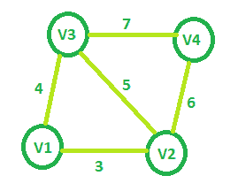

# 给定图

的最小生成树成本

> 原文： [https://www.geeksforgeeks.org/minimum-spanning-tree-cost-of-given-graphs/](https://www.geeksforgeeks.org/minimum-spanning-tree-cost-of-given-graphs/)

给定 **V** 节点（V > 2）的无向图，名称为 V <sub>1</sub> ，V <sub>2</sub> ，V <sub>3</sub> ，…， V <sub>n</sub> 。 当 **0 < | **V <sub>i</sub>** 和 **V <sub>j</sub>** 时，两个节点相互连接。 i – j | ≤2** 。 将任意顶点对**（V <sub>i</sub> ，V <sub>j</sub> ）**之间的每个边分配权重 **i + j** 。 任务是找到带有 **V** 节点的此类图的[最小生成树](https://www.geeksforgeeks.org/kruskals-minimum-spanning-tree-algorithm-greedy-algo-2/)的成本。

**示例：**

> **输入：** V = 4
> 
> **输出：** 13
> 
> **输入：** V = 5
> **输出：** 21

**方法：**从具有最小节点（即 3 个节点）的图开始，最小生成树的成本为 7。现在，对于每个节点 **i** ，从第四个节点开始， 在此图中添加 **i <sup>第</sup>** 节点只能连接到**（i – 1） <sup>th</sup>** 和**（i – 2）第<sup>个</sup>** 节点和最小生成树将仅包括权重最小的节点，因此新添加的边将具有权重 **i +（i – 2）** 。

> 因此，添加第四个节点将增加总体权重，因为 7 +（4 + 2）= 13
> 类似地添加第五个节点，权重= 13 +（5 + 3）= 21
> …
> 对于 n 节点，**权重=权重+（n +（n – 2））**。

可以概括为**权重= V <sup>2</sup> – V +1** ，其中 **V** 是图中的总节点。

下面是上述方法的实现：

## C ++

```

// C++ implementation of the approach 
#include <bits/stdc++.h> 
using namespace std; 

// Function that returns the minimum cost 
// of the spanning tree for the required graph 
int getMinCost(int Vertices) 
{ 
    int cost = 0; 

    // Calculating cost of MST 
    cost = (Vertices * Vertices) - Vertices + 1; 

    return cost; 
} 

// Driver code 
int main() 
{ 
    int V = 5; 
    cout << getMinCost(V); 

    return 0; 
} 

```