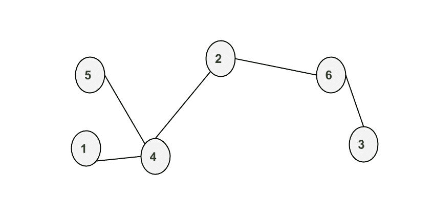

# 通过不相交联合方法

计算非循环图中两个顶点之间的节点数

> 原文： [https://www.geeksforgeeks.org/number-nodes-two-vertices-acyclic-graph-disjoint-union-method/](https://www.geeksforgeeks.org/number-nodes-two-vertices-acyclic-graph-disjoint-union-method/)

给定一个已连接的无环图，一个源顶点和一个目标顶点，您的任务是通过**不相交联合方法计算给定源顶点和目标顶点之间的顶点数量。**

**示例**：

```
Input : 1 4
        4 5
        4 2
        2 6
        6 3
        1 3 
Output : 3
In the input 6 is the total number of vertices
labeled from 1 to 6 and the next 5 lines are the connection 
between vertices. Please see the figure for more
explanation. And in last line 1 is the source vertex
and 3 is the destination vertex. From the figure 
it is clear that there are 3 nodes(4, 2, 6) present
between 1 and 3\. 

```



要使用脱节联合方法，我们必须首先检查给定图的每个节点的父级。 我们可以使用 [BFS](https://www.geeksforgeeks.org/breadth-first-traversal-for-a-graph/) 遍历图，并计算图的每个顶点的父顶点。 例如，如果我们从顶点 1 遍历图形（即开始我们的 BFS），则 1 是 4 的父级，然后 4 是 5 和 2 的父级，再次 2 是 6 的父级，而 6 是 3 的父级。

现在，要计算源节点和目标节点之间的节点数，我们必须创建一个从目标节点的父节点开始的循环，并且在每次迭代之后，我们将使用当前节点的父节点更新此节点，并保持计数 迭代次数。 当我们到达源顶点并且 count 变量给出源节点和目标节点的连接路径中的节点数时，循环的执行将终止。

在上述方法中，不相交集是具有单个顶点的所有集，并且我们使用并集操作合并了两个集，其中一个包含父节点，另一个包含子节点。

以下是上述方法的实现。

## C++

```cpp

// C++ program to calculate number 
// of nodes between two nodes 
#include <bits/stdc++.h> 
using namespace std; 

// function to calculate no of nodes 
// between two nodes 
int totalNodes(vector<int> adjac[], int n, 
                             int x, int y) 
{ 
    // x is the source node and 
    // y is destination node 

    // visited array take account of 
    // the nodes visited through the bfs 
    bool visited[n+1] = {0}; 

    // parent array to store each nodes 
    // parent value 
    int p[n] ; 

    queue<int> q; 
    q.push(x); 

    // take our first node(x) as first element 
    // of queue and marked it as 
    // visited through visited[] array 
    visited[x] = true; 

    int m; 

    // normal bfs method starts 
    while (!q.empty()) 
    { 
        m = q.front() ; 
        q.pop(); 
        for (int i=0; i<adjac[m].size(); ++i) 
        { 
            int h = adjac[m][i]; 
            if (!visited[h]) 
            { 
                visited[h] = true; 

                // when new node is encountered 
                // we assign it's parent value 
                // in parent array p 
                p[h] = m ; 
                q.push(h); 
            } 
        } 
    } 

    // count variable stores the result 
    int count = 0; 

    // loop start with parent of y 
    // till we encountered x 
    int i = p[y]; 
    while (i != x) 
    { 
        // count increases for counting 
        // the nodes 
        count++; 

        i = p[i]; 
    } 

    return count ; 
} 

// Driver program to test above function 
int main() 
{ 
    // adjacency list for graph 
    vector < int > adjac[7]; 

    // creating graph, keeping length of 
    // adjacency list as (1 + no of nodes) 
    // as index ranges from (0 to n-1) 
    adjac[1].push_back(4); 
    adjac[4].push_back(1); 
    adjac[5].push_back(4); 
    adjac[4].push_back(5); 
    adjac[4].push_back(2); 
    adjac[2].push_back(4); 
    adjac[2].push_back(6); 
    adjac[6].push_back(2); 
    adjac[6].push_back(3); 
    adjac[3].push_back(6); 

    cout << totalNodes(adjac, 7, 1, 3); 

    return 0; 
} 

```