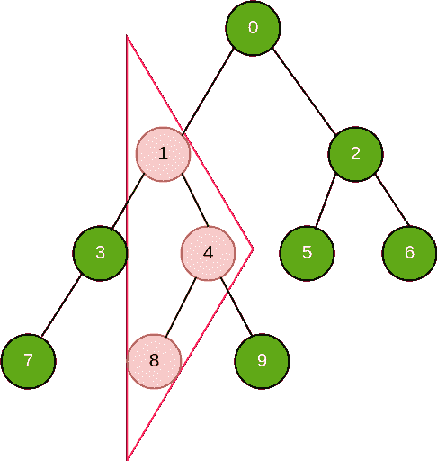
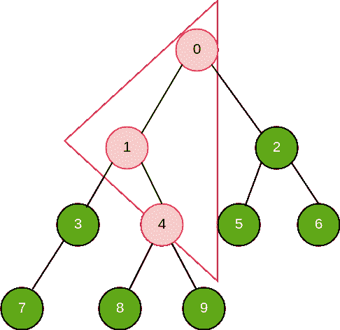

# 二叉树

中的等腰三角形数

> 原文： [https://www.geeksforgeeks.org/number-of-isosceles-triangles-in-a-binary-tree/](https://www.geeksforgeeks.org/number-of-isosceles-triangles-in-a-binary-tree/)

<font size="2">**先决条件**：[深度优先搜索](https://www.geeksforgeeks.org/depth-first-search-or-dfs-for-a-graph/) | [父数组表示形式](https://www.geeksforgeeks.org/construct-a-binary-tree-from-parent-array-representation/)</font>

给定二叉树的父数组表示形式，我们需要找到二叉树中等腰三角形的数量。

考虑代表二叉树的父数组：
**父数组**：


下面给出的是给定父数组的树表示。
**二叉树**：


在二叉树中可以找到三种等腰三角形。 这三种不同类型的等腰三角形可以作为三种不同情况来处理。

<font size="4">**情况 1**：</font> Apex（与基本共享平等边的顶点）有两个后继（直接/间接）。
这种情况可以表示为：

在给定的树中，有 6 个这样的等腰三角形，即； **（0、1、2），（0、3、6），（1、3、4），（1、7、9），（4、8、9），（2、5、6）**

```
Pseudo Code: count += min(left_down[i], right_down[i]);
```

<font size="4">**情况 2**：</font> Apex 具有左后继者（直接/间接），而顶点本身是其父代的右后继者（直接/间接）。
这种情况可以表示为：

在给定的树中，有 2 个这样的等腰三角形，即； **（1、8、4），（0、5、2）**

```
Pseudo Code: count += min(left_down[i], left_up[i]);
```

<font size="4">**情况 3**：</font> Apex 具有右继任者（直接/间接），而顶点本身是其父代的左继任者（直接/间接）。
这种情况可以表示为：

在给定的树中，有 1 个这样的等腰三角形，即； **（0，1，4）**

```
Pseudo Code: count += min(right_down[i], right_up[i]);
```

> **伪代码说明**：
> left_down [i]->第 i 个节点距其最远的后继者的最大距离
> right_down [i]->第 i 个节点距其最远的最大距离 右后继者
> left_up [i]->第 i 个节点与其最远的左前任者的最大距离
> right_up [i]->第 i 个节点与其最远的前任者的最大距离

以下是计算给定二叉树中存在的等腰三角形数目的实现：

## C ++

```

/* C++ program for calculating number of  
isosceles triangles present in a binary tree */
#include <bits/stdc++.h> 
using namespace std; 

#define MAX_SZ int(1e5) 

/* Data Structure used to store  
   Binary Tree in form of Graph */
vector<int>* graph; 

// Data varirables 
int right_down[MAX_SZ]; 
int left_down[MAX_SZ]; 
int right_up[MAX_SZ]; 
int left_up[MAX_SZ]; 

/* Utility function used to  
   start a DFS traversal over a node */
void DFS(int u, int* parent) 
{ 

    if (graph[u].size() != 0) 
        sort(graph[u].begin(), graph[u].end()); 

    if (parent[u] != -1) { 
        if (graph[parent[u]].size() > 1) { 
            /* check if current node is  
                                left child of its parent */
            if (u == graph[parent[u]][0]) { 
                right_up[u] += right_up[parent[u]] + 1; 
            } 
            // current node is right child of its parent 
            else { 
                left_up[u] += left_up[parent[u]] + 1; 
            } 
        } 
        /* check if current node is left and  
                            only child of its parent */
        else { 
            right_up[u] += right_up[parent[u]] + 1; 
        } 
    } 
    for (int i = 0; i < graph[u].size(); ++i) { 

        int v = graph[u][i]; 

        // iterating over subtree 
        DFS(v, parent); 

        // left child of current node 
        if (i == 0) { 
            left_down[u] += left_down[v] + 1; 
        } 
        // right child of current node 
        else { 
            right_down[u] += right_down[v] + 1; 
        } 
    } 
} 

/* utility function used to generate  
                graph from parent array */
int generateGraph(int* parent, int n) 
{ 

    int root; 

    graph = new vector<int>[n]; 

    // Generating graph from parent array 
    for (int i = 0; i < n; ++i) { 

        // check for non-root node 
        if (parent[i] != -1) { 
            /* creating an edge from node with number 
             parent[i] to node with number i */
            graph[parent[i]].push_back(i); 
        } 
        // initializing root 
        else { 
            root = i; 
        } 

        // Initializing necessary data variables 
        left_up[i] = 0; 
        right_up[i] = 0; 
        left_down[i] = 0; 
        right_down[i] = 0; 
    } 
    // root of the binary tree 
    return root; 
} 

// Driver Function 
int main() 
{ 

    int n = 10; 

    /* Parent array used for storing  
       parent of each node */
    int parent[] = { -1, 0, 0, 1, 1, 2, 2, 3, 4, 4 }; 

    /* generateGraph() function generates a graph a  
       returns root of the graph which can be used for 
       starting DFS traversal */
    int root = generateGraph(parent, n); 

    // triggering dfs for traversal over graph 
    DFS(root, parent); 

    int count = 0; 

    // Calculation of number of isosceles triangles 
    for (int i = 0; i < n; ++i) { 
        count += min(right_down[i], right_up[i]); 
        count += min(left_down[i], left_up[i]); 
        count += min(left_down[i], right_down[i]); 
    } 

    cout << "Number of isosceles triangles "
         << "in the given binary tree are " << count; 

    return 0; 
} 

```