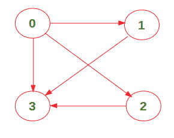
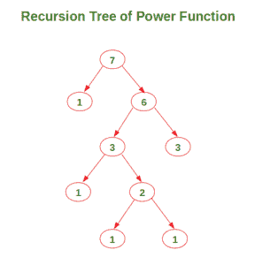

# 从源到目的地的步行数

> 原文： [https://www.geeksforgeeks.org/number-of-walks-from-source-to-destination/](https://www.geeksforgeeks.org/number-of-walks-from-source-to-destination/)

给定一个图和两个顶点 src 和 dest，计算从 src 到 dest 的路径总数，其中路径的长度为 k（它们之间应该恰好有 k 条边）。 注意，该图表示为邻接矩阵。
例如，请考虑以下图形：



从顶点 0 到长度为 2 的顶点 3 的路径数为 2（{0-> 1-> 3}和{0-> 2-> 3}）。
我们已经讨论了[中的 O（V <sup>3</sup> K）方法，对从源到目的地的所有可能的走行进行精确的 k 边计数](https://www.geeksforgeeks.org/count-possible-paths-source-destination-exactly-k-edges/)。 在这篇文章中，讨论了 O（V <sup>3</sup> Log K）方法。

**方法**：想法是计算结果矩阵，其中*结果=（图） <sup>k</sup>* 。 那么，从源到目的地的长度为 k 的路径总数将是 *result [src] [dest]* 。 我们使用[这种](https://www.geeksforgeeks.org/write-a-c-program-to-calculate-powxn/)技术来计算给定图的邻接矩阵的幂。
此处用于幂= 7 的幂函数的递归树如下所示：



下面是上述方法的实现：

**Output:** 

```
Total number of walks: 2

```

**时间复杂度**：


* * *

* * *

如果您喜欢 GeeksforGeeks 并希望做出贡献，则还可以使用 [tribution.geeksforgeeks.org](https://contribute.geeksforgeeks.org/) 撰写文章，或将您的文章邮寄至 tribution@geeksforgeeks.org。 查看您的文章出现在 GeeksforGeeks 主页上，并帮助其他 Geeks。

如果您发现任何不正确的地方，请单击下面的“改进文章”按钮，以改进本文。