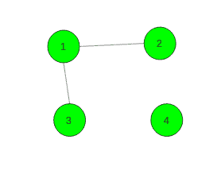

# 从每个连接的组件中选择节点的方法数量

> 原文： [https://www.geeksforgeeks.org/number-of-ways-to-select-a-node-from-each-connected-component/](https://www.geeksforgeeks.org/number-of-ways-to-select-a-node-from-each-connected-component/)

给定一个具有 **N** 个节点和 **M** 个边的图。 任务是找到从给定图的每个连接组件中选择节点的方法。

**示例：**

> **输入：**
> 
> **输出：** 3
> （1、4），（2、4），（3、4）是可行的方式。
> 
> **输入：**
> 
> **输出：** 6
> （1、4、5），（2、4、5），（3、4 5），（1、4、6），（2、4、6），（3、4、6）是可能的方式。

**方法：**每个连接组件中节点数的乘积是必需的答案。 运行一个简单的 [dfs](https://www.geeksforgeeks.org/depth-first-search-or-dfs-for-a-graph/) ，以查找每个连接的组件中的节点数。

下面是上述方法的实现：

## C ++

```

// C++ implementation of the approach 
#include <bits/stdc++.h> 
using namespace std; 
#define N 100005 

int n, m, temp; 
vector<int> gr[N]; 
int vis[N]; 

// Function to add edges in the graph 
void Add_edges(int x, int y) 
{ 
    gr[x].push_back(y); 
    gr[y].push_back(x); 
} 

// Function for DFS 
void dfs(int ch) 
{ 
    // Mark node as visited 
    vis[ch] = 1; 

    // Count number of nodes in a component 
    temp++; 
    for (auto i : gr[ch]) 
        if (!vis[i]) 
            dfs(i); 
} 

// Function to return the required number of ways 
int NumberOfWays() 
{ 

    // To store the required answer 
    int ans = 1; 

    memset(vis, 0, sizeof vis); 
    for (int i = 1; i <= n; i++) { 

        // If current node hasn't been visited yet 
        if (!vis[i]) { 
            temp = 0; 
            dfs(i); 

            // Multiply it with the answer 
            ans *= temp; 
        } 
    } 

    return ans; 
} 

// Driver code 
int main() 
{ 
    n = 4, m = 2; 

    // Add edges 
    Add_edges(1, 2); 
    Add_edges(1, 3); 

    cout << NumberOfWays(); 

    return 0; 
} 

```

## 爪哇

```

// Java implementation of the approach  
import java.util.*; 

class GFG 
{  

static final int N = 100005; 

static int n, m, temp;  
static Vector<Integer> []gr = new Vector[N];  
static int []vis = new int[N];  

// Function to add edges in the graph  
static void Add_edges(int x, int y)  
{  
    gr[x].add(y);  
    gr[y].add(x);  
}  

// Function for DFS  
static void dfs(int ch)  
{  
    // Mark node as visited  
    vis[ch] = 1;  

    // Count number of nodes in a component  
    temp++;  
    for (int i : gr[ch])  
        if (vis[i] == 0)  
            dfs(i);  
}  

// Function to return the required number of ways  
static int NumberOfWays()  
{  

    // To store the required answer  
    int ans = 1;  
    Arrays.fill(vis, 0); 

    for (int i = 1; i <= n; i++) 
    {  

        // If current node hasn't been visited yet  
        if (vis[i] == 0)  
        {  
            temp = 0;  
            dfs(i);  

            // Multiply it with the answer  
            ans *= temp;  
        }  
    }  

    return ans;  
}  

// Driver code  
public static void main(String[] args)  
{  
    n = 4; 
    m = 2;  
    for (int i = 0; i < N; i++) 
        gr[i] = new Vector<Integer>(); 

    // Add edges  
    Add_edges(1, 2);  
    Add_edges(1, 3);  

    System.out.print(NumberOfWays());  
} 
}  

// This code is contributed by PrinciRaj1992 

```

## Python3

```

# Python3 implementation of the approach 

# Function to add edges in the graph 
def Add_edges(x, y): 

    gr[x].append(y) 
    gr[y].append(x) 

# Function for DFS 
def dfs(ch): 

    # Mark node as visited 
    vis[ch] = 1
    global temp 

    # Count number of nodes  
    # in a component 
    temp += 1
    for i in gr[ch]: 
        if not vis[i]: 
            dfs(i) 

# Function to return the required  
# number of ways 
def NumberOfWays(): 

    # To store the required answer 
    ans = 1
    global temp 

    for i in range(1, n + 1):  

        # If current node hasn't been  
        # visited yet 
        if not vis[i]: 
            temp = 0
            dfs(i) 

            # Multiply it with the answer 
            ans *= temp 

    return ans 

# Driver code 
if __name__ == "__main__": 

    n, m, temp = 4, 2, 0
    N = 100005

    gr = [[] for i in range(N)] 
    vis = [None] * N 

    # Add edges 
    Add_edges(1, 2) 
    Add_edges(1, 3) 

    print(NumberOfWays()) 

# This code is contributed by Rituraj Jain 

```

## C＃

```

// C# implementation of the approach  
using System; 
using System.Collections.Generic; 

class GFG 
{  

static readonly int N = 100005; 

static int n, m, temp;  
static List<int> []gr = new List<int>[N];  
static int []vis = new int[N];  

// Function to add edges in the graph  
static void Add_edges(int x, int y)  
{  
    gr[x].Add(y);  
    gr[y].Add(x);  
}  

// Function for DFS  
static void dfs(int ch)  
{  
    // Mark node as visited  
    vis[ch] = 1;  

    // Count number of nodes in a component  
    temp++;  
    foreach (int i in gr[ch])  
        if (vis[i] == 0)  
            dfs(i);  
}  

// Function to return the required number of ways  
static int NumberOfWays()  
{  

    // To store the required answer  
    int ans = 1;  
    for(int i= 0; i < N; i++) 
        vis[i] = 0; 

    for (int i = 1; i <= n; i++) 
    {  

        // If current node hasn't been visited yet  
        if (vis[i] == 0)  
        {  
            temp = 0;  
            dfs(i);  

            // Multiply it with the answer  
            ans *= temp;  
        }  
    }  

    return ans;  
}  

// Driver code  
public static void Main(String[] args)  
{  
    n = 4; 
    m = 2;  
    for (int i = 0; i < N; i++) 
        gr[i] = new List<int>(); 

    // Add edges  
    Add_edges(1, 2);  
    Add_edges(1, 3);  

    Console.Write(NumberOfWays());  
} 
} 

// This code is contributed by 29AjayKumar 

```

**Output:**

```
3

```

[](https://practice.geeksforgeeks.org/courses/competitive-programming-live?utm_source=geeksforgeeks&utm_medium=article&utm_campaign=gfg_article_cp)

* * *

* * *

如果您喜欢 GeeksforGeeks 并希望做出贡献，则还可以使用 [tribution.geeksforgeeks.org](https://contribute.geeksforgeeks.org/) 撰写文章，或将您的文章邮寄至 tribution@geeksforgeeks.org。 查看您的文章出现在 GeeksforGeeks 主页上，并帮助其他 Geeks。

如果您发现任何不正确的地方，请单击下面的“改进文章”按钮，以改进本文。