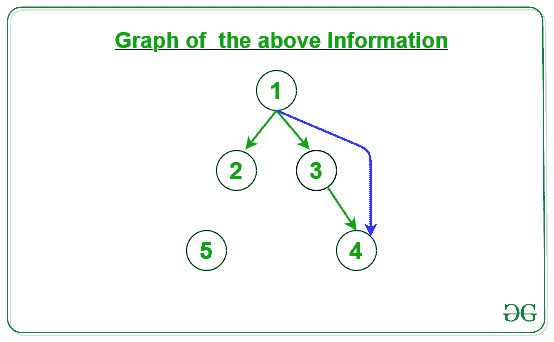

# 复理定理

> 原文： [https://www.geeksforgeeks.org/paranthesis-theorem/](https://www.geeksforgeeks.org/paranthesis-theorem/)

**括号定理**用于图的 [DFS 中。 它指出，深度优先搜索树中的后代具有有趣的属性。 如果 **v 是 u** 的后代，则 v 的**发现时间晚于 **u** 的发现时间。
在图 g =（V，E）的任何**](https://www.geeksforgeeks.org/depth-first-search-or-dfs-for-a-graph/) **[DFS 遍历](https://www.geeksforgeeks.org/depth-first-search-or-dfs-for-a-graph/)中，对于任何两个顶点 u 和 v，下列条件之一完全成立：**

*   间隔 **[d [u]，f [u]]** 和 **[d [v]，f [v]]** 完全不相交，并且 u 或 v 是另一个的后代 在深度优先的森林中。
*   间隔 **[d [u]，f [u]]** 包含在间隔 **[d [v]，f [v]]** 中，并且 u 是 v in 的后代。 一棵深度优先的树。
*   间隔 **[d [u]，f [u]]** 完全包含在间隔 **[d [v]，f [v]]** 中，并且 v 是 u 的后代 在深度优先的树中。

**边缘分类：**
[DFS 遍历](https://www.geeksforgeeks.org/depth-first-search-or-dfs-for-a-graph/)可用于对输入图 G =（V，E）的边缘进行分类。 可以根据深度优先林定义四种边缘类型：

1.  **树边缘：**它是在图上应用 DFS 后获得的树中存在的边缘。
2.  **前边缘：**这是一个边缘（u，v），使得 v 是后代，但不是 DFS 树的一部分。
3.  **后边缘：**这是一条边缘（u，v），因此 v 是边缘 u 的祖先，但不是 DFS 树的一部分。 后边缘的存在指示有向图中的循环。
4.  **交叉边缘：**这是连接两个节点的一条边缘，这样两个节点之间就没有任何祖先和后代关系。

给定 **N** 顶点和 **M** 边的[图](https://www.geeksforgeeks.org/graph-and-its-representations/)，任务是将 M 边分类为[树边，前向边，向后边和交叉 边缘](https://www.geeksforgeeks.org/tree-back-edge-and-cross-edges-in-dfs-of-graph/)。

**示例：**

> **输入：** N = 5，M = 7，arr [] [] = {{1，2}，{1，3}，{3，4}，{1，4}，{2， 5}，{5，1}，{3，2}}}}
> **输出：**
> {1，2}->树边缘
> {1，3}- >树边缘
> {3，4}->树边缘
> {1，4}->前边缘
> {2，5}->树边缘
> {5，1}->后边缘
> {3，2}->交叉边缘
> **说明：**
> 1.绿色边缘：树边缘
> 2 。蓝色边缘：前边缘
> 3.黑色边缘：后边缘
> 4.红色边缘：交叉边缘
> 下面是上述信息的给定图：
> [](https://media.geeksforgeeks.org/wp-content/uploads/20200515201450/Untitled-Diagram66-3.jpg)
> 
> **输入：** N = 5，M = 4，arr [] [] = {{1，2}，{1，3}，{3，4}，{1，4}}
> **输出：**
> {1，2}->树边缘
> {1，3}->树边缘
> {3，4}->树边缘
> {1，4}->前边缘
> **说明：**
> 1.绿边缘：树边缘
> 2.蓝色边缘：前边缘
> 3。 黑色边缘：向后边缘
> 4.红色边缘：交叉边缘
> 下面是上述信息的给定图：
> [](https://media.geeksforgeeks.org/wp-content/uploads/20200515201618/Untitled-Diagram122.jpg)

**方法：**

1.  在给定图上使用 DFS 遍历，以发现发现时间和完成时间以及每个节点的父级。
2.  通过使用括号定理，可以在以下条件下对给定边进行分类：
    *   **树边缘：**对于任何边缘**（U，V）**，如果节点 U 是节点 V 的**父级**，则**（U，V）**是给定图的**树边缘**。
    *   **前边缘：**对于任何边缘**（U，V）**，如果**节点 V** **的发现时间和完成时间与发现时间完全重叠** **节点 U** 的结束时间，则**（U，V）**是给定图的**前缘**。
    *   **后边缘：**对于任何边缘**（U，V）**，如果**节点 U** **的发现时间和完成时间与发现时间完全重叠** **节点 V** 的结束时间，则**（U，V）**是给定图的**向后边缘**。
    *   **交叉边：**对于任何边**（U，V）**，如果**节点 U** **的发现时间和完成时间与**不重叠， **节点 V** 的发现时间和完成时间，则**（U，V）**是给定图的**交叉边缘**。

下面是上述方法的实现：

```

// C++ program for the above approach 

#include "bits/stdc++.h" 
using namespace std; 

// For recording time 
int tim = 0; 

// For creating Graph 
vector<list<int> > G; 

// For calculating Discovery time 
// and finishing time of nodes 
vector<int> disc, fin; 

// For finding Parent of node 
vector<int> Par; 

// For storing color of node 
vector<char> Color; 

// Recursive function for DFS 
// to update the 
void DFS_Visit(int v) 
{ 

    // Make the current nodes as visited 
    Color[v] = 'G'; 

    // Increment the time 
    tim = tim + 1; 

    // Assign the Discovery node of 
    // node v 
    disc[v] = tim; 

    // Traverse the adjacency list of 
    // vertex v 
    for (auto& it : G[v]) { 

        // If the nodes is not visited, 
        // then mark the parent of the 
        // current node and call DFS_Visit 
        // for the current node 
        if (Color[it] == 'W') { 
            Par[it] = v; 
            DFS_Visit(it); 
        } 
    } 
    Color[v] = 'B'; 
    tim = tim + 1; 
    fin[v] = tim; 
} 

void DFS(vector<list<int> >& G) 
{ 

    // Intialise Par, disc, fin and 
    // Color vector to size of graph 
    Par.resize(G.size()); 
    disc.resize(G.size()); 
    fin.resize(G.size()); 
    Color.resize(G.size()); 

    // Initialise the Par[], Color[], 
    // disc[], fin[] 
    for (int i = 1; i < G.size(); i++) { 
        Color[i] = 'W'; 
        Par[i] = 0; 
        disc[i] = 0; 
        fin[i] = 0; 
    } 

    // For every vertex if nodes is 
    // not visited then call DFS_Visit 
    // to update the discovery and 
    // finishing time of the node 
    for (int i = 1; i < G.size(); i++) { 

        // If color is 'W', then 
        // node is not visited 
        if (Color[i] == 'W') { 
            DFS_Visit(i); 
        } 
    } 
} 

// Function to check whether 
// time intervals of x and y overlaps 
// or not 
bool checkOverlap(int x, int y) 
{ 

    // Find the time intervals 
    int x1 = disc[x], y1 = fin[x]; 
    int x2 = disc[y], y2 = fin[y]; 

    // Complete overlaps 
    if (x2 > x1 && y1 > y2) { 
        return true; 
    } 
    else { 
        return false; 
    } 
} 

// Function to check which Edges 
// (x, y) belongs 
string checkEdge(int x, int y) 
{ 

    // For Tree Edge 
    // If x is parent of y, then it 
    // is Tree Edge 
    if (Par[y] == x) { 
        return "Tree Edge"; 
    } 

    // For Forward Edge 
    else if (checkOverlap(x, y)) { 
        return "Forward Edge"; 
    } 

    // For Backward Edge 
    else if (checkOverlap(y, x)) { 
        return "Backward Edge"; 
    } 

    else { 
        return "Cross Edge"; 
    } 
} 

// Function call to find the Tree Edge, 
// Back Edge, Forward Edge, and Cross Edge 
void solve(int arr[][2], int N, int M) 
{ 

    // Create graph of N size 
    G.resize(N + 1); 

    // Traverse each edges 
    for (int i = 0; i < M; i++) { 

        int x = arr[i][0]; 
        int y = arr[i][1]; 

        // Make Directed graph 
        G[x].push_back(y); 
    } 

    // DFS call to calculate discovery 
    // and finishing time for each node 
    DFS(G); 

    // Condition for Tree Edge, Forward 
    // Edges, Backward Edge and Cross Edge 
    for (int i = 0; i < M; i++) { 

        int x = arr[i][0]; 
        int y = arr[i][1]; 

        // Function call to check Edges 
        cout << "{" << x << ", " << y 
             << "} -> " << checkEdge(x, y) 
             << endl; 
    } 
} 

// Driver Code 
int main() 
{ 

    // Number of Nodes 
    int N = 5; 

    // Number of Edges 
    int M = 7; 

    // Edges for the graph 
    int arr[M][2] 
        = { { 1, 2 }, { 1, 3 }, 
            { 3, 4 }, { 1, 4 },  
            { 2, 5 }, { 5, 1 }, 
            { 3, 1 } }; 

    // Function Call 
    solve(arr, N, M); 

    return 0; 
} 

```

**Output:**

```
{1, 2} -> Tree Edge
{1, 3} -> Tree Edge
{3, 4} -> Tree Edge
{1, 4} -> Forward Edge
{2, 5} -> Tree Edge
{5, 1} -> Backward Edge
{3, 1} -> Backward Edge

```


* * *

* * *

如果您喜欢 GeeksforGeeks 并希望做出贡献，则还可以使用 [tribution.geeksforgeeks.org](https://contribute.geeksforgeeks.org/) 撰写文章，或将您的文章邮寄至 tribution@geeksforgeeks.org。 查看您的文章出现在 GeeksforGeeks 主页上，并帮助其他 Geeks。

如果您发现任何不正确的地方，请单击下面的“改进文章”按钮，以改进本文。