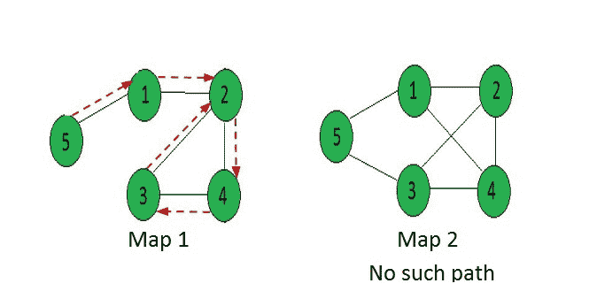

# 使用每个边沿行进每个节点的路径（柯尼斯堡七桥）

> 原文： [https://www.geeksforgeeks.org/paths-travel-nodes-using-edgeseven-bridges-konigsberg/](https://www.geeksforgeeks.org/paths-travel-nodes-using-edgeseven-bridges-konigsberg/)

有 n 个节点，这些节点之间有 m 个桥。 使用每个边缘（如果可能）打印通过每个节点的可能路径，仅通过每个边缘一次。



**示例**：

```
Input : [[0, 1, 0, 0, 1],
         [1, 0, 1, 1, 0],
         [0, 1, 0, 1, 0],
         [0, 1, 1, 0, 0],
         [1, 0, 0, 0, 0]]

Output : 5 -> 1 -> 2 -> 4 -> 3 -> 2

Input : [[0, 1, 0, 1, 1],
         [1, 0, 1, 0, 1],
         [0, 1, 0, 1, 1],
         [1, 1, 1, 0, 0],
         [1, 0, 1, 0, 0]]

Output : "No Solution"

```

它是图论中最著名的问题之一，被称为“柯尼斯堡七桥”问题。 1735 年，著名数学家莱昂哈德·欧拉（Leonhard Euler）解决了这个问题。这个问题也被认为是图论的开端。
当时的问题是：普鲁士的克尼格斯堡市周围有 7 座桥梁，连接 4 个土地。 是否有任何方法可以从任何地方出发并穿过每座桥梁一次且只有一次？ 请参阅[这些维基百科图片](https://en.wikipedia.org/wiki/Seven_Bridges_of_K%C3%B6nigsberg#/media/File:7_bridges.svg)以获得更多清晰度。

欧拉首先引入图论来解决这个问题。 他将每个区域视为图形的一个节点，并将它们之间的每个桥视为它们之间的边。 现在，他计算了该图中是否存在任何[欧拉路径](https://www.geeksforgeeks.org/mathematics-euler-hamiltonian-paths/)。 如果有一条欧拉路径，那么就没有解决方案。
这里的问题是 1735 年问题的广义版本。

下面是实现：

```

// A C++ program print Eulerian Trail in a 
// given Eulerian or Semi-Eulerian Graph 
#include <iostream> 
#include <string.h> 
#include <algorithm> 
#include <list> 
using namespace std; 

// A class that represents an undirected graph 
class Graph 
{ 
// No. of vertices 
    int V; 

    // A dynamic array of adjacency lists 
    list<int> *adj; 
public: 

    // Constructor and destructor 
    Graph(int V) 
    { 
        this->V = V; 
        adj = new list<int>[V]; 
    } 
    ~Graph() 
    { 
        delete [] adj; 
    } 

    // functions to add and remove edge 
    void addEdge(int u, int v) 
    { 
        adj[u].push_back(v); 
        adj[v].push_back(u); 
    } 

    void rmvEdge(int u, int v); 

    // Methods to print Eulerian tour 
    void printEulerTour(); 
    void printEulerUtil(int s); 

    // This function returns count of vertices 
    // reachable from v. It does DFS 
    int DFSCount(int v, bool visited[]); 

    // Utility function to check if edge u-v 
    // is a valid next edge in Eulerian trail or circuit 
    bool isValidNextEdge(int u, int v); 
}; 

/* The main function that print Eulerian Trail. 
It first finds an odd degree vertex (if there is any) 
and then calls printEulerUtil() to print the path */
void Graph::printEulerTour() 
{ 
    // Find a vertex with odd degree 
    int u = 0; 

    for (int i = 0; i < V; i++) 
        if (adj[i].size() & 1) 
        { 
            u = i; 
            break; 
        } 

    // Print tour starting from oddv 
    printEulerUtil(u); 
    cout << endl; 
} 

// Print Euler tour starting from vertex u 
void Graph::printEulerUtil(int u) 
{ 

    // Recur for all the vertices adjacent to 
    // this vertex 
    list<int>::iterator i; 
    for (i = adj[u].begin(); i != adj[u].end(); ++i) 
    { 
        int v = *i; 

        // If edge u-v is not removed and it's a a 
        // valid next edge 
        if (v != -1 && isValidNextEdge(u, v)) 
        { 
            cout << u << "-" << v << " "; 
            rmvEdge(u, v); 
            printEulerUtil(v); 
        } 
    } 
} 

// The function to check if edge u-v can be considered 
// as next edge in Euler Tout 
bool Graph::isValidNextEdge(int u, int v) 
{ 

    // The edge u-v is valid in one of the following 
    // two cases: 

    // 1) If v is the only adjacent vertex of u 
    int count = 0; // To store count of adjacent vertices 
    list<int>::iterator i; 
    for (i = adj[u].begin(); i != adj[u].end(); ++i) 
        if (*i != -1) 
            count++; 
    if (count == 1) 
        return true; 

    // 2) If there are multiple adjacents, then u-v 
    //    is not a bridge 
    // Do following steps to check if u-v is a bridge 

    // 2.a) count of vertices reachable from u 
    bool visited[V]; 
    memset(visited, false, V); 
    int count1 = DFSCount(u, visited); 

    // 2.b) Remove edge (u, v) and after removing 
    // the edge, count vertices reachable from u 
    rmvEdge(u, v); 
    memset(visited, false, V); 
    int count2 = DFSCount(u, visited); 

    // 2.c) Add the edge back to the graph 
    addEdge(u, v); 

    // 2.d) If count1 is greater, then edge (u, v) 
    // is a bridge 
    return (count1 > count2)? false: true; 
} 

// This function removes edge u-v from graph. 
// It removes the edge by replacing adjcent 
// vertex value with -1\. 
void Graph::rmvEdge(int u, int v) 
{ 
    // Find v in adjacency list of u and replace 
    // it with -1 
    list<int>::iterator iv = find(adj[u].begin(), 
                                adj[u].end(), v); 
    *iv = -1; 

    // Find u in adjacency list of v and replace 
    // it with -1 
    list<int>::iterator iu = find(adj[v].begin(), 
                                  adj[v].end(), u); 
    *iu = -1; 
} 

// A DFS based function to count reachable 
// vertices from v 
int Graph::DFSCount(int v, bool visited[]) 
{ 
    // Mark the current node as visited 
    visited[v] = true; 
    int count = 1; 

    // Recur for all vertices adjacent to this vertex 
    list<int>::iterator i; 
    for (i = adj[v].begin(); i != adj[v].end(); ++i) 
        if (*i != -1 && !visited[*i]) 
            count += DFSCount(*i, visited); 

    return count; 
} 

// Driver program to test above function 
int main() 
{ 
    // Let us first create and test 
    // graphs shown in above figure 
    Graph g1(4); 
    g1.addEdge(0, 1); 
    g1.addEdge(0, 2); 
    g1.addEdge(1, 2); 
    g1.addEdge(2, 3); 
    g1.printEulerTour(); 

    Graph g3(4); 
    g3.addEdge(0, 1); 
    g3.addEdge(1, 0); 
    g3.addEdge(0, 2); 
    g3.addEdge(2, 0); 
    g3.addEdge(2, 3); 
    g3.addEdge(3, 1); 

    // comment out this line and you will see that 
    // it gives TLE because there is no possible 
    // output g3.addEdge(0, 3); 
    g3.printEulerTour(); 

    return 0; 
} 

```

**Output:**

```
2-0  0-1  1-2  2-3  
1-0  0-2  2-3  3-1  1-0  0-2

```


* * *

* * *

如果您喜欢 GeeksforGeeks 并希望做出贡献，则还可以使用 [tribution.geeksforgeeks.org](https://contribute.geeksforgeeks.org/) 撰写文章，或将您的文章邮寄至 tribution@geeksforgeeks.org。 查看您的文章出现在 GeeksforGeeks 主页上，并帮助其他 Geeks。

如果您发现任何不正确的地方，请单击下面的“改进文章”按钮，以改进本文。