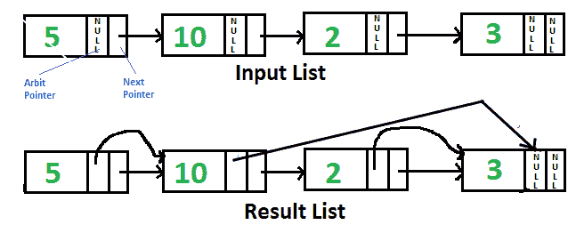

# 将仲裁指针指向链接列表中的最大值右侧节点

给定单链表，每个节点都有一个额外的“任意”指针，该指针当前指向NULL。 我们需要在右侧链表中使“任意”指针指向最大值节点。

**简单解决方案**是一个接一个地遍历所有节点。 对于每个节点，找到右侧最大的节点并更改下一个指针。 该解决方案的时间复杂度为O（n 2 ）。

有效的**解决方案**可以在O（n）时间内工作。 以下是步骤。

1.  反转给定的链表。
2.  开始遍历链表并存储到目前为止遇到的最大值节点。 使每个节点的仲裁指向最大。 如果到目前为止，当前节点中的数据大于最大节点，请更新最大。
3.  反向修改链表和返回头。

以下是上述步骤的执行。

## C ++

*filter_none*

*编辑*
*关闭*

*play_arrow*

*链接*
*亮度_4*
*代码*

| `// C++ program to point arbit pointers to highest``// value on its right``#include<bits/stdc++.h>``using` `namespace` `std;` [`/* Link list node */``struct` `Node``{` `int` `data;` `Node* next, *arbit;``};``/* Function to reverse the linked list */``Node* reverse(Node *head)``{` `Node *prev = NULL, *current = head, *next;` `while` `(current != NULL)` `{` `next  = current->next;` `current->next = prev;` `prev = current;` `current = next;` `}` `return` `prev;``}``// This function populates arbit pointer in every``// node to the greatest value to its right.``Node* populateArbit(Node *head)``{` `// Reverse given linked list` `head = reverse(head);` `// Initialize pointer to maximum value node` `Node *max = head;` `// Traverse the reversed list` `Node *temp = head->next;`​​ `while` `(temp != NULL)` `{` `// Connect max through arbit pointer` `temp->arbit = max;` `// Update max if required` `if` `(max->data < temp->data)` `max = temp;` `// Move ahead in reversed list` `temp = temp->next;` `}` `// Reverse modified linked list and return` `// head.` `return` `reverse(head);``}``// Utility function to print result linked list``void` `printNextArbitPointers(Node *node)``{` `printf` `(` `"Node\tNext Pointer\tArbit Pointer\n"` `);` `while` `(node!=NULL)` `{` `cout << node->data <<` `"\t\t"` `;` `if` `(node->next)` `cout << node->next->data <<` `"\t\t"` `;` `else` `cout <<` `"NULL"` `<<` `"\t\t"` `;` `if` `(node->arbit)` `cout << node->arbit->data;` `else` `cout <<` `"NULL"` `;` `cout << endl;` `node = node->next;` `}``}`[HTG3 47] `/* Function to create a new node with given data */``Node *newNode(` `int` `data)``{` `Node *new_node =` `new` `Node;` `new_node->data = data;` `new_node->next = NULL;` `return` `new_node;``}` [`/* Driver program to test above functions*/``int` `main()``{` `Node *head = newNode(5);` `head->next = newNode(10);` `head->next->next = newNode(2);` `head->next->next->next = newNode(3);` `head = populateArbit(head);` `printf` `(` `"Resultant Linked List is: \n"` `);` ] `printNextArbitPointers(head);` [ `return` `0;``}` |

*chevron_right**filter_none*