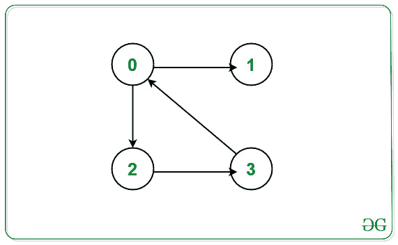
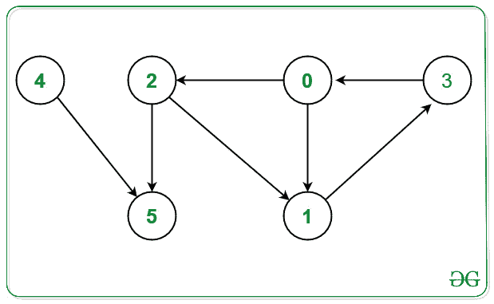

# 在有向图

中不属于任何循环的打印节点

> 原文： [https://www.geeksforgeeks.org/print-nodes-which-are-not-part-of-any-cycle-in-a-directed-graph/](https://www.geeksforgeeks.org/print-nodes-which-are-not-part-of-any-cycle-in-a-directed-graph/)

给定有向[图](https://www.geeksforgeeks.org/introduction-to-graphs/) G`N`个节点和`E`由值 **[0，N – 1]** 和[的节点组成的边 类型为[`u`，`v`}的 2D 数组](https://www.geeksforgeeks.org/multidimensional-arrays-in-java/) **Edges [] [2]** ，表示顶点之间的[定向边 和`v`。 任务是在给定图`G`中找到不属于任何周期的节点。](https://www.geeksforgeeks.org/minimum-number-of-edges-between-two-vertices-of-a-graph/)

**示例**：

> **输入**：N = 4，E = 4，Edges [] [2] = {{0，2}，{0，1}，{2，3}，{3，0}}
> **输出**：1
> **说明**：
>  
> 从上面的给定图中，节点 0-之间存在一个循环。 > 2-> 3->0。
> 在任何周期内都没有出现的节点是 1。
> 因此，打印 1。
> 
> **输入**：N = 6，E = 7，Edges [] [2] = {{0，1}，{0，2}，{1，3}，{2，1}，{2 ，5}，{3，0}，{4，5}}
> **输出**：4 5
> **说明**：
> [ [](https://media.geeksforgeeks.org/wp-content/uploads/20201014150654/UntitledDiagram2.jpg) 
> 从上面的给定图中，节点之间存在一个循环：
> 1）0-> 1-> 3->0。
> 2）0-> 2-> 1-> 3->0。
> 在任何周期内都没有出现的节点是 4 和 5。
> 因此，打印 4 和 5。

**天真的方法**：最简单的方法是[为给定图中的每个节点检测有向图](https://www.geeksforgeeks.org/detect-cycle-in-a-graph/)中的周期，并仅打印不属于给定周期中任何周期的那些节点 图形。

***时间复杂度**：O（V *（V + E）），其中 V 是顶点数，E 是边数。*

***辅助空间**：O（V）*

**高效方法**：为了优化上述方法，其思想是在给定图中的任何循环时，将中间节​​点存储为**访问循环节点**。 要实现此部分，请使用辅助数组 **cyclePart []** ，该数组将在执行 [DFS 遍历](https://www.geeksforgeeks.org/depth-first-search-or-dfs-for-a-graph/)时存储中间循环节点。 步骤如下：

*   初始化大小为`N`的辅助数组 **cyclePart []** ，使得如果 **cyclePart [i] = 0** ，则 **i <sup>th</sup>** 节点在任何周期内都不存在。

*   初始化大小为`N`的辅助数组 **recStack []** ，以便通过将访问的节点标记为 **true 将其存储在[递归](https://www.geeksforgeeks.org/recursion/)堆栈中。** 。

*   在给定的图形上对每个未访问的节点执行 DFS 遍历，然后执行以下操作：

    *   现在，在给定图中找到一个循环，只要找到一个循环，就将 **cyclePart []** 中的节点标记为 **true** ，因为该节点是循环的一部分。

    *   如果在[递归](https://www.geeksforgeeks.org/recursion/)调用中访问了任何**节点**并且为 **recStack [node]** 也为 true，则该节点是循环的一部分，然后将该节点标记为 **是**。

*   在执行 **DFS 遍历**之后，[遍历数组](https://www.geeksforgeeks.org/c-program-to-traverse-an-array/) **cyclePart []** 并打印所有标记为**假**的节点，因为这些节点是 不是任何周期的一部分。

下面是上述方法的实现：

## C++

```cpp

// C++ program for the above approach 

#include <bits/stdc++.h> 
using namespace std; 

class Graph { 

    // No. of vertices 
    int V; 

    // Stores the Adjacency List 
    list<int>* adj; 
    bool printNodesNotInCycleUtil( 
        int v, bool visited[], bool* rs, 
        bool* cyclePart); 

public: 
    // Constructor 
    Graph(int V); 

    // Member Functions 
    void addEdge(int v, int w); 
    void printNodesNotInCycle(); 
}; 

// Function to initialize the graph 
Graph::Graph(int V) 
{ 
    this->V = V; 
    adj = new list<int>[V]; 
} 

// Function that adds directed edges 
// between node v with node w 
void Graph::addEdge(int v, int w) 
{ 
    adj[v].push_back(w); 
} 

// Function to perform DFS Traversal 
// and return true if current node v 
// formes cycle 
bool Graph::printNodesNotInCycleUtil( 
    int v, bool visited[], 
    bool* recStack, bool* cyclePart) 
{ 

    // If node v is unvisited 
    if (visited[v] == false) { 

        // Mark the current node as 
        // visited and part of 
        // recursion stack 
        visited[v] = true; 
        recStack[v] = true; 

        // Traverse the Adjacency 
        // List of current node v 
        for (auto& child : adj[v]) { 

            // If child node is unvisited 
            if (!visited[child] 
                && printNodesNotInCycleUtil( 
                       child, visited, 
                       recStack, cyclePart)) { 

                // If child node is a part 
                // of cycle node 
                cyclePart[child] = 1; 
                return true; 
            } 

            // If child node is visited 
            else if (recStack[child]) { 
                cyclePart[child] = 1; 
                return true; 
            } 
        } 
    } 

    // Remove vertex from recursion stack 
    recStack[v] = false; 
    return false; 
} 

// Function that print the nodes for 
// the given directed graph that are 
// not present in any cycle 
void Graph::printNodesNotInCycle() 
{ 

    // Stores the visited node 
    bool* visited = new bool[V]; 

    // Stores nodes in recursion stack 
    bool* recStack = new bool[V]; 

    // Stores the nodes that are 
    // part of any cycle 
    bool* cyclePart = new bool[V]; 

    for (int i = 0; i < V; i++) { 
        visited[i] = false; 
        recStack[i] = false; 
        cyclePart[i] = false; 
    } 

    // Traverse each node 
    for (int i = 0; i < V; i++) { 

        // If current node is unvisited 
        if (!visited[i]) { 

            // Perform DFS Traversal 
            if (printNodesNotInCycleUtil( 
                    i, visited, recStack, 
                    cyclePart)) { 

                // Mark as cycle node 
                // if it return true 
                cyclePart[i] = 1; 
            } 
        } 
    } 

    // Traverse the cyclePart[] 
    for (int i = 0; i < V; i++) { 

        // If node i is not a part 
        // of any cycle 
        if (cyclePart[i] == 0) { 
            cout << i << " "; 
        } 
    } 
} 

// Function that print the nodes for 
// the given directed graph that are 
// not present in any cycle 
void solve(int N, int E, 
           int Edges[][2]) 
{ 

    // Initialize the graph g 
    Graph g(N); 

    // Create a directed Graph 
    for (int i = 0; i < E; i++) { 
        g.addEdge(Edges[i][0], 
                  Edges[i][1]); 
    } 

    // Function Call 
    g.printNodesNotInCycle(); 
} 

// Driver Code 
int main() 
{ 
    // Given Number of nodes 
    int N = 6; 

    // Given Edges 
    int E = 7; 

    int Edges[][2] = { { 0, 1 }, { 0, 2 },  
                       { 1, 3 }, { 2, 1 },  
                       { 2, 5 }, { 3, 0 },  
                                 { 4, 5 } }; 

    // Function Call 
    solve(N, E, Edges); 

    return 0; 
} 

```

**Output:**

```
4 5

```

***时间复杂度**：O（V + E）*

***空间复杂度**：O（V）*


* * *

* * *

如果您喜欢 GeeksforGeeks 并希望做出贡献，则还可以使用 [tribution.geeksforgeeks.org](https://contribute.geeksforgeeks.org/) 撰写文章，或将您的文章邮寄至 tribution@geeksforgeeks.org。 查看您的文章出现在 GeeksforGeeks 主页上，并帮助其他 Geeks。

如果您发现任何不正确的地方，请单击下面的“改进文章”按钮，以改进本文。