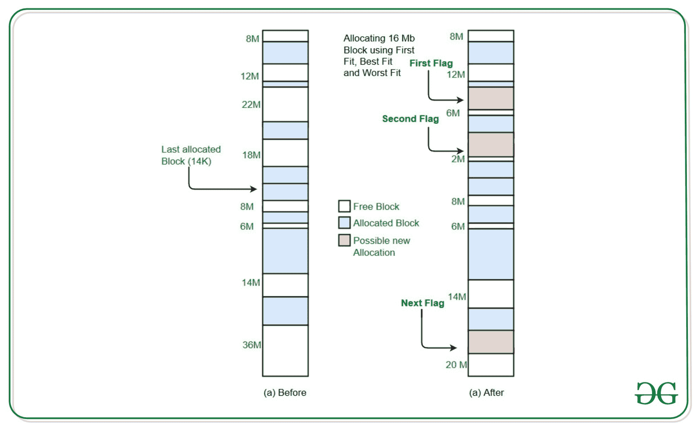

# 使用链接列表

的内存管理中最佳拟合算法程序

**用于内存管理的最佳拟合算法：**在分配过程中损失最小的内存分区是分配给该流程的最适合内存分区。

在[文章](https://www.geeksforgeeks.org/program-best-fit-algorithm-memory-management/)中，我们已经讨论了一种使用数组的最佳拟合算法。 但是，这里我们将研究使用链表的另一种方法，其中也可以删除分配的节点。

**示例：**

```
Input : blockSize[] = {100, 500, 200}
        processSize[] = {95, 417, 112, 426} 
Output :
Block with size 426 can't be allocated
Tag    Block ID    Size
0          0        95
1          1        417
2          2        112
After deleting node with tag id 1.
Tag    Block ID    Size
0        0         95
2        2        112
3        1        426

```

[](https://media.geeksforgeeks.org/wp-content/uploads/20200528192255/ahf.jpg)

**方法：**这个想法是为每个存储块分配一个唯一的标签ID。 为每个大小不同的进程提供了块ID（表示它们属于哪个内存块），以及唯一的标记ID（用于删除特定进程以释放空间）。 创建一个给定的内存块大小的空闲列表和已分配的进程列表。

**创建分配的列表：**
通过找到最合适或最佳的内存块来分配内存，从而创建给定进程大小的分配列表。 如果找不到该内存块，则只需打印它即可。 否则，创建一个节点并将其添加到分配的链表中。

**删除进程：**
每个进程都有唯一的标签ID。 从分配的链表中删除流程节点，以释放一些空间供其他流程使用。 删除后，使用已删除节点的块ID来增加空闲列表中的内存块大小。

下面是该方法的实现：

## C ++

```

// C++ implementation of program 
// for best fit algorithm for memory 
// management using linked list 

#include <bits/stdc++.h> 
using namespace std; 

// Two global counters 
int g = 0, k = 0; 

// Structure for free list 
struct free { 
    int tag; 
    int size; 
    struct free* next; 
}* free_head = NULL, *prev_free = NULL; 

// Structure for allocated list 
struct alloc { 
    int block_id; 
    int tag; 
    int size; 
    struct alloc* next; 
}* alloc_head = NULL, *prev_alloc = NULL; 

// Function to create free 
// list with given sizes 
void create_free(int c) 
{ 
    struct free* p = (struct free*) 
        malloc(sizeof(struct free)); 
    p->size = c; 
    p->tag = g; 
    p->next = NULL; 
    if (free_head == NULL) 
        free_head = p; 
    else
        prev_free->next = p; 
    prev_free = p; 
    g++; 
} 

// Fuction to print free list which 
// prints free blocks of given sizes 
void print_free() 
{ 
    struct free* p = free_head; 
    cout << "Tag\tSize\n"; 
    while (p != NULL) { 
        cout << p->tag << "\t"
             << p->size << "\n"; 
        p = p->next; 
    } 
} 

// Function to print allocated list which 
// prints allocated blocks and their block ids 
void print_alloc() 
{ 
    struct alloc* p = alloc_head; 
    cout << "Tag\tBlock ID\tSize\n"; 
    while (p != NULL) { 
        cout << p->tag << "\t  " << p->block_id 
             << "\t\t" << p->size << "\n"; 
        p = p->next; 
    } 
} 

// Function to allocate memory to 
// blocks as per Best fit algorithm 
void create_alloc(int c) 
{ 
    // create node for process of given size 
    struct alloc* q = (struct alloc*) 
        malloc(sizeof(struct alloc)); 
    q->size = c; 
    q->tag = k; 
    q->next = NULL; 
    struct free* p = free_head; 

    // Temporary node r of free 
    // type to find the best and 
    // most suitable free node to 
    // allocate space 
    struct free* r = (struct free*) 
        malloc(sizeof(struct free)); 
    r->size = 99999; 

    // Loop to find best choice 
    while (p != NULL) { 
        if (q->size <= p->size) { 
            if (p->size < r->size) 
                r = p; 
        } 
        p = p->next; 
    } 

    // Node found to allocate 
    // space from 
    if (r->size != 99999) { 
        // Adding node to allocated list 
        q->block_id = r->tag; 
        r->size -= q->size; 
        if (alloc_head == NULL) 
            alloc_head = q; 
        else { 
            prev_alloc = alloc_head; 
            while (prev_alloc->next != NULL) 
                prev_alloc = prev_alloc->next; 
            prev_alloc->next = q; 
        } 
        k++; 
    } 

    // Node with size not found 
    else
        cout << "Block with size "
             << c << " can't be allocated\n"; 
} 

// Function to delete node from 
// allocated list to free some space 
void delete_alloc(int t) 
{ 
    // Standard delete function 
    // of a linked list node 
    struct alloc *p = alloc_head, *q = NULL; 

    // First, find the node according 
    while (p != NULL) 
    // to given tag id 
    { 
        if (p->tag == t) 
            break; 
        q = p; 
        p = p->next; 
    } 
    if (p == NULL) 
        cout << "Tag ID doesn't exist\n"; 
    else if (p == alloc_head) 
        alloc_head = alloc_head->next; 
    else
        q->next = p->next; 
    struct free* temp = free_head; 
    while (temp != NULL) { 
        if (temp->tag == p->block_id) { 
            temp->size += p->size; 
            break; 
        } 
        temp = temp->next; 
    } 
} 

// Driver Code 
int main() 
{ 
    int blockSize[] = { 100, 500, 200 }; 
    int processSize[] = { 95, 417, 112, 426 }; 
    int m = sizeof(blockSize) 
            / sizeof(blockSize[0]); 
    int n = sizeof(processSize) 
            / sizeof(processSize[0]); 

    for (int i = 0; i < m; i++) 
        create_free(blockSize[i]); 

    for (int i = 0; i < n; i++) 
        create_alloc(processSize[i]); 

    print_alloc(); 

    // block of tag id 1 deleted 
    // to free space for block of size 426 
    delete_alloc(1); 

    create_alloc(426); 
    cout << "After deleting block"
         << " with tag id 1.\n"; 
    print_alloc(); 
} 

```

**Output:**

```
Block with size 426 can't be allocated
Tag    Block ID    Size
0      0        95
1      1        417
2      2        112
After deleting block with tag id 1.
Tag    Block ID    Size
0      0        95
2      2        112
3      1        426

```

注意读者！ 现在不要停止学习。 通过 [**DSA自学课程**](https://practice.geeksforgeeks.org/courses/dsa-self-paced?utm_source=geeksforgeeks&utm_medium=article&utm_campaign=gfg_article_dsa_content_bottom) 以对学生方便的价格掌握所有重要的DSA概念，并为行业做好准备。

* * *

* * *

如果您喜欢GeeksforGeeks并希望做出贡献，则还可以使用 [tribution.geeksforgeeks.org](https://contribute.geeksforgeeks.org/) 撰写文章，或将您的文章邮寄至tribution@geeksforgeeks.org。 查看您的文章出现在GeeksforGeeks主页上，并帮助其他Geeks。

如果您发现任何不正确的地方，请单击下面的“改进文章”按钮，以改进本文。