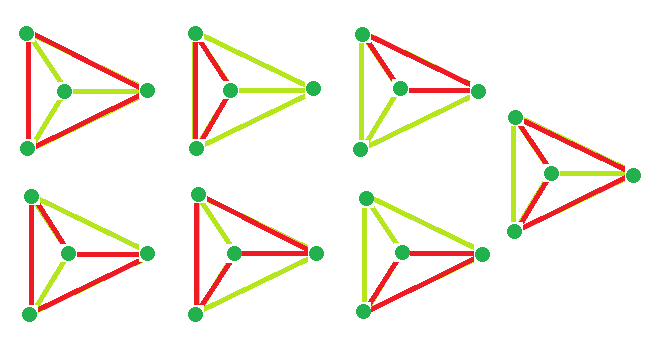
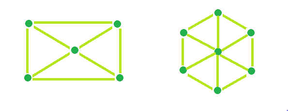

# 程序来查找轮图的直径，周期和边

> 原文： [https://www.geeksforgeeks.org/program-to-find-the-diameter-cycles-and-edges-of-a-wheel-graph/](https://www.geeksforgeeks.org/program-to-find-the-diameter-cycles-and-edges-of-a-wheel-graph/)

**轮图**：轮图是通过将单个通用顶点连接到循环的所有顶点而形成的图。 **属性：-**

*   车轮图是平面图。
*   车轮图中始终存在哈密顿循环。
*   如果 n 分别为奇数和偶数，则色数为 3 和 4。

 **问题陈述**：给定车轮图中的顶点数量。 任务是找到：

1.  轮图中的循环数。
2.  轮图中的边数。
3.  轮图的直径。

**示例**：

```
Input: vertices = 4
Output: Number of cycle = 7
         Number of edge = 6
         Diameter = 1

Input: vertices = 6
Output: Number of cycle = 21
         Number of edge = 10
         Diameter = 2

```

**示例 1**：对于顶点= 4 轮图，**的总循环为 7** ：


**示例 2**：对于顶点= 5 和 7 轮图**边数分别为 8 和 12** ：


**示例 3**：对于顶点= 4，**直径为 1** ，因为我们可以通过仅覆盖 1 个边来从任何顶点扩展到任何顶点。


**计算循环，边和直径的公式：-**

```
Number of Cycle = (vertices * vertices) - (3 * vertices) + 3
Number of edge = 2 * (vertices - 1)
Diameter = if vertices = 4, Diameter = 1
           if vertices > 4, Diameter = 2

```

以下是所需的实现：

## C++

```cpp

// C++ Program to find the diameter,  
// cycles and edges of a Wheel Graph 
#include <bits/stdc++.h> 
using namespace std; 

// Function that calculates the 
// Number of Cycle in Wheel Graph. 
int totalCycle(int vertices) 
{ 
    int result = 0; 

    // calculates no. of Cycle. 
    result = pow(vertices, 2) - (3 * vertices) + 3; 

    return result; 
} 

// Function that calculates the 
// Number of Edges in Wheel graph. 
int Edges(int vertices) 
{ 
    int result = 0; 

    result = 2 * (vertices - 1); 

    return result; 
} 

// Function that calculates the 
// Diameter in Wheel Graph. 
int Diameter(int vertices) 
{ 
    int result = 0; 

    // calculates Diameter. 
    if (vertices == 4) 
        result = 1; 
    else
        result = 2; 

    return result; 
} 

// Driver Code 
int main() 
{ 
    int vertices = 4; 

    cout << "Number of Cycle = " << totalCycle(vertices) << endl; 
    cout << "Number of Edges = " << Edges(vertices) << endl; 
    cout << "Diameter = " << Diameter(vertices); 

    return 0; 
} 

```