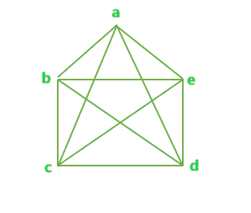

# 程序，用于查找完整图形中的边总数

> 原文： [https://www.geeksforgeeks.org/program-to-find-total-number-of-edges-in-a-complete-graph/](https://www.geeksforgeeks.org/program-to-find-total-number-of-edges-in-a-complete-graph/)

给定一个图的 N 个顶点。 任务是在 N 个顶点的*完整图*中找到可能的边总数。

**完全图：**完全图是其中每对顶点通过一条边连接的图。

**范例**：

```
Input : N = 3
Output : Edges = 3

Input : N = 5
Output : Edges = 10

```

在 N 个顶点的完整图中，可能的边总数为：

> **N 个顶点的完整图中的边总数** =（n *（n – 1））/ 2

**示例 1：**下面是 N = 5 个顶点的完整图形。



上面完整图中的边总数= 10 =（5）*（5-1）/ 2。

以下是上述想法的实现：

## C ++

```

// C++ implementation to find the 
// number of edges in a complete graph 

#include <bits/stdc++.h> 
using namespace std; 

// Function to find the total number of 
// edges in a complete graph with N vertices 
int totEdge(int n) 
{ 
    int result = 0; 

    result = (n * (n - 1)) / 2; 

    return result; 
} 

// Driver Code 
int main() 
{ 
    int n = 6; 

    cout << totEdge(n); 

    return 0; 
} 

```

## 爪哇

```

// Java implementation to find the 
// number of edges in a complete graph 

class GFG { 

// Function to find the total number of 
// edges in a complete graph with N vertices 
static int totEdge(int n) 
{ 
    int result = 0; 

    result = (n * (n - 1)) / 2; 

    return result; 
} 

    // Driver Code 
    public static void main(String []args) 
    { 
        int n = 6; 
        System.out.println(totEdge(n)); 
    } 

} 

```

## Python 3

```

# Python 3 implementation to   
# find the number of edges  
# in a complete graph  

# Function to find the total  
# number of edges in a complete 
# graph with N vertices 
def totEdge(n) : 

    result = (n * (n - 1)) // 2

    return result 

# Driver Code 
if __name__ == "__main__" : 

    n = 6

    print(totEdge(n)) 

# This code is contributed 
# by ANKITRAI1 

```

## C＃

```

// C# implementation to find  
// the number of edges in a 
// complete graph 
using System; 

class GFG  
{ 

// Function to find the total  
// number of edges in a complete  
// graph with N vertices 
static int totEdge(int n) 
{ 
    int result = 0; 

    result = (n * (n - 1)) / 2; 

    return result; 
} 

// Driver Code 
public static void Main() 
{ 
    int n = 6; 
    Console.Write(totEdge(n)); 
} 
} 

// This code is contributed  
// by ChitraNayal 

```

## 的 PHP

```

<?php 
// PHP implementation to find  
// the number of edges in a  
// complete graph  

// Function to find the total  
// number of edges in a complete 
// graph with N vertices  
function totEdge($n)  
{  
    $result = 0;  

    $result = ($n * ($n - 1)) / 2;  

    return $result;  
}  

// Driver Code  
$n = 6;  
echo totEdge($n);  

// This code is contributed 
// by Shivi_Aggarwal 
?> 

```

**Output:**

```
15

```


* * *

* * *

如果您喜欢 GeeksforGeeks 并希望做出贡献，则还可以使用 [tribution.geeksforgeeks.org](https://contribute.geeksforgeeks.org/) 撰写文章，或将您的文章邮寄至 tribution@geeksforgeeks.org。 查看您的文章出现在 GeeksforGeeks 主页上，并帮助其他 Geeks。

如果您发现任何不正确的地方，请单击下面的“改进文章”按钮，以改进本文。